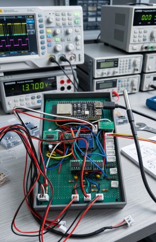

# Chapter 1 — Introduction

*Previous: [README](../README.md)*

## Table of Contents

- [The Origin Story](#the-origin-story)
- [What GalvOS Is (and Isn't)](#what-galvos-is-and-isnt)
- [Safety — Read This First](#safety--read-this-first)
- [Disclaimer](#disclaimer)
- [Hardware Overview](#hardware-overview)
- [System Architecture](#system-architecture)
- [Signal Flow](#signal-flow)
- [Safety Interlock Chain](#safety-interlock-chain)

---

## The Origin Story

It started with a simple question: *why can't I dim this laser?*

The Mikoy 5W RGB laser projector is a capable piece of hardware at a budget price point. The optics are decent, the galvo set is respectable, and the laser diodes are genuine. But the proprietary firmware shipped in it had one glaring limitation — brightness was binary. Full power or nothing. No dimming, no PWM control, no gradual fade. Just ON and a rather aggressive OFF.

After some investigation with an AI assistant (yes, this is an AI-assisted project and proud of it), the conclusion was clear: a firmware bug wasn't to blame. The OEM controller simply didn't implement it. The options were to accept this, or to replace the entire brain of the machine.

The second option sounded more fun.

What followed was a complete hardware and firmware replacement: a custom perfboard controller built around the ESP32-S3, a 16-bit SPI DAC, a quad op-amp differential output stage, a browser-based WebUI, DMX and Art-Net input, ILDA playback, hardware safety interlocks, temperature monitoring, and a point optimizer pipeline with adaptive density, S-curve blanking, and ringing compensation.

It is, objectively, considerably more than was needed to fix a dimmer. Classic maker story.

The result is GalvOS — an open-source platform that replaces the OEM controller with something that is more capable, fully hackable, and free for anyone to use, modify, and improve.

---

## What GalvOS Is (and Isn't)

**GalvOS is:**

- A complete firmware and hardware replacement for the Mikoy 5W RGB laser projector
- An open-source ESP32-S3 platform that could in principle be adapted to other galvo laser projectors
- A browser-based laser show controller with DMX, Art-Net, sACN, OSC, Ether Dream/Helios streaming, ILDA playback, a BPM-synced sequencer and modulation engine, and a rich WebUI
- A working project with real hardware-verified features — not a prototype

**GalvOS is not:**

- A plug-and-play consumer product. You need to build the hardware yourself.
- Compatible with the original Mikoy mainboard or firmware — this is a full replacement.
- A beginner laser project. You will be working with Class IIIB/IV laser radiation.
- Officially supported by Mikoy, Espressif, or anyone else. It is a community project.
- A substitute for understanding what you are building. Read the docs. All of them.

**Tested hardware:** Jolooyo JY-15K-BL galvo set, MN-1W5AT laser driver, DAC8562 DAC, OPA4134 op-amp. Other galvo sets or laser drivers may require hardware or firmware adjustments.

---

## Safety — Read This First

This section is not optional reading. Please treat it accordingly.

### Laser Hazard Classification

The Mikoy 5W RGB projector contains laser diodes with a combined output power of approximately 5W across three wavelengths (638 nm red, 520 nm green, 445 nm blue). This places it in **Class IIIB or Class IV** under IEC 60825-1, depending on beam geometry and configuration.

At these power levels:

- **Intrabeam exposure causes immediate, permanent eye injury** — including at reflections from glossy surfaces.
- **Skin burns** are possible at close range or with prolonged exposure.
- **Fire ignition** is possible if the beam is focused on combustible materials.
- The blue channel (445 nm, 3W) carries an elevated **photochemical retinal hazard** (blue-light hazard, B(λ) factor) in addition to the thermal hazard.

### Required Precautions

- **Always wear appropriate laser safety eyewear** rated for the specific wavelengths and power levels in use. General-purpose "laser goggles" are not sufficient — the OD rating must be matched to your wavelengths and power.
- **Never look into the beam** or at specular (mirror-like) reflections, even briefly.
- **Never operate the laser without beam containment** — enclosure, beam stops, or a controlled environment where no person can be unintentionally exposed.
- **Always treat an unarmed laser as potentially armed.** Hardware faults can cause unexpected emission.
- **Keep your build area clear** of people who are not wearing appropriate eye protection.
- **Test new firmware with the laser disconnected** from mains power until you are confident it behaves correctly.

### Legal Obligation

By modifying this device, the original CE marking, eye safety certification, and any product compliance declarations are **void**. You are constructing a new, uncertified laser product.

Depending on your jurisdiction, operating a Class IIIB or Class IV laser device may require:

- A registered laser safety officer
- A controlled access environment
- Compliance with national laser safety standards (EN 60825-1, ANSI Z136.1, or equivalent)
- Permits or licenses

**Check your local laws before proceeding.** This is your responsibility — not the project's.

### The Built-In Safety Chain

GalvOS includes hardware and software monitoring functions, but the current V2 PCB is **not approved for fabrication or laser operation**. An independent, default-off shutdown path has not been established by the available design evidence. See [Safety Interlock Chain](#safety-interlock-chain) and the [current hardware checkpoint](../hardware/reviews/CURRENT-HARDWARE.md); neither a green UI status nor a passing ERC/DRC is a safety qualification.

---

## Disclaimer

> THE HARDWARE DESIGNS, FIRMWARE, AND ALL OTHER MATERIALS IN THIS REPOSITORY ARE PROVIDED "AS IS", WITHOUT WARRANTY OF ANY KIND, EXPRESS OR IMPLIED, INCLUDING BUT NOT LIMITED TO WARRANTIES OF MERCHANTABILITY, FITNESS FOR A PARTICULAR PURPOSE, AND NON-INFRINGEMENT.
>
> THE AUTHORS AND CONTRIBUTORS SHALL NOT BE LIABLE FOR ANY CLAIM, DAMAGES, OR OTHER LIABILITY — INCLUDING BUT NOT LIMITED TO PERSONAL INJURY, PROPERTY DAMAGE, LOSS OF EYESIGHT, OR LOSS OF DATA — ARISING FROM THE USE, MISUSE, OR INABILITY TO USE THIS PROJECT OR ANY DERIVATIVE WORKS.
>
> This project is not affiliated with, endorsed by, or connected to Mikoy or any OEM laser manufacturer.

If this disclaimer makes you uncomfortable, that discomfort is appropriate. Build carefully.

---

## Hardware Overview

GalvOS is built on a custom perfboard (15 × 9 cm) that replaces the original Mikoy mainboard. The key components are:

| Component | Part | Role |
| --- | --- | --- |
| MCU | ESP32-S3-WROOM-1 N16R8 | Main processor (dual-core, 240 MHz, 16 MB Flash, 8 MB OPI PSRAM) |
| DAC | DAC8562 | 16-bit dual-channel SPI DAC for X/Y galvo positioning |
| Op-Amp | OPA4134UA (quad, SOIC-14) | Differential amplifier stage — converts DAC output to ±5V galvo drive |
| Galvo Set | Jolooyo JY-15K-BL | 2-axis galvo scanner, 15 kpps rated, ±20° optical, 0.025 g·cm² inertia |
| Laser Driver | MN-1W5AT | 3-channel constant-current buck driver, active-HIGH TTL control |
| Optocouplers | 6N137 × 3 | Galvanically isolated laser TTL signals (R, G, B) |
| DMX | MAX485 module | RS-485 receiver for DMX-512 input (receive-only) |
| Watchdog | NE555 × 2 | Hardware scan-fail detection + hardware watchdog with SSR |
| Temperature | DS18B20 (1-Wire) | Up to 5 sensors: laser diodes, PSU, galvo board, chassis, TTL module |
| Power — 5V | HW-613 buck converter | +5V rail for ESP32, optocouplers, NE555s, MAX485 |
| Power — ±15V | External galvo PSU | ±15V for OPA4134 differential stage |

The full netlist with all resistor values, capacitor values, and wiring is in the [`hardware/`](../hardware/) directory.



An early prototype status of the perfboard build.

### Memory Architecture

The ESP32-S3 N16R8 provides:

- **16 MB SPI Flash** — partitioned into two 5 MB OTA app slots (`app0`/`app1`), a 5 MB LittleFS partition (holds the WebUI), 256 KB NVS, and a 64 KB coredump region (see [`partitions.csv`](../partitions.csv))
- **8 MB OPI PSRAM** — used for large pattern buffers, JSON serialization, and the pattern cache. All allocations above ~16 KB must use `ps_malloc()` or `heap_caps_malloc(MALLOC_CAP_SPIRAM)`.
- **~140 KB free internal DRAM** (post-boot) — still scarce (shared with the Wi-Fi/lwIP/AsyncTCP stack), but considerably less scarce than it used to be: ~120 KB of `static` scratch buffers (pattern verts/chains, paint canvas, EtherDream RX, SD file tables, optimizer transform scratch) live in lazily-allocated PSRAM via `src/util/ps_scratch.h` instead of DRAM `.bss`. Static RAM footprint dropped from 180,728 B to 57,872 B. See [Known Issues → Optimize Heap Usage](10-known-issues-and-todos.md#planned-features) for the full breakdown.

---

## System Architecture

GalvOS runs two FreeRTOS cores in parallel:

**Core 0 — Communication & Control:**

- Wi-Fi stack
- WebUI HTTP server (ESPAsyncWebServer)
- Art-Net UDP receiver
- DMX-512 receiver (MAX485)
- sACN / E1.31 multicast receiver
- OSC 1.0 receiver, UDP 9000
- Ether Dream protocol receiver
- Helios DAC network emulation, TCP 7768
- Preset Sequencer step advance
- Safety monitor task
- Temperature monitoring
- NTP client

**Core 1 — Real-Time Output:**

- Galvo timer ISR — fires at the configured sample rate (default 30,000 times/second)
- Pattern engine — generates `LaserPoint` streams from active preset or ILDA file
- Point optimizer pipeline — processes raw points before DAC output (resample, corner dwell, blanking, warp, brightness compensation, scanner clamps)
- BPM clock + modulator engine tick — resolved once per frame boundary, feeding beat-synced parameter modulation into the pattern engine
- Inverse filter — per-axis galvo deconvolution applied to every emitted point
- DAC8562 SPI writes — raw hardware register access, not IDF polling

The two cores share data through a small set of carefully designed shared structures (`gConfig`, `gState`, `gLivePreset`, etc.) protected by atomic operations and dedicated mutexes where needed.

---

## Signal Flow

Understanding the signal chain from firmware to physical beam is useful for troubleshooting and calibration.

### X/Y Position (Galvo)

```text
Pattern Engine
  → LaserPoint (int16_t x, y ∈ [-32768 .. 32767])
  → Point Optimizer (resample, corner dwell, blanking, velocity/accel clamp)
  → galvo_out.cpp ISR
  → DAC code = coordinate + 0x8000  (maps [-32768..32767] → [0x0000..0xFFFF])
  → DAC output limited to [dac_limit_min .. dac_limit_max] (default 0x0666..0xF999)
  → DAC8562 SPI (16-bit, ~30 kpps throughput via raw hardware register access, 40 MHz SPI clock — the DAC8562 is rated for 50 MHz max and 40 MHz is the next clean APB/2 divider on the ESP32-S3's 80 MHz APB bus)
  → VOUTA / VOUTB (0 .. 2.5V relative to internal VREF)
  → OPA4134 differential amplifier (gain 2.2×, inverting)
     VOUT = 2 × (2.5V − VDAC)  →  range ≈ ±5V
  → R_XO / R_YO (100 Ω series output protection)
  → J_GALVO XIN / YIN
  → Galvo driver board → mirrors
```

The coordinate convention (before any calibration transform) is: **x increases to the right, y increases downward**. Physical orientation is calibrated using `invert_x`, `invert_y`, and `swap_xy` in the Calibration tab.

### RGB Laser Modulation

```text
Pattern Engine
  → LaserPoint (uint8_t r, g, b ∈ [0..255])
  → galvo_out.cpp rgbWrite()
     → mapVisibleRange(value, thresh_x)   [remaps 0-255 onto thresh..255]
     → applyGamma(value)                  [CIE 1931 perceptual curve, if enabled]
     → master_dimmer scaling
     → gain_r / gain_g / gain_b white balance scaling
  → LEDC PWM (50 kHz, 8-bit) on GPIO 7 / 8 / 21
  → 220 Ω series resistor → 6N137 optocoupler LED
  → 6N137 output collector → 1 kΩ pull-up to +3.3V / 1 kΩ pull-down to GND
     → V_HIGH (LED off, 6N137 blocking) = 1.65V  →  Laser TTL HIGH  →  Laser ON
     → V_LOW  (LED on,  6N137 saturating) ≈ 0V   →  Laser TTL LOW   →  Laser OFF
  → J_LASER R_TTL / G_TTL / B_TTL
  → MN-1W5AT laser driver (active-HIGH: HIGH = laser on)
```

With adequate LED drive, the 6N137 inverts the GPIO signal: **GPIO HIGH → optocoupler output LOW → laser TTL OFF** for the stated active-HIGH driver. More time HIGH at the GPIO therefore means more time OFF, not ON. `rgbWrite()` handles the intended inversion; actual driver thresholds and fault states still require qualification.

**Reset-state limitation:** The 10 kΩ GPIO pull-ups bias the inputs in the intended OFF direction, but cannot guarantee enough 6N137 LED current to hold the outputs LOW. Do not infer a defined laser-OFF state during reset, brownout or partial power from these resistors. GPIO38 is configured LOW by firmware initialization; that is not proof of a hardware-enforced OFF state before initialization or during a fault. The V2 RGB optocouplers also share power ground on both sides, so their presence does not establish galvanic isolation.

---

## Safety Interlock Chain

The intended system must inhibit emission independently of application software and must not automatically re-arm after a safety trip. The current V2 schematic and firmware do not prove those properties. The actual external SSR/power-switch circuit, any key/enclosure interlock chain and mirror feedback still need to be identified and qualified.

Current implementation:

1. **E-stop status:** J_ESTOP1.1 reaches GPIO47 only. Firmware enables the GPIO pull-up and currently accepts HIGH/open as OK; a broken/open wire is therefore not diagnosed as a trip by that input rule. No direct E-stop-to-SSR gate is shown in V2.
2. **Scan-command activity:** U_SCAN1 monitors electrical command activity, not measured mirror position. Its status reaches GPIO39 through the V2 input buffer. This is not proof that a mirror is moving or that a stalled mirror will be detected.
3. **Watchdog output:** U_WD1 drives J_SSR1 through a 330 Ω resistor. GPIO38 controls the timer's reset input; GPIO14 provides its trigger activity. Trigger margins, timeout/fault behavior and the actual external switch remain unqualified.
4. **Software arm:** With `safety_override` disabled, `allOk()` combines E-stop status, scan status, software watchdog, subsystem health and the ARM request. The task's status-fault path does not clear ARM, so recovery can request enable again without a new ARM action. With override enabled, `allOk()` returns the ARM request alone and bypasses those status checks. In that mode, `emergencyStop()` lowers GPIO38 immediately but retains the ARM request, allowing the next decision to request enable again.
5. **Temperature:** The monitor explicitly clears the ARM request on alert/critical conditions. That remains a software action, not an independently qualified thermal cutout.

Do not treat this as a firmware-independent safety chain or assume that J_SSR1 alone proves laser-energy removal. The [shutdown-boundary review](../hardware/reviews/2026-09-14-shutdown-boundary.md) records current evidence and the information required before a safety redesign. Keep laser emission physically inhibited during bring-up.
The `safety::lastFailsafeReason()` function stores the reason for the last shutdown in RTC memory, which survives `esp_restart()` — so you can read it in the serial log after a reset.

---

**Heads-up**: *This complete project is - i hate that wording - "vibe coded"*. It is amazing how much you can do with the help of an LLM without knowing anything about a specific topic. I've learned so much about all sub topics that this projects touches.

---

*Next: [Chapter 2 — Prerequisites](02-prerequisites.md)*
