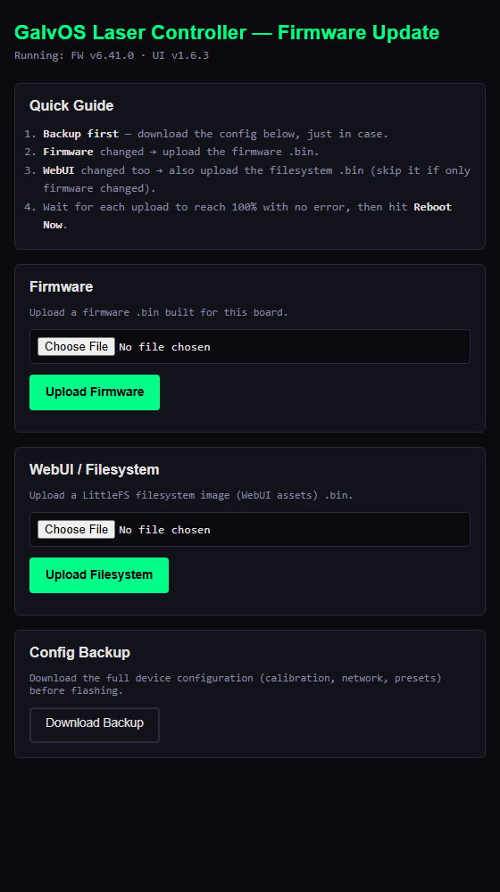

# Chapter 3 — Build & Configuration

*Previous: [Chapter 2 — Prerequisites](02-prerequisites.md)*

## Table of Contents

- [Repository Setup](#repository-setup)
- [PlatformIO Build](#platformio-build)
- [Flash Instructions](#flash-instructions)
- [Wireless / OTA Update](#wireless--ota-update)
- [platformio.ini — Build Parameters](#platformioini--build-parameters)
- [Partition Table](#partition-table)
- [config.h — Compile-Time Constants](#configh--compile-time-constants)
- [RuntimeConfig — User Parameters](#runtimeconfig--user-parameters)
- [ProjectionConfig — Galvo & Laser Parameters](#projectionconfig--galvo--laser-parameters)
- [SafetyConfig — Temperature Thresholds](#safetyconfig--temperature-thresholds)
- [Optimizer Defaults](#optimizer-defaults)
- [Warp, Brightness & Inverse Filter](#warp-brightness--inverse-filter)
- [pinmap.h — GPIO Assignments](#pinmaph--gpio-assignments)
- [NVS — Parameter Persistence](#nvs--parameter-persistence)
- [Resetting to Defaults](#resetting-to-defaults)

---

## Repository Setup

Clone the repository and open it in VS Code with the PlatformIO extension installed:

```bash
git clone https://github.com/Andre1Becker/GalvOS.git
cd GalvOS
code .
```

PlatformIO detects `platformio.ini` automatically. On the first build it will download the ESP32-S3 platform toolchain (~500 MB) and all library dependencies. This happens once — subsequent builds are fast.

**Library dependencies** are declared in `platformio.ini` and managed automatically. You do not need to install anything manually:

| Library | Version | Purpose |
| --- | --- | --- |
| `esp32async/AsyncTCP` | ^3.4.10 | Async TCP for ESPAsyncWebServer |
| `esp32async/ESPAsyncWebServer` | ^3.11.1 | WebUI HTTP server + WebSocket |
| `someweisguy/esp_dmx` | ^4.1.0 | DMX-512 receive via UART |
| `rstephan/ArtnetWifi` | git | Art-Net UDP receiver |
| `bblanchon/ArduinoJson` | ^7.0.4 | JSON serialization (PSRAM allocator) |
| `paulstoffregen/OneWire` | ^2.3.8 | 1-Wire bus |
| `milesburton/DallasTemperature` | ^3.11.0 | DS18B20 temperature sensor driver |
| `ArduinoOTA` | bundled | Network push updates over port 3232 |
| `SD` | bundled | FAT32 SD card access (ILDA/SVG files, playlists) |

---

## PlatformIO Build

All build actions are run from the PlatformIO VS Code sidebar or the terminal:

```bash
# Build firmware (no flash)
pio run

# Flash firmware only (data/index.html not updated)
pio run --target upload

# Flash LittleFS only (updates WebUI, firmware not changed)
pio run --target uploadfs

# *** RECOMMENDED: build and flash everything in one step ***
pio run --target upload_all

# Open serial monitor (115200 baud)
pio device monitor
```

**Important:** Any change to files in the `data/` directory (the WebUI) requires `upload_all` or `uploadfs` — a firmware-only flash will not update the WebUI. The same applies in reverse: changes to firmware source files do not require an `uploadfs`.

### What `upload_all` Does

The `scripts/upload_all.py` pre-build script adds a custom target that:

1. Builds the LittleFS image from `data/`
2. Flashes the firmware
3. Flashes the LittleFS

The `scripts/gzip_assets.py` pre-build hook automatically gzip-compresses `index.html` (and any other HTML/CSS/JS/SVG files in `data/`) before the LittleFS image is assembled. This reduces the on-flash size from ~440 KB to ~105 KB and eliminates a heap spike that occurred when serving the uncompressed file over Wi-Fi. The uncompressed originals remain in `data/` as the editable source; only the `.gz` variants are served.

---

## Flash Instructions

1. Connect the ESP32-S3 DevKitC-1 to your PC via USB (the USB port labeled "UART", not "USB").
2. On the **first flash** of a new board, or if the partition table has changed, hold the BOOT button while pressing EN, then release both. This puts the board in download mode.
3. Run `pio run --target upload_all`.
4. After flashing, the ESP32 restarts automatically.

**Serial port selection:** PlatformIO usually detects the correct port automatically. If you have multiple serial devices, set `upload_port` in `platformio.ini`:

```ini
upload_port = /dev/ttyUSB0   ; Linux
upload_port = COM5            ; Windows
```

**Upload speed:** Set to 921600 baud in `platformio.ini`. This is stable on most systems. If you see flash errors, reduce to `460800`.

---

## Wireless / OTA Update

Once a board has its first USB flash, every later update can go over Wi-Fi instead — no cable, no PlatformIO upload, just a browser. GalvOS exposes this at `http://<hostname>.local/update` (or the device's IP), protected by HTTP Basic Auth: user `admin`, password = the first 8 hex digits of the chip's MAC address (also shown as **HTTP-OTA Pass** on the Configuration tab — see [Access Credentials](04-ui-guide.md#access-credentials)).



The page has three parts:

| Card | Writes to | Use it when… |
| --- | --- | --- |
| **Firmware** | whichever of `app0`/`app1` isn't currently running (see [Partition Table](#partition-table)) | anything under `src/` or `include/` changed |
| **WebUI / Filesystem** | the `spiffs` partition (formatted LittleFS, holds `data/`) | anything under `data/` (`index.html`, assets) changed |
| **Config Backup** | *(download only)* | always — before flashing anything |

Firmware and filesystem updates are independent uploads — a firmware-only change only needs the Firmware card, a WebUI-only change only needs the Filesystem one. Uploading a `.bin` that doesn't fit the target partition is rejected by `Update.begin()` rather than bricking the device.

### Steps

1. Build whichever artifact(s) you need — this only builds, it does **not** flash anything over USB:

   ```bash
   pio run                    # firmware.bin -> .pio/build/esp32-s3-devkitc-1/firmware.bin
   pio run --target buildfs   # littlefs.bin -> .pio/build/esp32-s3-devkitc-1/littlefs.bin
   ```

   Both land in `.pio/build/<environment>/` — `esp32-s3-devkitc-1` for this board. The
   `/update` page doesn't care what you name the file you upload (it matches on the form
   field, not the filename), but renaming each to include the version you're about to ship
   — `firmware_x.y.z.bin` / `littlefs_x.y.z.bin` — keeps a folder of old builds sane to
   pick through later.
2. Open `http://<hostname>.local/update` and sign in (`admin` / chip-ID password).
3. Click **Download Backup** first — same JSON as the Configuration tab's [Backup & Restore](04-ui-guide.md#backup--restore) card, and cheap insurance against a bad flash.
4. Pick the matching `.bin` under **Firmware** and/or **WebUI / Filesystem** and click its Upload button. A progress bar tracks the transfer; any `Update.write()`/`Update.end()` failure is shown inline (e.g. "not enough space", a truncated upload) instead of a bare "Update failed".
5. Once every upload you started shows its success message, click **Reboot Now**.

The laser is force-disarmed the instant an upload starts, and OTA is refused outright while armed — same rule as [`POST /api/restore`](08-api-reference.md#post-apirestore). Nothing reboots automatically on success, specifically so a multi-part update (say, firmware done but the filesystem upload still in progress) can't get rebooted into half-finished.

> **Note:** `ArduinoOTA` (IDE/CLI push over port 3232, same chip-ID password) still runs in parallel with the `/update` page — use whichever is more convenient.

---

## platformio.ini — Build Parameters

These are the parameters in `platformio.ini` that you may want to adjust. Everything else should be left at its default unless you have a specific reason to change it.

### Parameters You Will Likely Touch

| Parameter | Default | Description |
| --- | --- | --- |
| `LASER_FW_VERSION` | *(current release)* | Version string shown in the WebUI header and serial log. Increment this when you modify the firmware (see [Version Bumps](#version-bumps)). The WebUI additionally carries its own independent `UI_VERSION` (in `data/index.html`). |
| `GALVO_SAMPLE_RATE_HZ` | `30000` | The ISR tick rate — how many DAC samples are written per second. This is **not** the same as `galvo_kpps` in the WebUI (which controls how many of those ticks contain new pattern points). Default 30,000 Hz = 30 kpps effective output at full density. |
| `DEFAULT_DMX_ADDRESS` | `1` | Default DMX start address on first boot (before any NVS config). |
| `DEFAULT_DMX_UNIVERSE` | `0` | Default Art-Net universe on first boot. |
| `upload_port` | *(auto)* | Serial port for flashing. Set explicitly if auto-detect picks the wrong port. |
| `upload_speed` | `921600` | Baud rate for flashing. Reduce to `460800` if you see flash errors. |

### Parameters You Should Not Change (and Why)

| Parameter | Value | Why Not |
| --- | --- | --- |
| `board_build.flash_size` | `16MB` | Must match the N16R8 physical flash. Wrong value = flash corruption. |
| `board_build.psram_type` | `octal` | Required for the N16R8 OPI PSRAM. Other values break PSRAM. |
| `board_build.arduino.memory_type` | `qio_opi` | Required for N16R8 octal PSRAM. Do not change. |
| `board_build.partitions` | `partitions.csv` | Custom partition table — the default ESP32-S3 table is too small for the LittleFS image. |
| `BOARD_HAS_PSRAM` | defined | Enables PSRAM in the Arduino core. Without this, `ps_malloc()` does not work. |
| `ARDUINO_USB_MODE=1` | defined | Enables native USB CDC. Required for USB serial on the S3. |
| `CONFIG_ASYNC_TCP_RUNNING_CORE=0` | defined | Pins AsyncTCP to Core 0, away from the galvo ISR on Core 1. |

### Version Bumps

Version strings follow **Major.Minor.Patch**:

- **Patch** — single bug fix, one file changed
- **Minor** — new feature or refactor touching multiple call sites
- **Major** — broad architectural change

Update `LASER_FW_VERSION` in `platformio.ini` using Python string replacement (not sed — the escaped quotes make sed fragile):

```python
# In a patch script (old -> new):
content = content.replace('-D LASER_FW_VERSION=\\"x.y.z\\"',
                          '-D LASER_FW_VERSION=\\"x.y.z+1\\"', 1)
```

Each release is tagged in Git (`vX.Y.Z`) and summarized in [`CHANGELOG.md`](../CHANGELOG.md).

---

## Partition Table

`partitions.csv` defines the flash memory layout:

| Partition | Type | Size | Purpose |
| --- | --- | --- | --- |
| `otadata` | data/ota | 8 KB | OTA update bookkeeping |
| `app0` | app/ota_0 | 5 MB | Active firmware image |
| `app1` | app/ota_1 | 5 MB | OTA update staging slot |
| `spiffs` | data/spiffs | 5 MB | LittleFS — WebUI (`index.html.gz` + assets) |
| `coredump` | data/core dump | 64 KB | Core dump on crash (for post-mortem debugging) |
| `nvs` | data/nvs | 256 KB | NVS key-value store — all runtime config |

Total: ~15.32 MB of the 16 MB flash used. The LittleFS partition is labeled `spiffs` for historical PlatformIO compatibility — it is formatted as LittleFS, not SPIFFS.

The `nvs` partition is deliberately oversized (256 KB instead of the stock 20 KB) — calibration saves started failing with `NOT_ENOUGH_SPACE` once per-profile optimizer defaults, per-channel calibration, warp/brightness grids, and the inverse-filter models had all accumulated in NVS.

> **Note:** Any change to `partitions.csv` shifts every following partition's offset. If you flash a build whose partition table differs from the one already on the device, **erase the whole flash first** (`pio run --target erase` or `esptool.py erase_flash`) — otherwise the partition table and the actual flash contents disagree, and NVS reads return garbage or fail outright.

---

## config.h — Compile-Time Constants

These constants are defined in `include/config.h` and require a firmware rebuild if changed. They are not adjustable at runtime.

### Pattern Engine Limits

| Constant | Default | Description |
| --- | --- | --- |
| `PATTERN_POINTS_MAX` | `2048` | Maximum number of `LaserPoint` entries in the pattern buffer. Increasing this uses more PSRAM. |
| `POINTS_MODE_MAX_DOTS` | `50` | UI slider ceiling for the Points-Only mode dot count. |
| `POINTS_MODE_MIN_DWELL` | `3` | Minimum dwell ticks per dot in Points-Only mode. Below this, the dot is invisible. |
| `POINTS_MODE_MAX_DWELL` | `30` | Maximum dwell ticks per dot — prevents a small number of dots from consuming the whole frame budget. |
| `RANDOM_PTS_MAX_COUNT` | `14` | UI slider ceiling for the Random Points preset "Amount" parameter. |
| `KALEIDO_SEGMENTS_MAX` | `6` | UI slider ceiling for the Kaleidoscope effect segment count (even only: 2/4/6). |

### Content Limits

| Constant | Default | Description |
| --- | --- | --- |
| `PLAYLIST_MAX_ENTRIES` | `32` | Maximum entries in an ILDA playlist. |
| `PAINT_STROKES_MAX` | `12` | Maximum strokes/shapes on the Paint canvas. |
| `PAINT_VERTS_PER_STROKE` | `96` | Maximum vertices per stroke (simplified client-side before upload). |
| `ZONE_POINTS_MAX` | `16` | Maximum vertices in the projection zone polygon. |
| `WARP_GRID_MAX` | `5` | Maximum warp / brightness-compensation grid resolution (N × N control points). |
| `WELD_SPARK_COUNT_MIN` / `_MAX` | `4` / `10` | Spark count range for the Laser Welding effect. |

The SD-card file limits live in `include/pinmap.h` rather than `config.h`:

| Constant | Default | Description |
| --- | --- | --- |
| `ILDA_MAX_FILES` | `40` | Maximum `.ild` files indexed from the SD card. |
| `SVG_MAX_FILES` | `40` | Maximum `.svg` files indexed from the SD card. |
| `SVG_MAX_FILE_BYTES` | `256 KB` | Upload/playability size cap per SVG file. |
| `SVG_MAX_UPLOAD_NAME` | `60` | Maximum sanitized upload basename (excluding `.svg`). |

---

## RuntimeConfig — User Parameters

`RuntimeConfig` (defined in `include/config.h`, stored as `gConfig`) holds all parameters that can be changed at runtime via the WebUI or REST API. They are persisted to NVS and survive reboots.

### Galvo Geometry

| Field | Default | Range | Description |
| --- | --- | --- | --- |
| `galvo_x_offset` | `0` | −32767..32767 | DC offset applied to the X galvo output (DAC units). Use to center the image horizontally. |
| `galvo_y_offset` | `0` | −32767..32767 | DC offset applied to the Y galvo output. Use to center the image vertically. |
| `galvo_x_gain` | `32767` | 0..32767 | Scaling factor for X. Full scale = 32767. Reduce to shrink the image horizontally. |
| `galvo_y_gain` | `32767` | 0..32767 | Scaling factor for Y. Reduce to shrink the image vertically. |
| `swap_xy` | `false` | bool | Swap X and Y galvo channels. Use if your galvo wiring has X and Y reversed. |
| `invert_x` | `false` | bool | Mirror the image horizontally. |
| `invert_y` | `false` | bool | Mirror the image vertically. |

### DAC Output Limiting

| Field | Default | Description |
| --- | --- | --- |
| `dac_limit_min` | `0x0666` | Minimum DAC code (clips the lower end of travel). Default ≈ 2.5% from the bottom — keeps OPA4134 output within ±5.5V. |
| `dac_limit_max` | `0xF999` | Maximum DAC code (clips the upper end of travel). Default ≈ 2.5% from the top. |
| `outputScale` | `0.91` | Proportional pre-scale of X/Y about center (`0x8000`), applied **before** the clamp. `1.0` = rely on the clamp alone. |

These limits protect the galvo driver from being fed voltages outside its rated ±5V input range. The OPA4134 has a gain of 2.2× (R2/R4 = 22 kΩ instead of the theoretical 10 kΩ), so the actual output can slightly exceed ±5V at full DAC swing. The limits compensate for this. Adjust cautiously — reducing `dac_limit_min`/increasing `dac_limit_max` expands the scan angle but may stress the galvo driver.

`outputScale` and the clamp solve the same problem differently, and both are in the chain: the clamp *flattens* anything outside the window (a corner that overshoots becomes a straight clipped edge), while `outputScale` *shrinks the whole image proportionally* so those corners land inside the linear range in the first place and keep their shape. Scale first, clamp second as the final safety net.

### Color & Brightness

| Field | Default | Range | Description |
| --- | --- | --- | --- |
| `gain_r` | `115` | 0..255 | White balance gain for the red channel. Calibrated for R=1W, 638 nm (V(λ)=0.235). |
| `gain_g` | `43` | 0..255 | White balance gain for the green channel. Calibrated for G=1W, 520 nm (V(λ)=0.710). |
| `gain_b` | `255` | 0..255 | White balance gain for the blue channel. Calibrated for B=3W, 445 nm (V(λ)=0.040). |
| `gamma_enable` | `true` | bool | Enable CIE 1931 perceptual brightness correction. When enabled, the 0–255 PWM range follows human perception rather than linear power. Strongly recommended — linear laser output looks "blown out" at mid-brightness. |
| `thresh_r` | `143` | 0..255 | Visibility threshold for red: the minimum PWM duty at which the red laser diode actually emits visible light. Below this value the beam is physically dark. Calibrated via the Calibration tab. |
| `thresh_g` | `144` | 0..255 | Same for green. |
| `thresh_b` | `169` | 0..255 | Same for blue. The blue channel typically has the highest threshold. |

**How thresholds work:** The `mapVisibleRange()` function remaps the logical 0–255 color range onto [thresh_x .. 255], so "0% brightness" in patterns always means the laser is off, and "100% brightness" always means full output — regardless of the threshold. Without calibrated thresholds, the bottom portion of the brightness range does nothing visible, making the projector appear to have lower dynamic range than it actually has.

### Network

| Field | Default | Description |
| --- | --- | --- |
| `wifi_ssid` | `""` | Wi-Fi network name. Empty (or unreachable) = fall back to AP mode after the connect timeout — see [Chapter 4 → Accessing the WebUI](04-ui-guide.md#accessing-the-webui). |
| `wifi_pass` | `""` | Wi-Fi password. |
| `hostname` | `"galvOS"` | mDNS hostname. Accessible as `http://galvOS.local` on networks with mDNS support. Auto-generated from MAC if empty. |
| `wifi_static` | `false` | Use static IP instead of DHCP. |
| `wifi_ip` / `wifi_gw` / `wifi_mask` / `wifi_dns` | `""` | Static IP configuration. Only used when `wifi_static = true`. |
| `ntp_server` | `"pool.ntp.org"` | NTP server for time synchronization. |
| `ntp_tz` | `"UTC0"` | POSIX time zone string. Example for Central European Time: `"CET-1CEST,M3.5.0,M10.5.0/3"`. |

### DMX / Art-Net

| Field | Default | Range | Description |
| --- | --- | --- | --- |
| `dmx_address` | `1` | 1..512 | DMX start channel. The fixture occupies 25 consecutive channels (CH1 = Master Dimmer); see the channel map in `config.h` or [Chapter 8](08-api-reference.md). |
| `artnet_universe` | `0` | 0..32767 | Art-Net universe number. |

The BPM-clock DMX channel is configured separately (absolute 1–512, independent of `dmx_address`) — see [Chapter 4 → DMX BPM Source](04-ui-guide.md#dmx-bpm-source).

### Safety & Diagnostics

| Field | Default | Description |
| --- | --- | --- |
| `scanfail_timeout_ms` | `50` | How long the NE555 scan-fail timer runs before declaring a fault (firmware side, for display only — the hardware NE555 has its own RC time constant). |
| `watchdog_period_ms` | `500` | Hardware watchdog heartbeat interval. Firmware pulses GPIO14 at this rate; the NE555 watchdog must be retriggered within this window or it cuts the laser rail. |
| `heap_critical_bytes` | `6144` | Minimum free internal DRAM block. If internal heap fragmentation causes the largest free block to fall below this, the firmware triggers `esp_restart()`. Calibrated to 6 KB — approximately 2× margin below the measured peak load. |
| `safety_override` | `false` | Bypass software safety checks. **Use only for development.** Never enable in production. |
| `auth_hash` | `""` | SHA-256 hex of the WebUI password. Empty = default password `"laser"`. Set via the Settings tab. |
| `dac_debug_log` | `false` | Log DAC8562 writes (hex) to serial and WebUI log, rate-limited. Useful for debugging DAC output; not for production use. |

---

## ProjectionConfig — Galvo & Laser Parameters

`ProjectionConfig` (stored as `gProjection`, NVS namespace `"projection"`) holds parameters related to the physical galvo and laser hardware.

| Field | Default | Description |
| --- | --- | --- |
| `galvo_kpps` | `20` | **The most important runtime parameter.** Output rate in kilo-points-per-second. This directly controls the ISR period and how fast the galvo mirrors move. Range: 12–60 kpps. The Jolooyo JY-15K-BL is rated at 15 kpps — running above this causes missed steps and visible distortion. Start at 15 and only increase if your specific hardware handles it. |
| `galvo_rated_kpps` | `15` | The galvo's rated speed from its datasheet. Used as the basis for PPS scaling in the optimizer — do not confuse with `galvo_kpps`. If you use a different galvo set, set this to its rated speed. |
| `scan_angle_mech_deg` | `25.0°` | Galvo mechanical half-angle (±25° = 50° full sweep). Used for display and safety zone calculations. |
| `exit_angle_deg` | `20.0°` | Housing aperture half-angle — often smaller than the mechanical limit. |
| `ilda_test_angle_deg` | `8.0°` | ILDA standard rating angle (±8° optical). Used for PPS scaling calculations. |
| `power_r_mw` | `1000.0` | Red channel laser power in mW. Used for white balance auto-calculation and laser hazard display. |
| `power_g_mw` | `1000.0` | Green channel laser power in mW. |
| `power_b_mw` | `3000.0` | Blue channel laser power in mW. The blue diode in the Mikoy 5W is 3W — be aware that 445 nm carries an elevated photochemical retinal hazard (B(λ) = 0.22). |
| `distance_m` | `3.0` | Throw distance to the projection surface in meters. Used for spot size and safety calculations in the UI. |

---

## SafetyConfig — Temperature Thresholds

`SafetyConfig` (stored as `gSafety`, in the `"laser"` NVS namespace) controls the temperature-based safety responses.

| Field | Default | Description |
| --- | --- | --- |
| `temp_warn_c` | `45°C` | Temperature at which fans switch to 100% duty. Normal operation: fans run at `fan_min_pct`. |
| `temp_reduce_c` | `55°C` | Temperature at which laser power is reduced to 50% (via `thermal_power_scale`). |
| `temp_shutdown_c` | `70°C` | Temperature at which an immediate shutdown is triggered. |
| `fan_min_pct` | `15%` | Minimum fan PWM percentage. Below ~15%, most 12V fans fail to start reliably. |
| `fan_auto` | `true` | Automatic fan speed based on temperature. If false, fans run at `fan_min_pct` always. |

---

## Optimizer Defaults

All optimizer defaults are defined as `OPT_DEFAULT_*` macros in `config.h`. These set the initial values for all eight optimizer profiles on first boot (before NVS); per-profile overrides live in `OPT_PROFILE_DEFAULTS[]` in the same header. Changing them requires a rebuild and an NVS reset to take effect (existing NVS values take priority over compile-time defaults).

For a full explanation of what each parameter does, see [Chapter 5 — The Optimizer](05-optimizer.md).

| Macro | Default | Description |
| --- | --- | --- |
| `OPT_DEFAULT_CORNER_ANGLE_DEG` | `25.0°` | Minimum angle (at a vertex) that triggers corner dwell extra points. |
| `OPT_DEFAULT_MIN_CORNER_PTS` | `2` | Minimum extra points added at a corner. |
| `OPT_DEFAULT_MAX_CORNER_PTS` | `8` | Maximum extra points added at a corner. |
| `OPT_DEFAULT_PTS_PER_1000_UNITS` | `6.0` | Interior point density — points added per 1000 DAC units of segment length. |
| `OPT_DEFAULT_BLANK_SAMPLES` | `16` | Default blank jump sample count (without distance scaling). |
| `OPT_DEFAULT_GALVO_KPPS` | `30` | Fallback output rate used only when no live `gProjection.galvo_kpps` has been applied yet. |
| `OPT_DEFAULT_MAX_PTS_PER_FRAME` | `1010` | Point budget per frame. **Known effective limit: 1300** — no optical improvement is observed above this value on the JY-15K-BL hardware. |
| `OPT_DEFAULT_MIN_BLANK_SAMPLES` | `6` | Minimum blank samples (floor for distance-scaled blanking). |
| `OPT_DEFAULT_BLANK_PTS_PER_1000_UNITS` | `8.0` | Blank sample count scales with jump distance at this rate. |
| `OPT_DEFAULT_MIN_INTERIOR_PTS_PER_SEG` | `8` | Minimum interior points for longer segments. |
| `OPT_DEFAULT_STAGE1_BLANK_TARGET` | `16` | Stage 1 blank target point count. |
| `OPT_DEFAULT_RESAMPLE_ENABLED` | `false` | Constant-spacing resample stage. Disabled by default — output is identical to pre-resample when off. |
| `OPT_DEFAULT_RESAMPLE_SPACING_UNITS` | `160.0` | Spacing between resampled points in DAC units. |
| `OPT_DEFAULT_CURVATURE_RESAMPLE_ENABLED` | `false` | Curvature-adaptive resample — spends points where the path actually bends. Requires `resample_enabled`. |
| `OPT_DEFAULT_CURVATURE_GAIN` | `2.0` | How strongly curvature shortens the local spacing. |
| `OPT_DEFAULT_MIN_SPACING_UNITS` | `40.0` | Lower bound on curvature-adapted spacing (tightest corners). |
| `OPT_DEFAULT_MAX_SPACING_UNITS` | `400.0` | Upper bound on curvature-adapted spacing (straight runs). |
| `OPT_DEFAULT_RINGING_COMP_ENABLED` | `false` | ZV input-shaping ringing compensation. **Must be measured on your hardware before enabling** — wrong values make ringing worse. |
| `OPT_DEFAULT_RING_FREQ_HZ` | `200.0` | Resonant frequency of the galvo (Hz). Measure via scope step-response capture. |
| `OPT_DEFAULT_RING_DAMPING_RATIO` | `0.15` | Damping ratio of the galvo. Measure via scope. |
| `OPT_DEFAULT_VEL_CLAMP_ENABLED` | `false` | Velocity clamp. Disabled by default — tune `max_step_units` for your hardware first. |
| `OPT_DEFAULT_MAX_STEP_UNITS` | `200.0` | Maximum per-tick position change (DAC units/sample). Long lit moves above this are subdivided. |
| `OPT_DEFAULT_ACCEL_CLAMP_ENABLED` | `false` | Acceleration clamp. Disabled by default. |
| `OPT_DEFAULT_MAX_ACCEL_UNITS` | `800.0` | Maximum per-tick change in step magnitude (DAC units/sample²). |
| `OPT_DEFAULT_JITTER_ENABLED` | `false` | Point-distribution jitter (hand-drawn line texture). Off = byte-identical output. |
| `OPT_DEFAULT_JITTER_AMOUNT_UNITS` | `80.0` | Maximum perpendicular displacement of interior points, in DAC units. |
| `OPT_DEFAULT_REORDER_SEGMENTS` | `false` | Nearest-neighbour reordering of segment visitation order (shortens blank travel). |
| `OPT_DEFAULT_REORDER_2OPT` | `false` | 2-opt refinement pass on top of the nearest-neighbour tour. Requires `reorder_segments`. |

---

## Warp, Brightness & Inverse Filter

Three further structs in `config.h` are persisted to NVS and edited from the WebUI or REST API. They are documented in full in [Chapter 4](04-ui-guide.md#tab-calibration) and [Chapter 5](05-optimizer.md); the storage shape is:

| Struct | Global | Contents |
| --- | --- | --- |
| `WarpConfig` | `gWarp` | `enabled`, `gridSize` (2..`WARP_GRID_MAX`), and an N × N grid of target positions in normalized [−1..1] space. Corrects **geometry** (keystone / surface shape). |
| `BrightnessConfig` | `gBrightness` | `enabled`, `gridSize`, and an N × N grid of 0–255 gains. Corrects **exposure** (throw-distance/angle vignetting). Reuses the warp grid's bilinear sampling, but is otherwise independent. |
| `InverseFilterConfig` | `gInverseFilter` | `enabled`, `regAlpha` (rolloff regularization, default `0.35`), plus a per-axis `{wnHz, zeta}` model. An axis with `wnHz <= 0` is "unmeasured" and passes through unfiltered. |

> The inverse filter's per-axis resonance model is **not** the same setting as the optimizer's shared `ring_freq_hz`/`ring_damping_ratio`: the latter only times the ZV-shaped blank jump, the former pre-filters every emitted point. They are enabled independently.

---

## pinmap.h — GPIO Assignments

All GPIO assignments are defined in `include/pinmap.h`. The following table summarizes the assignments. Pins marked **Do Not Use** are reserved by hardware and cannot be reassigned.

| GPIO | Assignment | Direction | Notes |
| --- | --- | --- | --- |
| 1 | `PIN_SD_MISO` | Input | SD card MISO on SPI3 (independent from DAC's SPI2). Pull-up recommended. |
| 2 | `PIN_FAN1_TACH` | Input | Fan 1 tacho feedback, 4.7 kΩ pull-up → +3.3V. Wired in hardware; not yet read by firmware. |
| 4 | `PIN_DMX_RX` | Input | DMX-512 receive from MAX485 RO |
| 5 | `PIN_SD_SCK` | Output | SD card SCK on SPI3 (independent from DAC's SPI2) |
| 6 | `PIN_SD_MOSI` | Output | SD card MOSI on SPI3 (independent from DAC's SPI2) |
| 7 | `PIN_LASER_R` | Output | Red laser TTL (via 6N137). Fail-safe pull-up R_FSR 10kΩ → +3.3V |
| 8 | `PIN_LASER_G` | Output | Green laser TTL (via 6N137). Fail-safe pull-up R_FSG 10kΩ → +3.3V |
| 9 | `PIN_FAN2_TACH` | Input | Fan 2 tacho feedback, 4.7 kΩ pull-up → +3.3V. Wired in hardware; not yet read by firmware. |
| 10 | `PIN_GALVO_CS` | Output | DAC8562 /SYNC (chip select) on SPI2 |
| 11 | `PIN_GALVO_MOSI` | Output | SPI2 MOSI — DAC8562 only, no longer shared |
| 12 | `PIN_GALVO_SCK` | Output | SPI2 SCLK — DAC8562 only, no longer shared |
| 13 | `PIN_DAC_CLR_N` | Output | DAC8562 /CLR — pulsed LOW at init, then HIGH |
| 14 | `PIN_WATCHDOG_OUT` | Output | Hardware watchdog heartbeat to NE555 (U12) |
| 16 | `PIN_FAN1_PWM` | Output | Fan 1 PWM (25 kHz, 8-bit) |
| 17 | `PIN_FAN2_PWM` | Output | Fan 2 PWM (25 kHz, 8-bit) |
| 15 | `PIN_ENC_A` | Input | Rotary encoder channel A |
| 18 | `PIN_ONEWIRE` | Bidirectional | DS18B20 1-Wire data. 4.7 kΩ pull-up to +3.3V required. |
| 21 | `PIN_LASER_B` | Output | Blue laser TTL (via 6N137). Fail-safe pull-up R_FSB 10kΩ → +3.3V |
| 38 | `PIN_LASER_ENABLE` | Output | Central laser enable → SSR1. HIGH only when all safety checks pass. |
| 40 | `PIN_ENC_B` | Input | Rotary encoder channel B |
| 41 | `PIN_ENC_BTN` | Input | Rotary encoder push button (optional, not populated on the reference build) |
| 39 | `PIN_SCAN_FAIL_IN` | Input | NE555 scan-fail output (U11) |
| 42 | `PIN_SD_CS` | Output | SD card chip select on SPI3 (independent from DAC's SPI2) |
| 43 | `PIN_DEBUG_TX` | Output | UART0 TX / USB CDC TX |
| 44 | `PIN_DEBUG_RX` | Input | UART0 RX / USB CDC RX |
| 47 | `PIN_ESTOP` | Input | Emergency stop (active = pin HIGH via pull-up = E-stop not pressed) |
| 48 | `PIN_STATUS_LED` | Output | Onboard RGB LED |

**Reserved — Do Not Use:**

| GPIO | Reason |
| --- | --- |
| 0, 3, 45, 46 | Strapping pins — state at boot determines boot mode |
| 19, 20 | USB D−/D+ — native USB CDC |
| 35, 36, 37 | OPI PSRAM internal connections on N16R8 — not accessible |

**Currently unassigned (free for expansion):**

GPIO 45 is free (`PIN_HEARTBEAT` is reserved for it in `pinmap.h` but commented out — uncomment only if the hardware is fitted). Everything else on the header is assigned; GPIO 2 and 9, freed when the SD card moved to SPI3, now carry the fan tacho inputs.

---

## NVS — Parameter Persistence

GalvOS uses the ESP32 NVS (Non-Volatile Storage) to persist configuration across reboots. Parameters are stored in two NVS namespaces:

| Namespace | Contents |
| --- | --- |
| `"laser"` | `RuntimeConfig` fields, optimizer profiles, safety config, Wi-Fi credentials, warp/brightness grids, inverse-filter models |
| `"projection"` | `ProjectionConfig` fields (galvo_kpps, laser power, angles, distance) |
| `"bpm"` | Manual BPM and the BPM-clock DMX channel |
| `"temp_names"` / `"temp_off"` / `"temp_unit"` | Per-sensor display names, per-sensor calibration offsets, and the WebUI temperature unit |

NVS values take priority over compile-time defaults on every boot. This means:

- Changing an `OPT_DEFAULT_*` macro in `config.h` has **no effect** if that parameter is already stored in NVS.
- To apply new compile-time defaults, you must reset NVS (see below).

Optimizer profile parameters are keyed with a per-profile suffix (`_s`, `_c`, `_w`, `_3`, `_sol`, `_sc`) pinned to the profile index — not the profile name. This means profile parameters survive renames without resetting to defaults.

---

## Resetting to Defaults

**Via WebUI:** Configuration tab → **⚠ Factory Reset** (`POST /api/factory-reset`). This clears the `"laser"` namespace — the bulk of the configuration, Wi-Fi credentials included — and restarts. Note that it does **not** touch `"projection"`, `"bpm"`, or the `"temp_*"` namespaces; use the esptool route below if you want a genuinely blank device.

**Via esptool (nuclear option):** Erase the NVS partition. With this project's `partitions.csv`, `nvs` is the **last** partition — at offset `0xF20000`, size `0x40000`:

```bash
esptool.py --port /dev/ttyUSB0 erase_region 0xF20000 0x40000
```

Confirm the offset for your build first (`pio run --target buildfs` prints the table, or read `partitions.csv`) — erasing the wrong region wipes the filesystem or an app slot. When in doubt, `esptool.py erase_flash` and reflash everything.

> **Note:** Wi-Fi credentials are stored in NVS. After a reset the device no longer knows any network, so it falls back to its own AP (SSID `Laser-XXXX`) — see [Chapter 4 → Accessing the WebUI](04-ui-guide.md#accessing-the-webui) for the credentials.

---

*Next: [Chapter 4 — UI Guide](04-ui-guide.md)*
