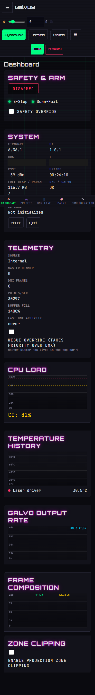

# Chapter 4 — UI Guide

The GalvOS WebUI is a single-page application served directly from the ESP32's LittleFS flash. No internet connection required, no app to install — open a browser and go.

## Table of Contents

- [Accessing the WebUI](#accessing-the-webui)
- [Installing as a PWA](#installing-as-a-pwa)
- [General Layout](#general-layout)
- [Themes](#themes)
- [Tab: Dashboard](#tab-dashboard)
- [Tab: Presets](#tab-presets)
- [Tab: Preset Manager](#tab-preset-manager)
- [Tab: DMX Live](#tab-dmx-live)
- [Tab: Text](#tab-text)
- [Tab: Paint](#tab-paint)
- [Tab: ILDA / SD](#tab-ilda--sd)
- [Tab: Calibration](#tab-calibration)
- [Tab: Optimizer](#tab-optimizer)
- [Tab: Projection](#tab-projection)
- [Tab: Thermal](#tab-thermal)
- [Tab: Log](#tab-log)
- [Tab: Configuration](#tab-configuration)

> **A note on screenshots:** captured live from a running device (firmware v6.36.1 / UI v1.0.1) via `scripts/capture_screenshots.py`, which also redacts IP/hostname/credential fields before saving. Re-run it after UI changes to keep this chapter current.

---

## Accessing the WebUI

On first boot, GalvOS starts in Wi-Fi Access Point mode:

- **SSID:** `galvOS`
- **Password:** none (open network)
- **IP address:** `192.168.4.1`

Open `http://192.168.4.1` in any browser. Once you configure a Wi-Fi network in the Configuration tab and restart, GalvOS connects to your network and is available at the assigned DHCP address — or at `http://galvOS.local` on networks that support mDNS.

> **Tip:** The IP address is always shown on the Dashboard tab under System → IP Address.

---

## Installing as a PWA

GalvOS ships as a Progressive Web App (PWA). This means you can install it on your device's home screen and launch it like a native app — no browser chrome, full screen, offline-capable UI.

**On Android (Chrome):**

1. Open the WebUI in Chrome.
2. Tap the three-dot menu → "Add to Home screen".
3. Confirm. The app icon appears on your home screen.

**On iOS (Safari):**

1. Open the WebUI in Safari.
2. Tap the Share button (box with arrow) → "Add to Home Screen".
3. Confirm.

**On Desktop (Chrome/Edge):**

1. Look for the install icon in the address bar (a small computer with a download arrow).
2. Click it and confirm.

---

## General Layout

Since the v6.32.0 rewrite, the UI is a responsive shell around 13 tabs: a **collapsible sidebar** for tab navigation on desktop, a **bottom tab bar** on mobile, and a **content area** in the middle. All tabs are accessible at any time — switching tabs does not stop the laser or change the active pattern.

The **top bar** stays pinned while you scroll (properly so since v6.33.0) and carries the controls that must never be more than one glance away:

- **ARM / DISARM** — the laser arm control lives here, on its own always-visible row. Since v6.34.0 it is guaranteed on screen at every viewport width from 320 px up — it previously vanished on phones, which is exactly the wrong control to lose on the device you're most likely holding during a show.
- **Master Dimmer** — global brightness as a top-bar chip (moved out of the Dashboard in v6.33.0), visible even on the narrowest mobile layout.
- **Status dots** — beam, E-Stop, scan-fail, sequencer beat, and Wi-Fi state, each with proper `role=status`/`aria-label` for screen readers (v6.34.0).
- The **safety banner** (shown when an interlock trips) stacks above the top bar instead of fighting it for the same pixels.

The page title shows both version numbers as `FW: x.y.z - UI:X.Y.Z` — since v6.35.0 the WebUI carries its own version (`UI_VERSION`), independent of the firmware, so "which UI build am I actually looking at" has an answer.

Touch targets (small buttons, checkbox/radio rows) meet the 44×44 px minimum for live/mobile control since v6.34.0.

---

## Themes

The WebUI ships **three switchable themes** (v6.32.0, consolidated from the earlier v6.17.0/v6.20.1 theme experiments), driven by a CSS custom-property token engine:

- **Cyberpunk / Glitch** (default) — neon glow, scanline decor, chromatic-aberration accents. The classic GalvOS look, turned up.
- **Terminal CLI** — pure black, zero border radius, box-drawing card headers. For people who think a laser controller should look like `htop`.
- **Minimalist Dark** — no glow, no decor, just controls. The theme you switch to when someone serious is watching.

Pick a theme via the theme buttons in the navigation. The choice persists in the browser's localStorage and is applied by an inline boot script before first paint — no flash of the wrong theme on reload. Colors that encode real meaning (sensor chart lines, log severity, laser color swatches) are deliberately identical across all themes.

---

## Tab: Dashboard

The Dashboard is the home screen and the first thing you see on load. Since the v6.33.0 reorg it is **status and monitoring only** — everything you *operate* (Preset Grid, Modulators, Color Override, Sequencer transport, BPM Clock, Countdown Timer) lives on the [Presets tab](#tab-presets), and ARM/DISARM plus Master Dimmer live in the always-visible top bar. Since v6.35.0 the top row holds Safety & Arm, System, and Telemetry side by side.

### Safety & Arm Card

Shows the state of the hardware safety interlocks:

- **ARM pill** — current armed state at a glance (the actual ARM/DISARM buttons are in the top bar).
- **E-Stop** — green LED: E-Stop circuit is closed (not pressed), system can arm. Red: E-Stop is active, laser cannot arm.
- **Scan-Fail HW** — green LED: the NE555 scan-fail circuit is detecting DAC activity. Red: scan-fail triggered (galvo has stopped or firmware hung).
- **Fault reason** — if the system refused to arm, a text line appears here explaining which condition failed. This reads from the RTC memory value that survives restarts.
- **Safety Override checkbox** — mirrored with the Configuration tab's own checkbox (v6.33.0), so you don't have to leave the Dashboard to toggle it (you still shouldn't toggle it casually — see [Configuration → Safety](#safety-configuration)).

### Telemetry Card

Live readouts updated every second:

- **Source** — which control input is currently driving the output: `WebUI`, `DMX`, `Art-Net`, `Ether Dream`, `Helios`, `sACN`, `OSC`, or `Internal` (preset).
- **Master Dimmer** — effective master brightness (0–255), combining DMX CH1 and the WebUI override.
- **DMX Frames** — running count of DMX frames received. Useful to confirm DMX signal is arriving.
- **Galvo Rate** — current output rate in points-per-second with a visual bar. The bar fills relative to the configured `galvo_kpps` maximum.
- **Buffer fill level** — how full the DAC output ring buffer is. Sustained overflows cause flicker and are visible as "Ring buffer overflow" in the log.
- **Last DMX activity** — time since the last DMX frame arrived. Goes red if DMX signal is lost.
- **WebUI Override checkbox** — makes the WebUI take priority over DMX/Art-Net (the send-side wiring for this control was actually missing until the v6.32.0 rewrite closed the gap).

### CPU Load Graph

A scrolling 60-second graph of both core loads:

- **Core 0 (cyan)** — handles Wi-Fi, WebUI HTTP, Art-Net, DMX, safety. Typically 10–40% under normal use.
- Warning lines at 70% (yellow dashed) and 90% (red dashed) mark potential overload on Core 0.

### Temperature History Chart

A colour-coded scrolling chart of all DS18B20 sensor readings:

- 🔴 Laser diode module
- 🟠 Driver board
- 🟡 Galvo board
- 🟢 PSU
- 🔵 Ambient / chassis

Current temperatures are shown as a row of badges below the chart. Sensors that report as not connected are simply skipped (v6.33.0) instead of drawing a dead flatline and a "Not connected" badge.

### Galvo Output Rate

A scrolling 5-minute history of the actual DAC output rate in kpps (points-per-second). This is the real-time equivalent of the "Galvo Rate" bar in the Telemetry card, plotted over time so you can spot dips or instability instead of just the instantaneous value. Compare against the configured `galvo_kpps` (Tab: Projection) to confirm the output stays at the expected rate under load.

### Frame Composition Chart

Shows how each rendered frame's points split between **Lit** (green) and **Blank** (orange) against the **Total** point count (grey) over the same 5-minute window. A high blank-to-lit ratio usually means the optimizer is spending a lot of the frame budget on travel/jump moves between shapes rather than visible content — useful when tuning optimizer profiles (Tab: Optimizer) or diagnosing why a complex pattern looks dim or flickery.

### Zone Clipping Card

A one-checkbox quick toggle for projection zone clipping — the full zone editor (polygon, outline projection) stays on the [Calibration tab](#tab-calibration). Handy for flipping the safety fence on/off without leaving the Dashboard.

### System Card

System information in a compact multi-column field grid (v6.35.0): firmware version, **UI version** (independent of firmware since v6.35.0), hostname, IP address, Wi-Fi signal strength (RSSI), uptime, free heap (internal DRAM), free PSRAM, NTP time, and DAC/galvo status. The **SD card status plus Mount/Eject controls** were folded into this card in v6.33.0 (they previously had their own card; the full SD toolset lives on the [ILDA / SD tab](#tab-ilda--sd)). The API auth token moved to the **Access Credentials** card on the Configuration tab.

> **Note:** the per-interface activity LED card ("Control Interfaces", added v6.08.0) did not survive the v6.32.0 rewrite — interface enable/disable and debug logging live on the Configuration tab ([Control Interfaces](#control-interfaces)), and per-interface activity is still reported by the API (`/api/state` → `etherdream_connected`, `osc_active`, …).

---

## Tab: Presets

Since the v6.26.0/v6.33.0 reorgs, the Presets tab is the **complete performance control surface** — everything you touch during a show lives here. It is laid out as a wide main column (Global Controls, Color Animations, Preset Grid, Community Presets, Sequencer) plus a right-hand sidebar (BPM Clock, Countdown Timer, Parameter Modulators, Bindings).

### Global Controls

A card that applies to every active preset in real time. Changes take effect immediately without reloading the pattern. Defaults and ranges got a sanity pass in v6.36.0 — sliders now start neutral and their travel matches what the firmware actually does.

**Speed / Size / Autoscale / Rotation:**

- **Speed** — pattern animation speed (0–255, default 0 = static since v6.36.0). Meaning varies by preset: step increment, phase advance, or oscillation rate.
- **Size** — scales the pattern output (0–255). 255 = full scan range. Reduce to shrink the image. For Starfield, Size instead requests a star count — the readout shows the actual rendered count (`starfield_stars` in `/api/state`), which can be lower than requested if the Particles optimizer profile's `max_pts_per_frame` budget caps it first.
- **Autoscale Speed / Mode** — oscillates size at the set rate (default 0 = off). Modes: Off, Fit, Fill.
- **Rotation** — static rotation offset (0–359°).
- **Wave Amplitude** (0.1–2.0×) / **Wave Frequency** (0.25–4.0×) — only meaningful for Waves-category presets (moved into Global Controls in v6.25.0).
- Some presets reveal **extra parameter rows** when active (e.g. Fireworks: Trail/Endless/Duration; Spiral: Arms; Spiderweb: Rings/Sides; Starburst: Rays; Matrix Rain: Dots/Tilt).

**Auto-Rotation:**

- **Master enable** plus per-axis **X / Y / Z** checkboxes — pick which axes spin.
- **Rotation Speed** — one shared speed slider for all enabled axes, −0.5 to +0.5 (v6.36.0; the previous ±10 range was radians-per-frame in disguise — 0.3 already meant more than a full revolution per second, so 99% of the slider was a centrifuge).

**Kaleidoscope & Mirror:**

- **Kaleidoscope** — replicates the pattern into N rotationally symmetric segments (2–8, default 3 since v6.36.0 — 8 already looks fully kaleidoscopic, higher counts just wasted slider travel). Mirror H and Mirror V options alternate between original and mirrored copies of each segment.
- **Mirror** — simpler reflection: Off, X (horizontal flip), Y (vertical flip), Radial4 (4-fold copy without reflection).

**Color:**

- **Color wheel** — click or drag to select hue and saturation (properly round again since v6.34.0, even on narrow screens), with a brightness slider next to it.
- **Hex input** — type a hex color code directly (`#ffc96e` etc.).
- **Quick color buttons** — one-tap access to R, G, B, Magenta, Yellow, Cyan, White.

**Points-Only Mode:**
Converts any preset into a dot-cloud: instead of drawing connected lines, the optimizer samples points from the pattern and dwells on each one as a lit dot.

- **Enabled** — on/off.
- **Point Count** — number of dots (2–50, default 12 since v6.36.0; the slider used to run to 200 while the firmware silently clamped at 80 — both now agree on 50).
- **Fade In / Fade Out** — enable smooth brightness ramp at each dot, with configurable duration (0–5000 ms).
- **Fade Direction** — controls the order in which points fade: Inside→Outside, Outside→Inside, Left→Right, Right→Left, Top→Bottom, Bottom→Top.
- **Static Mode** — disables fading entirely; all dots at full brightness.
- The **Dotter** module (v6.31.0) can scatter these dots via a modulator binding on the `DOT_SPREAD` target — see [Parameter Modulators & Bindings](#parameter-modulators--bindings-sidebar).

**↺ Reset all** — resets all Global Controls sliders to their defaults without changing the active preset.

### Color Animations

Its own full-width card directly below Global Controls. Seven animation modes applied on top of any color override, laid out as a type selector (left), the active mode's panel (middle — color sequence grid or swatches), and speed/direction/actions (right):

- **Gradient** — smooth color cycle through a selected sequence. Choose a sequence (0–9) and set direction and speed.
- **Chase** — one color at a time, cycling through a sequence.
- **Strobe** — rapid on/off at the set speed in the selected color.
- **Pulse** — sine-wave brightness oscillation in the selected color.
- **Twinkle** — random brightness spikes; simulates a glitter/spark effect.
- **Color Flip** — hard cuts between R, G, B, W at the set speed.
- **Segment** — divides the pattern's points into segments, each painted a different color from the selected palette. Segment count and direction are adjustable.
- **⏹ Stop Animation** — stops any running color animation and returns to the last static color.
- **↺ Reset Colors** — clears any color override and returns to the preset's built-in color. Use this if colors appear washed out after a color animation.

Since v6.36.0 the speed slider defaults to 1 — the lowest visible speed — instead of mid-speed. Note that speed 0 does **not** mean "paused": the animation phase always advances by a small fixed floor, so a near-zero setting reads as "slow", not "stuck".

### Preset Grid

The main preset library, fetched from `/api/presets` on tab load. Each preset is shown as a tile with an SVG thumbnail and name. Waves and 3D presets live here too — they're just categories in the same grid, not separate cards. Since v6.36.0 each tile also carries a small per-category glyph that draws itself in on hover — a purely cosmetic flourish, but a satisfying one.

- **Category filters** — buttons above the grid filter by category (Geometry, Waves, 3D, Scenes, etc.). Click to toggle. Multiple categories can be active simultaneously.
- **Click a preset** — activates it immediately. The active preset name is shown in the Global Controls header.
- **⏹ Off** — stops the current preset (laser off).
- **↺ Reset all** — resets all Global Controls sliders to their defaults without changing the active preset.
- Waves presets pick up their **Amplitude** / **Frequency ×** from Global Controls Column 1. 3D presets use the **Auto-Rotation** controls in Column 2 for movement — rotation is not built into each preset, enable Auto-Rotation in Global Controls to spin them.

### Community Presets

A full-width card directly below the Preset Grid, showing every community preset stored on the device, each tile marked with a **COMMUNITY** badge.

- **Click a tile** — activates the preset: applies its playback params (built-in preset, color, speed, size) and layers its optimizer tuning on top of the live optimizer config. The active preset name shows as "Name (Community)".
- **＋ Browse / Manage** — jumps to the Preset Manager tab.
- If nothing is stored yet, the card tells you to go browse in the Preset Manager tab. It's not wrong.

### Sequencer

Added in v6.22.0 — a BPM-synced preset playlist, directly below Community Presets. Build a list of steps (preset + duration in beats + optional transition), and the sequencer walks them in time with the [BPM Clock](#bpm-clock-sidebar):

- **Step editor** — each step has a preset, a duration (1/2/4/8/16/32 beats), an optional **transition** (beats of blanked output before the next step — the beam goes dark, but colors/rotation/modulators keep animating underneath, so nothing freezes), and an enable checkbox.
- **Transport** — status pill, a beat-flash dot, and Prev / Start / Stop / Next buttons. Start jumps to step 0; Prev/Next are hard cuts that ignore beat timing.
- **Loop** — repeat the playlist indefinitely, or stop after the last step.
- The playlist persists on the device — but playback **never auto-starts on boot**, by design. A Class 4 laser that resumes its show when the power comes back is nobody's idea of a feature.

### BPM Clock (sidebar)

Added in v6.21.0 — the global tempo everything beat-synced (Sequencer, Modulators) runs on. Three sources with fixed priority **DMX > Tap > Manual**:

- **Manual** — type a BPM (20–300).
- **TAP** — a big, satisfying tap-tempo button; tap along at least twice and the clock follows (resets after a 3 s pause). Actually works since v6.25.1 — before that, the tap route was silently swallowed by its own sibling endpoint and the BPM display just sat there judging you.
- **DMX** — a configurable absolute DMX channel (default 237) drives the tempo; set the channel under Configuration → DMX BPM Source. Only active while a DMX/Art-Net signal is actually present.

The source pill shows which input currently owns the clock.

### Countdown Timer (sidebar)

Set hours/minutes/seconds, then Start/Pause/Stop. On expiry: do nothing, show a text message (Text mode), or play an ILDA file.

### Parameter Modulators & Bindings (sidebar)

Added in v6.23.0 — the animation engine that makes patterns *move on their own*. Up to **8 modulator slots**, each generating a continuous control signal, routed to live pattern parameters through up to **16 bindings**. The sidebar cards are collapsible and reorderable (v6.27.0), and modulator slots follow an add-on-demand pattern (v6.33.0): only slots in use are rendered, with an **+ Add Modulator** button revealing the next free one.

**Modulator types:**

- **Oscillator** — Sine, Triangle, Square, or Saw wave. Triangle/Square gain a Slope/Shape control (square duty cycle, saw↔triangle↔ramp morph) since v6.27.0.
- **Noise** — smooth random wander, with a persisted seed so a slot's curve survives reboots instead of reinventing itself.
- **Envelope** — externally triggered ramp. Either the classic Attack/Sustain/Release, or (since v6.27.0) a multi-point breakpoint curve: up to 8 points, 6 curve types, One-Shot/Loop/Ping-Pong/Trigger modes.
- **Step Sequencer** — up to 16 hand-set values stepped through in time.

Each slot is BPM-synced (whole note down to sixteenth) or free-running in Hz, with level, phase offset, and a name.

**Bindings** route a modulator onto a target parameter with **depth** and **offset**. Built-in targets: transform scale X/Y, shift X/Y, rotation, color hue/saturation/brightness, animation speed, and point density. Self-registering firmware modules add more (the dropdown picks them up automatically from the device):

- **Camera** (v6.28.0) — yaw/pitch/roll/dolly/FOV on the five 3D wireframe presets (Cube, Pyramid, Octahedron, Tetrahedron & Co.), including an optional perspective divide. All neutral by default — nothing moves until you bind something.
- **Duplicator** (v6.29.1) — clone the frame N times in a grid, radial, or spiral arrangement, with per-copy offset/angle/scale.
- **Spatial Noise** (v6.30.0) — a 2D value-noise modulator *type* for organic, hand-drawn-looking wobble.
- **Dotter** (v6.31.0) — scatter Points-Only-Mode dots (`DOT_SPREAD`), deterministic per dot so the cloud breathes instead of shimmering.

Modulators currently act on Preset-mode rendering; Text/Paint/ILDA output is not modulated. Slider changes apply instantly but are written to flash lazily (400 ms idle debounce, v6.24.3/v6.29.1) — dragging a depth slider no longer flash-writes the device into a sulk.

---

## Tab: Preset Manager

Home of the Community Presets feature: preset bundles hosted in the GalvOS GitHub repo, downloadable straight from the WebUI. Each bundle is a single JSON that carries a full optimizer tuning (same fields as the Optimizer tab) plus playback params (which built-in preset to run, color, speed, size) — someone else's 2 AM slider-tweaking session, packaged for your device.

### GitHub Browser

- **⟳ Browse GitHub** — fetches the community preset index from `raw.githubusercontent.com` and shows each entry as a card with name, author, description, and tags. Your **browser** does the fetching — the firmware never talks to GitHub itself, so this works even though the ESP32 has no internet-facing ambitions.
- **Download** — the browser downloads the preset JSON and POSTs it to the device, where it is validated against the schema and written to LittleFS. It then appears under Presets → Community Presets and in the Local Manager below.

> **Note:** Browsing requires the device you're viewing the WebUI on (phone/desktop) to have internet access. The ESP32 itself does not need any.

### Local Manager

A table of every community preset stored on the device (Name, Author, Size):

- **✎ Rename** — edits the display name in place (Enter or ✓ to confirm). The id and filename stay unchanged.
- **🗑** — deletes a single preset (with confirmation).
- **Checkboxes + 🗑 Delete selected** — bulk delete.
- **⟳ Refresh** — reloads the list from the device.

### Storage Monitor

A usage bar showing LittleFS storage: preset count and used/total space. Each preset is capped at 10 KB and the device stores at most **20 community presets** (since v6.07.6; updating an existing one doesn't count against the limit), so filling this up would take genuine dedication.

> **Note:** Activating a community preset applies its optimizer tuning as a session-only override — it is not persisted. Selecting another preset or rebooting returns to the built-in optimizer profile for that preset class.

Want to publish your own? See [Contributing a Community Preset](09-contributing.md#contributing-a-community-preset).

---

## Tab: DMX Live

Provides a software DMX console — 25 sliders corresponding to GalvOS's 25 DMX channels.

- **WebUI override toggle** — when enabled, the slider values are sent directly to the pattern engine, overriding any incoming hardware DMX signal. When disabled, the sliders display the last received DMX values (read-only view).
- **Reset all channels** — returns all sliders to their off/default state.
- **Test: Red circle** / **Test: Rainbow** — quick preset buttons that set a combination of channels to show a test pattern.

Full channel map: see [Chapter 3 — Build & Configuration → RuntimeConfig → DMX/Art-Net](03-build-and-config.md).

---

## Tab: Text

Projects laser text. Text mode overrides any active preset and DMX input while active.

- **Text input** — supports uppercase A–Z, digits 0–9, and `.,:!?-+`. Maximum 127 characters. Up to 16 characters display statically; longer text scrolls automatically.
- **Font** — Simple (thin strokes, fastest), Bold (thick strokes), Outline (double-line).
- **Animation** — Static, Scroll Left/Right, Bounce, Typewriter, Wave, Pulse, Rotate, Zoom, Orbit, Star Wars Scroll. All animation bugs from earlier releases were fixed in v6.05.7 — see [Known Issues](10-known-issues-and-todos.md#text-mode-issues) for the (now historical) details.
- **Live toggle** — when on, text updates are sent to the laser as you type. Turn off if you want to compose text before displaying it.
- **Speed / Size** — animation speed and text size.
- **Color / Rainbow** — fixed color via color picker, or rainbow cycling across characters.
- **Flip X / Flip Y** — mirror the text output horizontally or vertically.
- **🔄 Reverse Spin (Orbit)** — added in v6.05.7. Flips the Orbit animation's rotation direction; has no effect on other animations.
- **▶ Show text / ⏹ Stop** — activate or deactivate text mode. Leaving the text field empty and hitting Show now falls back to `GALVOS` instead of doing nothing (v6.05.7).

---

## Tab: Paint

A freehand drawing canvas that projects directly onto the laser.

- **Draw mode** — finger or mouse draws freehand strokes on the canvas.
- **Shape tools** — add rectangles, triangles, or circles as closed polygons.
- **Mirror brush** — mirror the current stroke across X, Y, or both axes while drawing.
- **Color picker** — set the color for the next stroke.
- **Clear** — erase all strokes.
- **Project** — sends the current canvas to the laser. The projector renders the strokes as a vector point cloud.

Since v5.89.19, the canvas is scaled to match your configured **projection zone** (fetched from `/api/zone` on load, falling back to the ±24000 default range if no zone is enabled), with the zone outline drawn as a dashed guide — so strokes drawn near the canvas edge no longer get clipped by zone blanking. **Limitations:** Maximum 12 strokes, 96 vertices per stroke.

---

## Tab: ILDA / SD

ILDA file playback from an SD card. Since v6.11.0 this tab is the single home for everything SD/ILDA — the former standalone Playlist tab moved in here.

### SD Card

- **File list** — lists `.ild` files found on the SD card (up to 40 files), including **subfolders** (v6.10.0; folder prefixes are highlighted so `Fancy Show 295/opener.ild` reads at a glance) with per-file size and date. Each entry has a ▶ Play button; while a big file loads, the row shows a **Loading… → Done** indicator instead of playing dead (v6.11.0).
- **Oversized files are grayed out** (v6.12.0) — the firmware estimates the worst-case PSRAM cost per file before you play it and disables Play for files that would blow the budget, with the reason on hover. Better a gray row than a watchdog reset mid-show.
- **Rescan / Refresh / Mount / Eject** — full SD control right in the tab. Since v6.14.0 the card **auto-mounts on a standing 5-second retry** — insert a card whenever you like and it gets picked up; you no longer have to catch a one-shot mount window at boot. An intentional Eject disables the watcher (so the card isn't re-mounted behind your back) until you press Mount again.

### ILDA Player

- **Enabled** — master switch (v6.10.1); disabling force-stops playback and ignores both WebUI and DMX file-select until re-enabled.
- **Now playing + progress bar** — file name and frame progress, live.
- **Speed / Size** — apply live to the running file via `/api/ilda/param` (they genuinely do things since v6.14.0 — the slider handler had been calling a function that didn't exist since day one).
- **Loop / Color Override / Invert X / Invert Y** — loop mode, a live color picker override, and per-axis mirroring (v6.14.0).
- **Stop / Pause / Resume** — transport controls.
- ILDA frames get only a light optimizer touch (v6.13.0): the live affine transform (your position/size/rotation) and a velocity clamp so a wild point jump baked into someone else's `.ild` can't blindside a low `galvo_kpps` setting. Resample, corner dwell, and blanking stay hands-off — the file's author already made those calls.

### Show Playlist

Sequential playback of multiple ILDA files (moved here from its own tab in v6.11.0): Start/Stop controls; entries are read from `/playlist.json` on the SD card, with per-entry loop count and pause duration (see [Chapter 8 — Playlist](08-api-reference.md#playlist)).

### ILDA Upload

Upload `.ild`/`.ilda` files to the SD card straight from the browser. Filenames are sanitized and length-capped server-side (v6.12.2/v6.12.3) — long names survive up to FAT's real 255-character limit, and hostile ones can't traverse directories or corrupt the index.

---

## Tab: Calibration

The calibration workflow covers four areas: color/gamma calibration, galvo geometry calibration, projection zone setup, and the ILDA standard test pattern.

### Color & Gamma Calibration (left card)

A list of calibration patterns to project while adjusting parameters. Select a pattern to activate it; press ⏹ Stop to return to normal operation. Pattern descriptions:

| Pattern | Purpose |
| --- | --- |
| White fill | Full-white output — for overall brightness assessment |
| Red / Green / Blue fill | Single-channel output — for per-channel threshold calibration |
| Three Circles | One solid R, G, B circle side by side — for white balance matching |
| Crosshair | Geometric reference for offset and gain calibration |
| Grid | Linearity check across the full scan range |
| DAC Range Box | Corner-to-corner rectangle at full DAC range — for DAC limit calibration |
| ILDA Test Pattern | Official ILDA 1995 test pattern — for galvo driver tuning |

### Galvo Calibration (right card)

Live geometry adjustments, sent to the hardware on every slider change:

- **X/Y Offset** — center the output image. Adjust until the crosshair pattern is centered on the projection surface.
- **X/Y Gain** — scale the image. The "Linked" button keeps X and Y gain equal (maintains aspect ratio).
- **Swap X/Y** — swap the X and Y galvo channels if they are wired in reverse.
- **Invert X / Invert Y** — mirror the output along either axis.
- **DAC limit min/max** — restrict the DAC output range to keep the OPA4134 output within the galvo's ±5V input rating. Default: 0x0666..0xF999.

Press **💾 Save calibration** to persist all values to NVS.

### Parameter Card (visibility threshold & white balance)

**Visibility threshold (base value):**

Each laser diode has a minimum PWM duty below which it emits no visible light — the dead zone. The threshold calibration finds this minimum so GalvOS can map 0–100% logical brightness onto the actually visible range.

Procedure:

1. Press **▶ Start test beam** — a static low-level beam activates on each channel, bypassing gain, gamma, and master dimmer so only the threshold sliders control it.
2. For each color channel, lower the slider until that color just goes dark. The value at which it disappears is the threshold.
3. Press **💾 Save thresholds**.

**Color channel brightness matching (White Balance):**

1. Press **▶ Start the Three Circle Pattern** — three solid circles (R, G, B) appear side by side.
2. Adjust Gain R / G / B until all three circles appear equally bright to the eye.
3. Alternatively, press **🪄 Auto White Balance** — the firmware calculates gains from the configured laser power values and applies them automatically.
4. Press **💾 Save calibration**.

**CIE 1931 Gamma:**
Toggles perceptual brightness correction. When enabled (default), the firmware applies a γ≈2.2 transfer curve so equal numerical steps in brightness look equal to human perception. Disable only if you need linear 0–255 output for a specific application.

### Projection Zone

An interactive canvas for defining a clipping polygon — the area the laser is allowed to scan. Lit points outside the polygon are blanked (laser off, mirror position retained).

- **Drag vertices** to shape the zone.
- **Tap an edge** to add a new vertex.
- **Double-tap a vertex** to remove it (minimum 3 vertices).
- **Project Outline** — projects the zone boundary onto the screen so you can verify it matches your safe scan area.
- **⬛ Enable Clipping** — activates zone clipping. Only enable after verifying the outline is correct.
- **Save Zone / Reset to Rectangle** — save or discard changes.

> **Known issue:** The ILDA test pattern currently has incorrect output. See [Known Issues](10-known-issues-and-todos.md).

### Camera-in-the-Loop Auto-Tuning (calib-cam)

Since firmware v6.03.0, there is a second calibration path that doesn't live in this tab at all: the `/api/calib-cam/*` REST API, driven by a companion host-side Python tool (`scripts/optimizeGalvo/optimizeGalvo.py`) using a mono/global-shutter USB camera. It projects dedicated reference patterns, measures them with the camera, and runs an automated Optuna search over optimizer scan/dwell parameters — the manual "tune a slider, look at the beam, repeat" loop, done in software instead.

This does **not** replace the Galvo Calibration card above (offset/gain/swap/invert are still manual) — it auto-tunes the *optimizer* profiles (Vector, Smooth, Waves, MultiObject) against camera-measured beam quality. See [Chapter 6 — Camera-in-the-Loop Auto-Tuning](06-camera-autotuning.md) for the full setup and workflow.

---

## Tab: Optimizer

Per-preset-class optimizer profile management. See [Chapter 5 — The Optimizer](05-optimizer.md) for a full explanation of what each parameter does.

### Profile Selector

Six optimizer profiles, one per preset class:

| Profile | Preset class | Scanner workload |
| --- | --- | --- |

| Vector | Closed polygons, straight runs | Corner dwell |
| Smooth | Continuous closed curves | Interior density |
| Waves | Open polylines, high frequency | Velocity clamp |
| Wireframe | 3D edge chains | Corner dwell + short jumps |
| MultiObject | Several closed objects | Long blank jumps |
| Particles | Isolated dots | Blank jumps only |

The active profile switches automatically when a preset is activated. You can also select a profile manually to edit it.

### Smart Defaults Button

**⚙ Smart defaults** — computes recommended parameter values from `opt_max_pts_per_frame` and `galvo_kpps` and applies them to the current profile. A good starting point after changing galvo hardware or kpps setting.

### Parameter Sliders

All sliders update the active profile live and show their **effective values** (`opt_eff_*`) after PPS scaling. The effective values are what the optimizer actually uses — they may differ from the raw slider values when `galvo_kpps` differs from `galvo_rated_kpps`.

Since v6.30.0 the settings include a **Jitter** group (Point Distribution Modifier): deterministic perpendicular displacement of interior points (`jitter_enabled` / `jitter_amount_units`), for a hand-drawn line texture instead of laser-perfect edges. Persisted, backed up, and honored by community presets like every other optimizer field.

See [Chapter 5 — The Optimizer → Parameter Reference](05-optimizer.md#parameter-reference) for a full table of all parameters.

---

## Tab: Projection

Hardware configuration for the galvo scanner and laser module.

### Galvo Sample Rate Card

- **Galvo rated speed** — set this to your galvo's datasheet kpps rating (Jolooyo JY-15K-BL = 15 kpps). This is the reference for PPS scaling in the optimizer.
- **Output Sample Rate slider** — `galvo_kpps`: the actual ISR tick rate (12–60 kpps). **This is the most important hardware parameter.** Start at your galvo's rated speed and only increase if the hardware handles it without distortion.
- Warning box — appears if the selected rate exceeds what is safe for the configured scan angle.
- **Autotune** — binary search for the highest kpps that avoids ring buffer overflow. Start a real pattern before running this for a meaningful result.
- **Period readout** — shows the calculated µs per DAC sample at the current rate.
- **💾 Apply & Save** — writes kpps and rated_kpps to NVS.

### Angular Configuration Card

Physical angles of the galvo and housing setup — used for the projection geometry calculator and safety assessment:

- **Mechanical Half-Angle** — galvo mirror maximum deflection (±°).
- **Housing Exit Half-Angle** — actual beam exit limit (typically smaller than galvo limit).
- **ILDA Rating Half-Angle** — standard ±8°; only change if your galvo's datasheet specifies a different rating angle.

### Laser Module Power Card

Laser power in mW per channel. Used for white balance auto-calculation and the safety assessment display. Totals shown:

- **Total power** (all channels)
- **Visible power V(λ)** — weighted by eye sensitivity
- **Blue-light hazard B(λ)** — the blue channel (445 nm) has the highest photochemical retinal risk

### Projection Geometry Card

Enter throw distance (0.5–30 m) to calculate projected image dimensions, area, peak irradiance, and points-per-frame budget at 30 fps.

### Safety Assessment Card

A simplified laser hazard summary based on configured power and angles: laser class, total/visible/BLH power, estimated minimum audience distance, NE555 scan-fail status, and rate-vs-angle adequacy.

---

## Tab: Thermal

Fan and temperature management.

- **Temperature thresholds** — configure warn, reduce, and shutdown temperatures (`temp_warn_c`, `temp_reduce_c`, `temp_shutdown_c`).
- **Fan control** — Auto mode (temperature-driven) or manual PWM override per fan.
- **Minimum fan speed** — prevents fans from stalling at low PWM (`fan_min_pct`, default 15%).
- Current sensor readings are also visible in the Dashboard temperature chart.

---

## Tab: Log

Live firmware log output, streamed from the ESP32 over the WebSocket. Auto-refreshes only when this tab is active.

- Log entries are color-coded by severity: INFO (dim), WARN (orange), ERROR (red).
- Use this tab to diagnose startup issues, track DMX frame counts, or watch for ring buffer overflow warnings.
- The log buffer is limited in size — older entries are overwritten.

### Memory Viewer

A second card below the log console, showing who holds the RAM — static/long-lived buffers only, sourced from `/api/meminfo` and refreshed every 3 s while the Log tab is open.

- **Internal SRAM (Heap)** — composition bar plus total, free now, largest free block, and lowest free ever since boot (the value the failsafe reboot threshold is compared against), and the failsafe reboot limit itself.
- **PSRAM** — composition bar plus total, free now, largest free block, and lowest free ever since boot.
- **Tracked Owners** — per-subsystem breakdown of registered static/long-lived allocations (see `mem_registry.h`), so a slow leak or an oversized buffer can be attributed to a specific module.
- **🔄 Refresh** — manual refresh outside the 3 s auto-cycle.

---

## Tab: Configuration

Network, DMX, safety, IP, and debug settings.

### DMX and Art-Net

- **DMX Start Address** (1–512) — first DMX channel GalvOS responds to.
- **Art-Net Universe** (0–32767) — Art-Net universe number.
- **DMX Debug Log** — logs incoming DMX traffic to Serial and the Log tab (v6.16.0; off by default).

### DMX BPM Source

The absolute DMX channel (default 237) that drives the [BPM Clock](#bpm-clock-sidebar)'s DMX source (v6.21.0, moved here from the retired Modulators tab in v6.26.0). Independent of the fixture's own start address.

### Control Interfaces

Per-interface enable/disable, one checkbox per network input (v6.08.0; Art-Net and Ether Dream joined in v6.15.1):

- **Art-Net** (UDP 6454)
- **Ether Dream** (UDP 7654 / TCP 7765)
- **OSC** (UDP 9000) — Open Sound Control 1.0 receiver, `/galvos/*` address space (see [Chapter 8 — Network Control Protocols](08-api-reference.md#network-control-protocols-non-http)).
- **sACN / E1.31** (UDP 5568, universe 1) — streaming-DMX over multicast.
- **Helios network DAC** (TCP 7768) — Helios DAC network emulation for laser software that speaks its point-stream framing.

Disabling an interface makes it ignore received data (reduces CPU load); its listening socket stays open until the next reboot. Each interface also has its own **Debug Log** toggle (v6.16.0) that writes protocol-level traffic to Serial and the Log tab — Ether Dream's is the most talkative, down to raw command bytes, for diagnosing client software that connects and then sulks. Press **Save** to persist.

### WiFi Connection

- Scan for available networks or enter SSID manually.
- Enter password. Hostname (default `galvOS`) sets the mDNS name.
- **NTP Server / Time zone** — time synchronization settings. Use POSIX TZ string format.
- **Connect** — connects without restarting. **Save & Restart** — saves and reboots.

### IP Configuration

- Toggle between DHCP and static IP.
- Enter static IP, gateway, subnet mask, and DNS when static mode is enabled.

### Safety Configuration

- **Safety Override** — bypasses E-Stop and scan-fail checks. Only use with the laser disarmed and no audience. Red warning state clearly shown.
- **⟳ System Reboot** — restarts the ESP32 immediately (confirmation prompt). Use after a config or firmware change that requires a reboot, without needing physical access to the device.
- **⚠ Factory Reset** — clears all NVS config and restarts. Wi-Fi credentials are lost; AP mode restarts.

### Backup & Restore

Added in v6.06.0 — because "I remember my DAC limits" is not a disaster recovery plan.

- **⬇ Download Backup** — downloads a JSON snapshot of galvo calibration, all 8 optimizer profiles, network settings, and system/thermal thresholds. Since v6.07.4 the filename carries the firmware version and a timestamp (`galvos_backup_v6.08.0_2026-07-25-13-19-06.json`) instead of the eternal `galvos_backup.json`, so a folder full of backups actually tells you which is which.
- **⬆ Choose Backup File** — pick a previously downloaded backup. GalvOS does a quick JSON-syntax check in the browser, then enables the **⚠ Restore Settings** button (visible from the start since v6.07.5, just disabled/dimmed until a valid file is picked).
- **⚠ Restore Settings** — asks for confirmation, then uploads the file. The firmware validates every single value against the same bounds the live config endpoints enforce before touching anything — if even one field is out of range, the whole restore is rejected and nothing is applied. On success it persists the config and reboots automatically.
- Restore is blocked while the laser is **armed** — disarm first.
- Not a substitute for the calibration workflow — it restores *previous* known-good values, it doesn't calibrate for you. See [Tab: Calibration](#tab-calibration) if you're setting up a projector for the first time.

### Access Credentials

- **HTTP-OTA Pass** — password for the `/update` OTA endpoint (user `admin`). Masked; hover to reveal.
- **API Token** — current `X-Auth` token required for write access to the HTTP API. Masked; hover to reveal, click to copy. (Moved here from the Dashboard System Card.)

### Debug

- **No-HW Mode** — skips SPI/DAC init at boot. Use only for firmware development without hardware connected. Disable before normal operation.
- **DAC Debug Log** — logs DAC8562 register writes to serial and the Log tab (rate-limited). For low-level DAC debugging only.
- **OTA Update** — firmware update via HTTP at `http://laser/update` (admin / your password).
