# Chapter 4 — UI Guide

*Previous: [Chapter 3 — Build & Configuration](03-build-and-config.md)*

The GalvOS WebUI is a single-page application served directly from the ESP32's LittleFS flash. No internet connection required, no app to install — open a browser and go.

## Table of Contents

- [Accessing the WebUI](#accessing-the-webui)
- [Installing as a PWA](#installing-as-a-pwa)
- [General Layout](#general-layout)
- [Themes](#themes)
- [Tab: Dashboard](#tab-dashboard)
- [Tab: Presets](#tab-presets)
- [Tab: Preset Manager](#tab-preset-manager)
- [Tab: DMX Live](#tab-dmx-live)
- [Tab: Text](#tab-text)
- [Tab: Paint](#tab-paint)
- [Tab: ILDA / SD](#tab-ilda--sd)
- [Tab: Calibration](#tab-calibration)
- [Tab: Optimizer](#tab-optimizer)
- [Tab: Projection](#tab-projection)
- [Tab: Thermal](#tab-thermal)
- [Tab: Log](#tab-log)
- [Tab: Configuration](#tab-configuration)

> **A note on screenshots:** captured live from a running device via `scripts/capture_screenshots.py`, which also redacts IP/hostname/credential fields before saving. The UI is under active development, so individual cards may have moved since a screenshot was taken.

---

## Accessing the WebUI

GalvOS tries to join the configured Wi-Fi network first. If no credentials are stored, or the network does not answer within the connect timeout, it additionally opens its own access point (the STA side keeps retrying in the background, so it will hop onto your network on its own once that comes back):

- **SSID:** `Laser-XXXX` — `XXXX` = the last four hex digits of the chip's MAC address
- **Password:** the next eight hex digits of the same MAC (printed in the serial boot log)
- **IP address:** `192.168.4.1`

Open `http://192.168.4.1` in any browser and configure your network under Configuration → WiFi Connection. Once connected, GalvOS is reachable at its DHCP address — or at `http://galvOS.local` on networks that support mDNS (the hostname is configurable).

> **Tip:** The IP address is always shown on the Dashboard tab under System → IP Address, and in the serial boot log.

A browser-only demo/simulation of the UI runs at [www.galvos.de](https://www.galvos.de).

---

## Installing as a PWA

GalvOS ships as a Progressive Web App (PWA). This means you can install it on your device's home screen and launch it like a native app — no browser chrome, full screen, offline-capable UI.

**On Android (Chrome):**

1. Open the WebUI in Chrome.
2. Tap the three-dot menu → "Add to Home screen".
3. Confirm. The app icon appears on your home screen.

**On iOS (Safari):**

1. Open the WebUI in Safari.
2. Tap the Share button (box with arrow) → "Add to Home Screen".
3. Confirm.

**On Desktop (Chrome/Edge):**

1. Look for the install icon in the address bar (a small computer with a download arrow).
2. Click it and confirm.

---

## General Layout

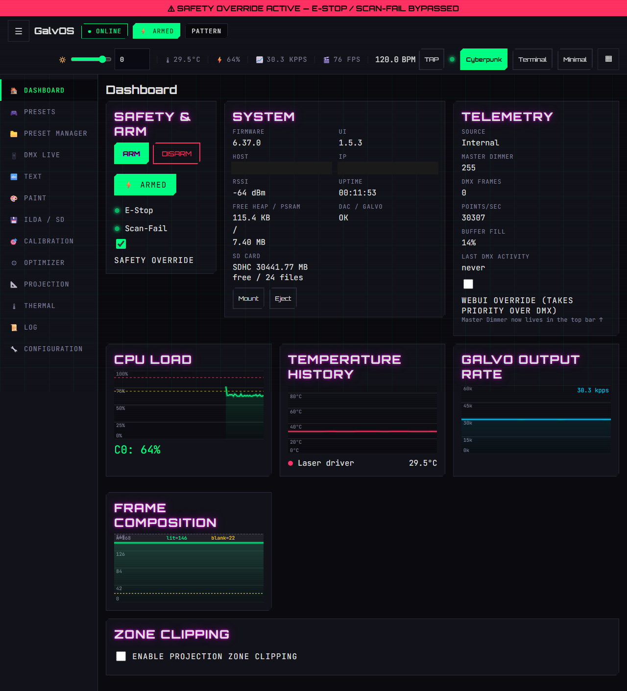

The UI is a responsive shell around 13 tabs: a **collapsible sidebar** for tab navigation on desktop, a **bottom tab bar** on mobile, and a **content area** in the middle. All tabs are accessible at any time — switching tabs does not stop the laser or change the active pattern.

The **top bar** stays pinned while you scroll and carries the controls that must never be more than one glance away:

- **ARM / DISARM** — the laser arm control lives here, on its own always-visible row, guaranteed on screen at every viewport width from 320 px up. It is the one control you must never have to hunt for on the phone you're holding during a show.
- **Master Dimmer** — global brightness as a top-bar chip, visible even on the narrowest mobile layout.
- **Status dots** — beam, E-Stop, scan-fail, sequencer beat, and Wi-Fi state, each with proper `role=status`/`aria-label` for screen readers.
- The **safety banner** (shown when an interlock trips) stacks above the top bar instead of fighting it for the same pixels.

The page title shows both version numbers as `FW: x.y.z - UI:X.Y.Z`. The WebUI carries its own version (`UI_VERSION`), independent of the firmware — flashing only the filesystem changes one and not the other, so "which UI build am I actually looking at" has an answer.

Touch targets (small buttons, checkbox/radio rows) meet the 44×44 px minimum for live/mobile control.

---

## Themes

The WebUI ships **three switchable themes**, driven by a CSS custom-property token engine:

- **Cyberpunk / Glitch** (default) — neon glow, scanline decor, chromatic-aberration accents. The classic GalvOS look, turned up.
- **Terminal CLI** — pure black, zero border radius, box-drawing card headers. For people who think a laser controller should look like `htop`.
- **Minimalist Dark** — no glow, no decor, just controls. The theme you switch to when someone serious is watching.

Pick a theme via the theme buttons in the navigation. The choice persists in the browser's localStorage and is applied by an inline boot script before first paint — no flash of the wrong theme on reload. Colors that encode real meaning (sensor chart lines, log severity, laser color swatches) are deliberately identical across all themes.

---

## Tab: Dashboard

The Dashboard is the home screen and the first thing you see on load. It is **status and monitoring only** — everything you *operate* (Preset Grid, Modulators, Color Override, Sequencer transport, BPM Clock, Countdown Timer) lives on the [Presets tab](#tab-presets), and ARM/DISARM plus Master Dimmer live in the always-visible top bar. The top row holds Safety & Arm, System, and Telemetry side by side.

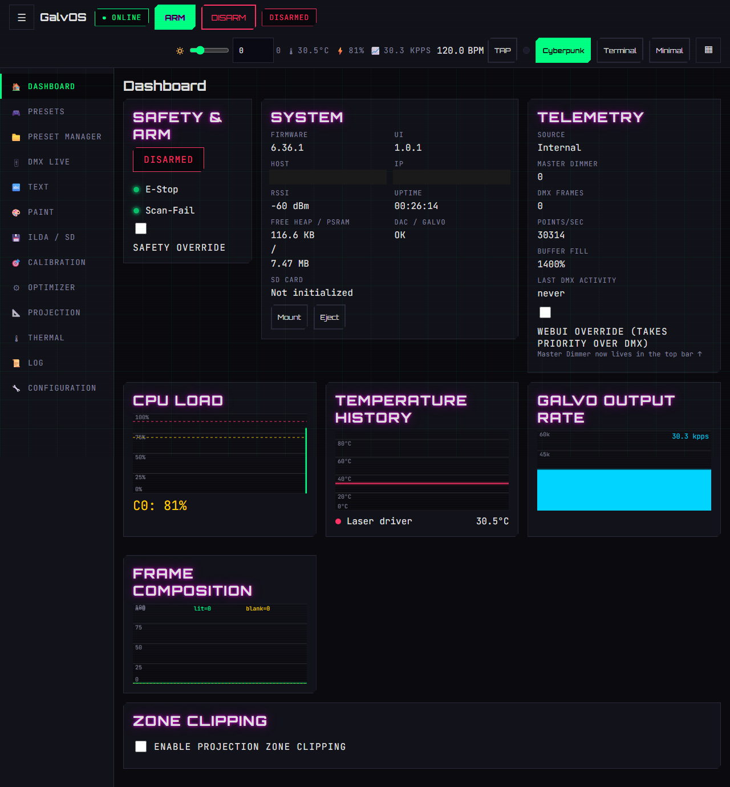

### Safety & Arm Card

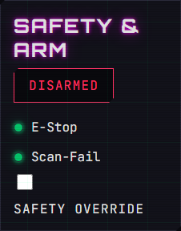

Shows the state of the hardware safety interlocks:

- **ARM pill** — current armed state at a glance (the actual ARM/DISARM buttons are in the top bar).
- **E-Stop** — green LED: E-Stop circuit is closed (not pressed), system can arm. Red: E-Stop is active, laser cannot arm.
- **Scan-Fail HW** — green LED: the NE555 scan-fail circuit is detecting DAC activity. Red: scan-fail triggered (galvo has stopped or firmware hung).
- **Fault reason** — if the system refused to arm, a text line appears here explaining which condition failed. This reads from the RTC memory value that survives restarts.
- **Safety Override checkbox** — mirrored with the Configuration tab's own checkbox, so you don't have to leave the Dashboard to toggle it (you still shouldn't toggle it casually — see [Configuration → Safety](#safety-configuration)).

### Telemetry Card

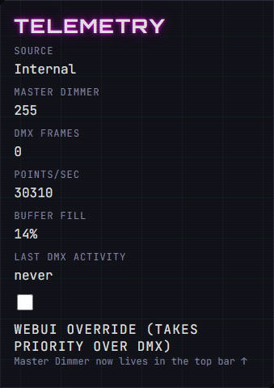

Live readouts updated every second:

- **Source** — which control input is currently driving the output: `WebUI`, `DMX`, `Art-Net`, `Ether Dream`, `Helios`, `sACN`, `OSC`, or `Internal` (preset).
- **Master Dimmer** — effective master brightness (0–255), combining DMX CH1 and the WebUI override.
- **DMX Frames** — running count of DMX frames received. Useful to confirm DMX signal is arriving.
- **Galvo Rate** — current output rate in points-per-second with a visual bar. The bar fills relative to the configured `galvo_kpps` maximum.
- **Buffer fill level** — how full the DAC output ring buffer is. Sustained overflows cause flicker and are visible as "Ring buffer overflow" in the log.
- **Last DMX activity** — time since the last DMX frame arrived. Goes red if DMX signal is lost.
- **WebUI Override checkbox** — makes the WebUI take priority over DMX/Art-Net.

The six charts below sit together in one grid (three columns on a wide screen, collapsing to two then one as the viewport narrows). The four single-metric ones (CPU Load, Galvo Output Rate, Buffer Fill, WiFi Signal) each get a min/avg/max readout under the chart, over whatever span is currently on screen; the two multi-series ones (Temperature, Frame Composition) skip it, since a blended min/avg/max across unrelated series wouldn't mean anything.

### CPU Load Graph

A scrolling 60-second graph of both core loads:

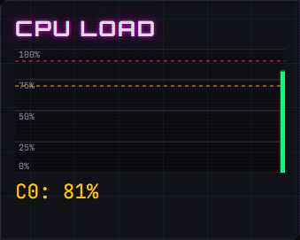

- **Core 0 (cyan)** — handles Wi-Fi, WebUI HTTP, Art-Net, DMX, safety, and the pattern render pipeline. Measured on a reference board at 44 kpps: ~1% with nothing rendering, ~1–2% on a preset served from the pipeline output cache, and ~15–25% on one that regenerates every frame. Sustained readings well above that are worth investigating; the render path's own share can be attributed stage by stage via [`GET /api/tasks`](08-api-reference.md#get-apitasks) → `render`.
- **Core 1 (magenta)** — sits at ~100% permanently and that is correct, not a fault. `galvoTask` busy-waits between DAC ticks to hold the sample clock steady, so the core is never idle by design.
- Warning lines at 70% (yellow dashed) and 90% (red dashed) mark potential overload on Core 0. They do not apply to Core 1.

> **Firmware older than 6.83.0 reported this wrong.** The load figure was derived from a
> baseline captured over the whole boot window, so an idle Core 0 read ~73% and the true
> 0–100% range was squeezed into roughly 73–100%. If you are comparing against numbers
> noted down from an older build, re-measure them rather than trying to convert.

### Temperature History Chart

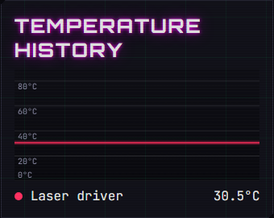

A colour-coded scrolling chart of all DS18B20 sensor readings, plus the ESP32-S3's own internal die temperature (violet):

- 🔴 Laser diode module
- 🟠 Driver board
- 🟡 Galvo board
- 🟢 PSU
- 🔵 Ambient / chassis
- 🟣 ESP32 CPU (internal die sensor, no external probe)

Current temperatures are shown as a row of badges below the chart. Sensors that report as not connected are skipped entirely rather than drawn as a dead flatline; the CPU reading always shows since it needs no external probe. Per-sensor names, calibration offsets, and the display unit (°C/°F/K) are set on the [Thermal tab](#tab-thermal).

### Galvo Output Rate

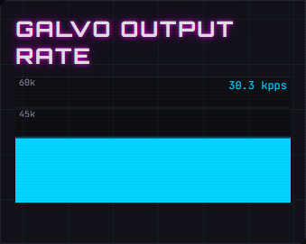

A scrolling 5-minute history of the actual DAC output rate in kpps (points-per-second). This is the real-time equivalent of the "Galvo Rate" bar in the Telemetry card, plotted over time so you can spot dips or instability instead of just the instantaneous value. Compare against the configured `galvo_kpps` (Tab: Projection) to confirm the output stays at the expected rate under load.

### Frame Composition Chart

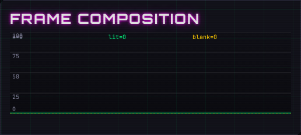

Shows how each rendered frame's points split between **Lit** (green) and **Blank** (orange) against the **Total** point count (grey) over the same 5-minute window. A high blank-to-lit ratio usually means the optimizer is spending a lot of the frame budget on travel/jump moves between shapes rather than visible content — useful when tuning optimizer profiles (Tab: Optimizer) or diagnosing why a complex pattern looks dim or flickery.

### Buffer Fill Chart

A scrolling history of the DAC output ring buffer's fill level (%), the same value shown live in the Telemetry card's buffer-fill readout — plotted over time so a sustained climb toward the warning (80%, yellow dashed) or critical (95%, red dashed) line is visible before it turns into an actual overflow, rather than only after flicker has already started.

### WiFi Signal (RSSI) Chart

A scrolling history of Wi-Fi signal strength in dBm, with green/yellow/red background bands instead of needing to memorize what a given dBm number means — strong (≥ −60 dBm), medium, and weak (≤ −75 dBm). Useful for correlating a controller that drops out of reach with a genuinely weak link versus some other cause (see the gateway-watchdog notes in [Troubleshooting](07-troubleshooting.md)).

### Zone Clipping Card

A one-checkbox quick toggle for projection zone clipping — the full zone editor (polygon, outline projection) stays on the [Calibration tab](#tab-calibration). Handy for flipping the safety fence on/off without leaving the Dashboard.

### System Card

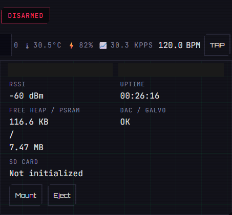

System information in a compact multi-column field grid: firmware version, **UI version** (independent of firmware), hostname, IP address, Wi-Fi signal strength (RSSI), **CPU Temp** (ESP32-S3 internal die sensor), uptime, free heap (internal DRAM), free PSRAM, NTP time, and DAC/galvo status. It also carries the **SD card status plus Mount/Eject controls** — the full SD toolset lives on the [ILDA / SD tab](#tab-ilda--sd). The API auth token is on the **Access Credentials** card of the Configuration tab.

> **Note:** there is no per-interface activity LED card. Interface enable/disable and debug logging live on the Configuration tab ([Control Interfaces](#control-interfaces)); per-interface activity is reported by the API (`/api/state` → `etherdream_connected`, `osc_active`, …).

---

## Tab: Presets

The Presets tab is the **complete performance control surface** — everything you touch during a show lives here. It is laid out as a wide main column (Global Controls, Color Animations, Preset Grid, Community Presets, Sequencer) plus a right-hand sidebar (BPM Clock, Countdown Timer, Parameter Modulators, Bindings).

### Global Controls

A card that applies to every active preset in real time. Changes take effect immediately without reloading the pattern; sliders start neutral, and their travel matches the range the firmware actually acts on.

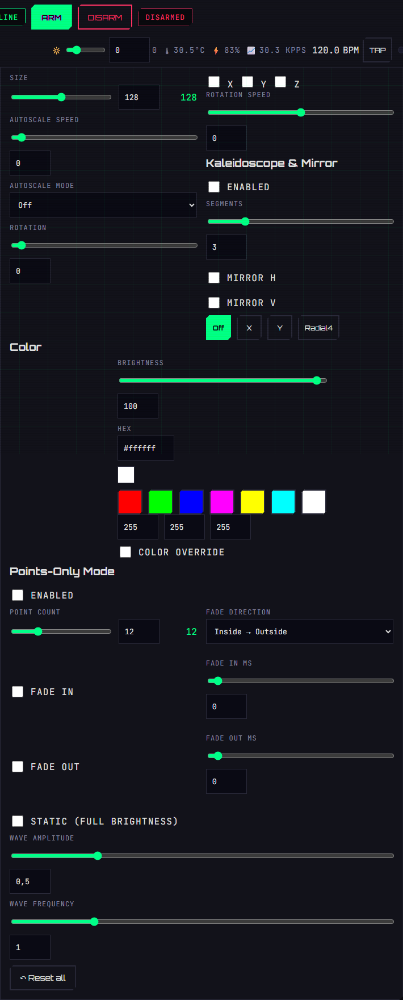

**Speed / Size / Autoscale / Rotation:**

- **Speed** — pattern animation speed (0–255, default 0 = static). Meaning varies by preset: step increment, phase advance, or oscillation rate.
- **Size** — scales the pattern output (0–255). 255 = full scan range. Reduce to shrink the image. For Starfield, Size instead requests a star count — the readout shows the actual rendered count (`starfield_stars` in `/api/state`), which can be lower than requested if the Particles optimizer profile's `max_pts_per_frame` budget caps it first.
- **Autoscale Speed / Mode** — oscillates size at the set rate (default 0 = off). Modes: Off, Fit, Fill.
- **Rotation** — static rotation offset (0–359°).
- **Wave Amplitude** (0.1–2.0×) / **Wave Frequency** (0.25–4.0×) — only meaningful for Waves-category presets (moved into Global Controls).
- Some presets reveal **extra parameter rows** when active (e.g. Fireworks: Trail/Endless/Duration; Spiral: Arms; Spiderweb: Rings/Sides; Starburst: Rays; Matrix Rain: Dots/Tilt).

**Auto-Rotation:**

- **Master enable** plus per-axis **X / Y / Z** checkboxes — pick which axes spin.
- **Rotation Speed** — one shared speed slider for all enabled axes, −0.5 to +0.5. The value is radians added per pattern frame, so it is deliberately small: 0.3 already means more than a full revolution per second.

**Kaleidoscope & Mirror:**

- **Mode** — **Kaleidoscope** (default) is a true dihedral mirror-fold: the source is folded into one wedge and stamped around it with alternating rotation/reflection, so adjacent segments mirror each other across their shared edge like a real optical kaleidoscope. **Radial Repeat** is the older plain rotational copy — the same wedge stamped around N times with no fold, optionally alternating Mirror H/Mirror V per segment (those two checkboxes only apply in this mode and are disabled under Kaleidoscope, which builds its own symmetry).
- **Segments** — 2/4/6, even only (the dihedral fold requires an even count to close exactly; default 4).
- **Mirror** — simpler reflection, independent of the above: Off, X (horizontal flip), Y (vertical flip), Radial4 (4-fold copy without reflection).

**Color:**

- **Color wheel** — click or drag to select hue and saturation (properly round again, even on narrow screens), with a brightness slider next to it.
- **Hex input** — type a hex color code directly (`#ffc96e` etc.).
- **Quick color buttons** — one-tap access to R, G, B, Magenta, Yellow, Cyan, White.

**Points-Only Mode:**
Converts any preset into a dot-cloud: instead of drawing connected lines, the optimizer samples points from the pattern and dwells on each one as a lit dot.

- **Enabled** — on/off.
- **Point Count** — number of dots (2–50, default 12; `POINTS_MODE_MAX_DOTS` in `config.h` is the matching firmware ceiling).
- **Fade In / Fade Out** — enable smooth brightness ramp at each dot, with configurable duration (0–5000 ms).
- **Fade Direction** — controls the order in which points fade: Inside→Outside, Outside→Inside, Left→Right, Right→Left, Top→Bottom, Bottom→Top.
- **Static Mode** — disables fading entirely; all dots at full brightness.
- The **Dotter** module can scatter these dots via a modulator binding on the `DOT_SPREAD` target — see [Parameter Modulators & Bindings](#parameter-modulators--bindings-sidebar).

**↺ Reset all** — resets all Global Controls sliders to their defaults without changing the active preset.

### Color Animations

Its own full-width card directly below Global Controls. Seven animation modes applied on top of any color override, laid out as a type selector (left), the active mode's panel (middle — color sequence grid or swatches), and speed/direction/actions (right):

- **Gradient** — smooth color cycle through a selected sequence. Choose a sequence (0–9) and set direction and speed.
- **Chase** — one color at a time, cycling through a sequence.
- **Strobe** — rapid on/off at the set speed in the selected color.
- **Pulse** — sine-wave brightness oscillation in the selected color.
- **Twinkle** — random brightness spikes; simulates a glitter/spark effect.
- **Color Flip** — hard cuts between R, G, B, W at the set speed.
- **Segment** — divides the pattern's points into segments, each painted a different color from the selected palette. Segment count and direction are adjustable.
- **⏹ Stop Animation** — stops any running color animation and returns to the last static color.
- **↺ Reset Colors** — clears any color override and returns to the preset's built-in color. Use this if colors appear washed out after a color animation.

The speed slider defaults to 1, the lowest visible speed. Note that speed 0 does **not** mean "paused": the animation phase always advances by a small fixed floor, so a near-zero setting reads as "slow", not "stuck".

### Preset Grid

The main preset library, fetched from `/api/presets` on tab load. Each preset is shown as a tile with an SVG thumbnail and name. Waves and 3D presets live here too — they're just categories in the same grid, not separate cards. Each tile carries a small per-category glyph that draws itself in on hover — a purely cosmetic flourish, but a satisfying one.

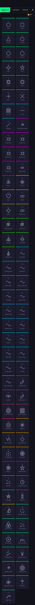

- **Category filters** — buttons above the grid filter by category (Geometry, Waves, 3D, Scenes, etc.). Click to toggle. Multiple categories can be active simultaneously.
- **Click a preset** — activates it immediately. The active preset name is shown in the Global Controls header.
- **⏹ Off** — stops the current preset (laser off).
- **↺ Reset all** — resets all Global Controls sliders to their defaults without changing the active preset.
- Waves presets pick up their **Amplitude** / **Frequency ×** from Global Controls Column 1. 3D presets use the **Auto-Rotation** controls in Column 2 for movement — rotation is not built into each preset, enable Auto-Rotation in Global Controls to spin them.

### Community Presets

A full-width card directly below the Preset Grid, showing every community preset stored on the device, each tile marked with a **COMMUNITY** badge.

- **Click a tile** — activates the preset: applies its playback params (built-in preset, color, speed, size) and layers its optimizer tuning on top of the live optimizer config. The active preset name shows as "Name (Community)".
- **＋ Browse / Manage** — jumps to the Preset Manager tab.
- If nothing is stored yet, the card tells you to go browse in the Preset Manager tab. It's not wrong.

### Sequencer

A BPM-synced preset playlist, directly below Community Presets. Build a list of steps (preset + duration in beats + optional transition), and the sequencer walks them in time with the [BPM Clock](#bpm-clock-sidebar):

- **Step editor** — each step has a preset, a duration (1/2/4/8/16/32 beats), an optional **transition** (beats of blanked output before the next step — the beam goes dark, but colors/rotation/modulators keep animating underneath, so nothing freezes), and an enable checkbox.
- **Transport** — status pill, a beat-flash dot, and Prev / Start / Stop / Next buttons. Start jumps to step 0; Prev/Next are hard cuts that ignore beat timing.
- **Loop** — repeat the playlist indefinitely, or stop after the last step.
- The playlist persists on the device — but playback **never auto-starts on boot**, by design. A Class 4 laser that resumes its show when the power comes back is nobody's idea of a feature.

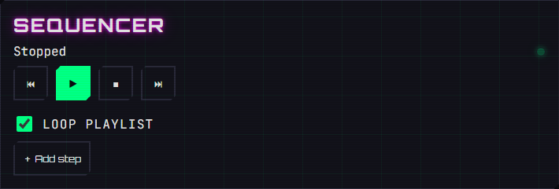

### BPM Clock (sidebar)

The global tempo everything beat-synced (Sequencer, Modulators) runs on. Three sources with fixed priority **DMX > Tap > Manual**:

- **Manual** — type a BPM (20–300).
- **TAP** — a big, satisfying tap-tempo button; tap along at least twice and the clock follows (resets after a 3 s pause).
- **DMX** — a configurable absolute DMX channel (default 237) drives the tempo, mapped 1:1 (channel value *v* = *v* BPM, no rescale). Set the channel under Configuration → DMX BPM Source. Only active while a DMX/Art-Net signal is actually present. Channel value **0 is Beat-Stop**: the beat phase freezes where it is (the source stays DMX, it does not fall through to Tap/Manual) and resumes from the same fractional position when the value goes back above 0.

The source pill shows which input currently owns the clock.

### Countdown Timer (sidebar)

Set hours/minutes/seconds, then Start/Pause/Stop. On expiry: do nothing, show a text message (Text mode), or play an ILDA file.

### Parameter Modulators & Bindings (sidebar)

The animation engine that makes patterns *move on their own*. Up to **8 modulator slots**, each generating a continuous control signal, routed to live pattern parameters through up to **16 bindings**. The sidebar cards are collapsible and reorderable, and modulator slots follow an add-on-demand pattern: only slots in use are rendered, with an **+ Add Modulator** button revealing the next free one.

**Modulator types:**

- **Oscillator** — Sine, Triangle, Square, or Saw wave. Triangle/Square gain a Slope/Shape control (square duty cycle, saw↔triangle↔ramp morph).
- **Noise** — smooth random wander, with a persisted seed so a slot's curve survives reboots instead of reinventing itself.
- **Envelope** — externally triggered ramp. Either the classic Attack/Sustain/Release, or a multi-point breakpoint curve: up to 8 points, 6 curve types, One-Shot/Loop/Ping-Pong/Trigger modes.
- **Step Sequencer** — up to 16 hand-set values stepped through in time.

Each slot is BPM-synced (whole note down to sixteenth) or free-running in Hz, with level, phase offset, and a name.

**Bindings** route a modulator onto a target parameter with **depth** and **offset**. Built-in targets: transform scale X/Y, shift X/Y, rotation, color hue/saturation/brightness, animation speed, and point density. Self-registering firmware modules add more (the dropdown picks them up automatically from the device):

- **Camera** — yaw/pitch/roll/dolly/FOV on the five 3D wireframe presets (Cube, Pyramid, Octahedron, Tetrahedron & Co.), including an optional perspective divide. All neutral by default — nothing moves until you bind something.
- **Duplicator** — clone the frame N times in a grid, radial, or spiral arrangement, with per-copy offset/angle/scale.
- **Spatial Noise** — a 2D value-noise modulator *type* for organic, hand-drawn-looking wobble.
- **Dotter** — scatter Points-Only-Mode dots (`DOT_SPREAD`), deterministic per dot so the cloud breathes instead of shimmering.

Modulators act on Preset-mode rendering; Text/Paint/ILDA output is not modulated. Slider changes apply instantly but are written to flash lazily (400 ms idle debounce), so dragging a depth slider does not fire a flash write per tick.

---

## Tab: Preset Manager

Home of the Community Presets feature: preset bundles hosted in the GalvOS GitHub repo, downloadable straight from the WebUI. Each bundle is a single JSON that carries a full optimizer tuning (same fields as the Optimizer tab) plus playback params (which built-in preset to run, color, speed, size) — someone else's 2 AM slider-tweaking session, packaged for your device.

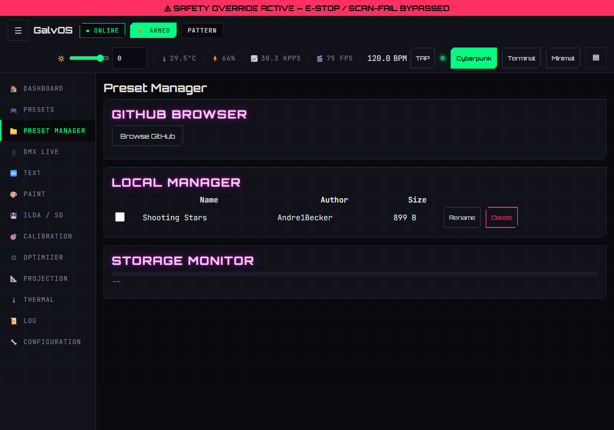

### GitHub Browser

- **⟳ Browse GitHub** — fetches the community preset index from `raw.githubusercontent.com` and shows each entry as a card with name, author, description, and tags. Your **browser** does the fetching — the firmware never talks to GitHub itself, so this works even though the ESP32 has no internet-facing ambitions.
- **Download** — the browser downloads the preset JSON and POSTs it to the device, where it is validated against the schema and written to LittleFS. It then appears under Presets → Community Presets and in the Local Manager below.

> **Note:** Browsing requires the device you're viewing the WebUI on (phone/desktop) to have internet access. The ESP32 itself does not need any.

### Local Manager

A table of every community preset stored on the device (Name, Author, Size):

- **✎ Rename** — edits the display name in place (Enter or ✓ to confirm). The id and filename stay unchanged.
- **🗑** — deletes a single preset (with confirmation).
- **Checkboxes + 🗑 Delete selected** — bulk delete.
- **⟳ Refresh** — reloads the list from the device.

### Storage Monitor

A usage bar showing LittleFS storage: preset count and used/total space. Each preset is capped at 10 KB and the device stores at most **20 community presets** (updating an existing one doesn't count against the limit), so filling this up would take genuine dedication.

> **Note:** Activating a community preset applies its optimizer tuning as a session-only override — it is not persisted. Selecting another preset or rebooting returns to the built-in optimizer profile for that preset class.

Want to publish your own? See [Contributing a Community Preset](09-contributing.md#contributing-a-community-preset).

---

## Tab: DMX Live

Provides a software DMX console — 25 sliders corresponding to GalvOS's 25 DMX channels.

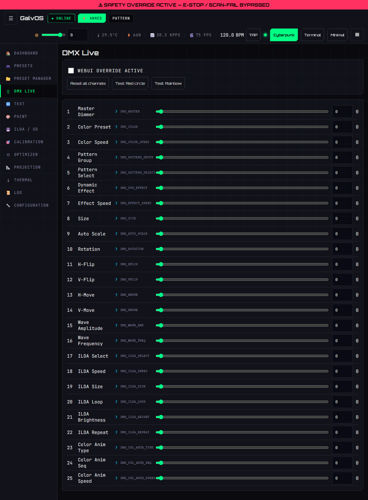

- **WebUI override toggle** — when enabled, the slider values are sent directly to the pattern engine, overriding any incoming hardware DMX signal. When disabled, the sliders display the last received DMX values (read-only view).
- **Reset all channels** — returns all sliders to their off/default state.
- **Test: Red circle** / **Test: Rainbow** — quick preset buttons that set a combination of channels to show a test pattern.

Full channel map: see [Chapter 3 — Build & Configuration → RuntimeConfig → DMX/Art-Net](03-build-and-config.md).

---

## Tab: Text

Projects laser text. Text mode overrides any active preset and DMX input while active.

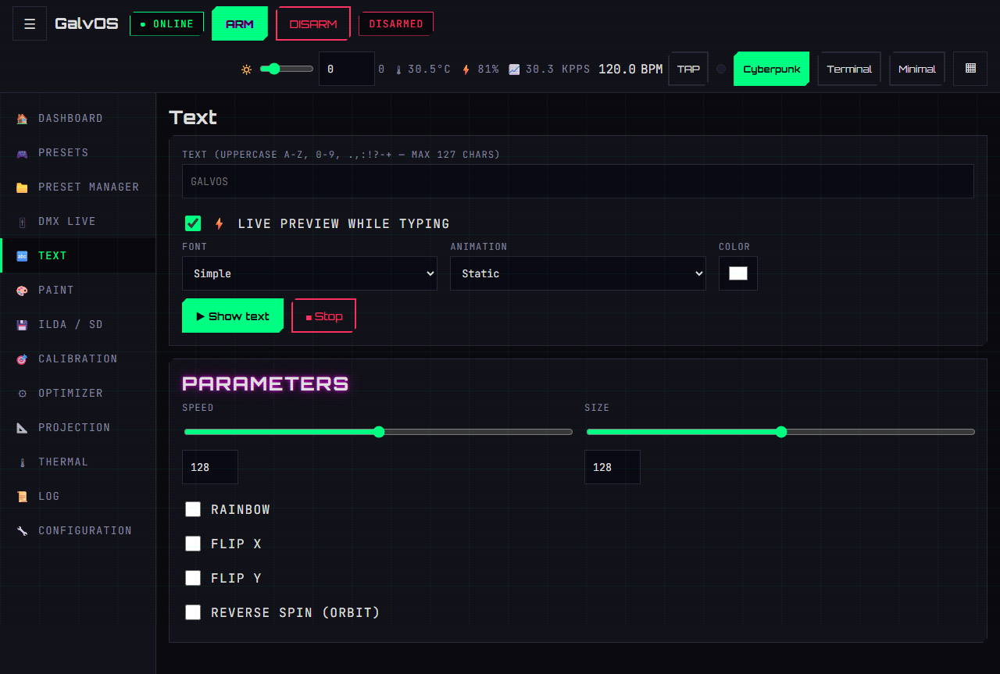

- **Text input** — supports uppercase A–Z, digits 0–9, and `.,:!?-+`. Maximum 127 characters. Up to 16 characters display statically; longer text scrolls automatically.
- **Font** — Simple (thin strokes, fastest), Bold (thick strokes), Outline (double-line).
- **Animation** — Static, Scroll Left/Right, Bounce, Typewriter, Wave, Pulse, Rotate, Zoom, Orbit, Star Wars Scroll.
- **Live toggle** — when on, text updates are sent to the laser as you type. Turn off if you want to compose text before displaying it.
- **Speed / Size** — animation speed and text size.
- **Color / Rainbow** — fixed color via color picker, or rainbow cycling across characters.
- **Flip X / Flip Y** — mirror the text output horizontally or vertically.
- **🔄 Reverse Spin (Orbit)** — flips the Orbit animation's rotation direction; has no effect on other animations.
- **▶ Show text / ⏹ Stop** — activate or deactivate text mode. Leaving the text field empty and pressing Show falls back to `GALVOS`.

---

## Tab: Paint

A freehand drawing canvas that projects directly onto the laser.

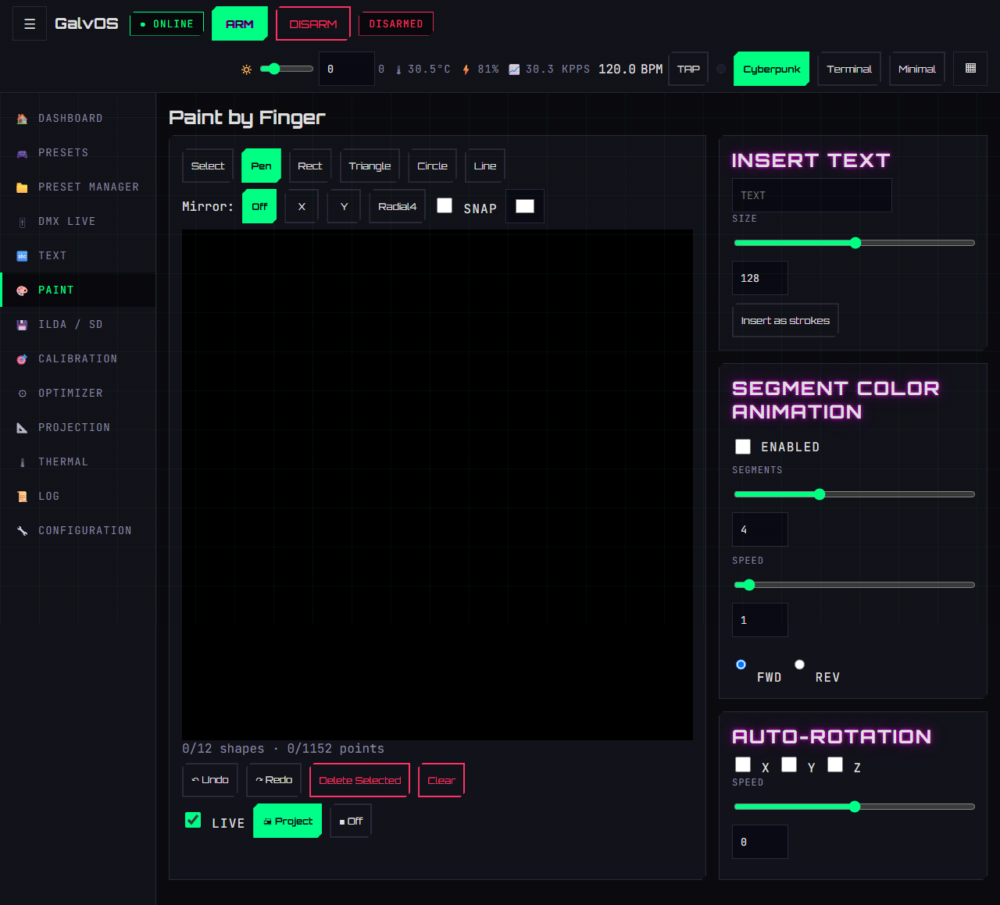

### Paint by Finger

- **Tools** — Select, Pen (freehand), Rect, Triangle, Circle, Line. Shapes are stored as closed polygons, exactly like a drawn stroke.
- **Mirror** — Off / X / Y / Radial4: mirrors the stroke as you draw it.
- **Snap** — snaps new points to a grid, for shapes that are meant to look deliberate.
- **Live** — pushes every edit to the laser as you make it, instead of waiting for Project.
- **↶ Undo / ↷ Redo / Delete Selected / Clear** — the usual editing set; Clear empties the canvas.
- **Color picker** — sets the color for the next stroke.
- **🖨 Project / ■ Off** — activates or deactivates Paint mode. Paint output overrides the active preset and DMX input.
- **Counter** — a live `n/12 shapes · m/1152 points` readout, so you can see the budget filling up before it bites.

The canvas is scaled to match your configured **projection zone** (fetched from `/api/zone` on load, falling back to the ±24000 default range if no zone is enabled), with the zone outline drawn as a dashed guide — so strokes drawn near the canvas edge don't get clipped by zone blanking. **Limits:** 12 strokes, 96 vertices per stroke.

### Insert Text

Renders a short text at a chosen **Size** into the canvas as ordinary strokes ("Insert as strokes"). Once inserted, the glyphs are just shapes: selectable, movable, and deletable like anything else you drew. This is independent of the [Text tab](#tab-text), which is its own output mode.

### Laser Welding

An alternative renderer of the same canvas: a bright torch head travels the drawn path, trailing a fading afterglow and throwing ballistic sparks. Active only while Paint mode is on and this card is **Enabled**.

- **Direction** — Fwd / Rev / Ping-Pong.
- **Speed** — head travel in path units per second (default 6000). Wall-clock driven, so travel speed does not change with the frame rate.
- **Glow Length** — afterglow trail length in path units (default 4000).
- **Sparks** / **Spark Life** — spark count (4–10) and lifetime in milliseconds.

Welding settings are live-only — they are not persisted to NVS.

### Segment Color Animation

Splits the canvas path into **Segments** and cycles colors along them at the set **Speed**, forward or reverse. A cheap way to make a static drawing move without touching the geometry.

### Auto-Rotation

Per-axis **X / Y / Z** checkboxes plus a shared **Speed** slider, applied to the whole canvas — the same control idea as the Presets tab's Auto-Rotation, scoped to Paint output.

---

## Tab: ILDA / SD

ILDA file playback from an SD card. This tab is the single home for everything SD/ILDA: the file browser, the player, the show playlist, uploads, and the SVG import/library.

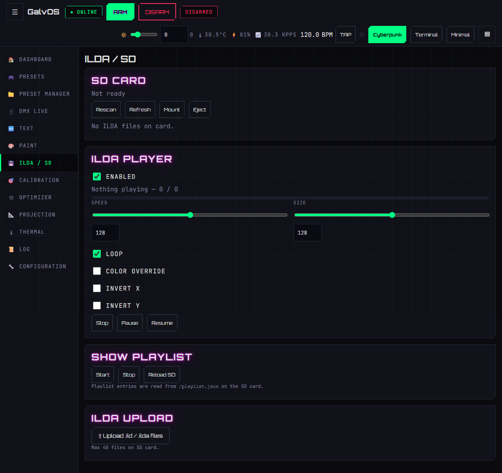

### SD Card

- **File list** — lists `.ild` files found on the SD card (up to 40 files), including **subfolders** (folder prefixes are highlighted so `Fancy Show 295/opener.ild` reads at a glance) with per-file size and date. Each entry has a ▶ Play button; while a big file loads, the row shows a **Loading… → Done** indicator instead of playing dead.
- **Per-file actions** — ⬇ download a file back to your browser, ✎ rename it, or 🗑 delete it (with confirmation), all straight from the row.
- **Oversized files are grayed out** — the firmware estimates the worst-case PSRAM cost per file before you play it and disables Play for files that would blow the budget, with the reason on hover. Better a gray row than a watchdog reset mid-show.
- **Rescan / Refresh / Mount / Eject** — full SD control right in the tab. The card **auto-mounts on a standing 5-second retry**, so a card inserted at any time gets picked up; there is no one-shot mount window at boot to catch. An intentional Eject disables the watcher (so the card isn't re-mounted behind your back) until you press Mount again.

### ILDA Player

- **Enabled** — master switch; disabling force-stops playback and ignores both WebUI and DMX file-select until re-enabled.
- **Now playing + progress bar** — file name and frame progress, live.
- **Speed / Size** — apply live to the running file via `/api/ilda/param`, on the next frame, without reloading it.
- **Loop / Color Override / Invert X / Invert Y** — loop mode, a live color picker override, and per-axis mirroring.
- **Stop / Pause / Resume** — transport controls.
- ILDA frames get only a light optimizer touch: the live affine transform (your position/size/rotation) and a velocity clamp so a wild point jump baked into someone else's `.ild` can't blindside a low `galvo_kpps` setting. Resample, corner dwell, and blanking stay hands-off — the file's author already made those calls.

### Show Playlist

Sequential playback of multiple ILDA files: Start/Stop controls; entries are read from `/playlist.json` on the SD card, with per-entry loop count and pause duration (see [Chapter 8 — Playlist](08-api-reference.md#playlist)).

### ILDA Upload

Upload `.ild`/`.ilda` files to the SD card straight from the browser. Filenames are sanitized and length-capped server-side — long names survive up to FAT's real 255-character limit, and hostile ones can't traverse directories or corrupt the index.

### SVG Import

Converts an SVG drawing into a Paint canvas — entirely in the browser, no firmware-side SVG parsing. The result projects through the same pipeline as the Paint tab's freehand shapes (`/api/paint/set`), so it inherits that budget:

| Limit | Value | Matches |
| --- | --- | --- |
| Strokes (paths) | 12 | `PAINT_STROKES_MAX` |
| Vertices per stroke | 96 | `PAINT_VERTS_PER_STROKE` |
| Total points | 1152 (12×96) | stays under the 1300 optimizer frame budget |
| Raw samples per path (pre-simplify) | 400 | — |

**Pipeline:** `Load SVG` reads the file, walks the DOM (`<g>` recursed, `<defs>`/`<symbol>`/`<clipPath>`/etc. skipped), rewrites `rect`/`circle`/`ellipse`/`line`/`polyline`/`polygon` to equivalent `path` data, samples each path at 400 points via `getPointAtLength` + `getCTM` (so nested `transform`s resolve correctly), then simplifies with Ramer-Douglas-Peucker (`epsilon = Simplify / 1000`). Paths are then prioritized longest-first into the 12 stroke slots — a path that still doesn't fit one 96-vertex slot after simplification is dropped whole, never truncated mid-path.

**Controls:**

- **Preview canvas** — black background, redraws live on every slider change (Simplify/Size/Invert/color), without re-parsing the SVG.
- **Status line** — `N paths · M pts` when everything fit; `N/T paths · M pts · D dropped` in amber otherwise.
- **Load SVG** — local file picker. **Project** — pushes the current result to the Paint canvas and activates Paint mode. **Off** — deactivates Paint mode (keeps the canvas).
- **Color picker + "Use SVG colors"** — per-path color resolves from `stroke` (preferred) or `fill`, walking the CSS cascade via `getComputedStyle`; falls back to the picker color when a path has neither (or the checkbox is off).
- **Size** (0–255, 128 = 100%) — scales around the drawing's center. **Simplify** (1–20) — RDP tolerance. **Invert X / Invert Y** — per-axis mirroring (SVG's Y axis is inverted against galvo Y by default, before this toggle). **Loop** — display-only preference (Paint mode loops inherently); saved/restored but never sent to the firmware.
- **Save / Restore** — round-trips the full card state (including the raw SVG text) through `localStorage` (`galvos_svg_state`), same pattern as the theme picker.
- **Save to SD** — uploads the currently loaded SVG text to the card (see below).

**SD storage:** the "SVG Files (SD)" card lists `.svg` files under `/svg/` with the same layout as the ILDA file list. Files that fail a pre-check (too large, malformed — no `<svg>` root, or no drawable elements found) show a disabled "Blocked" button with the reason on hover, exactly like ILDA's oversized-file graying. Pressing Play fetches the raw text and runs it through the same import pipeline as a local "Load SVG".

---

## Tab: Calibration

The calibration workflow covers six areas: galvo geometry, color/gamma parameters, the projection zone, geometric warp, brightness compensation, and the ILDA standard test pattern.

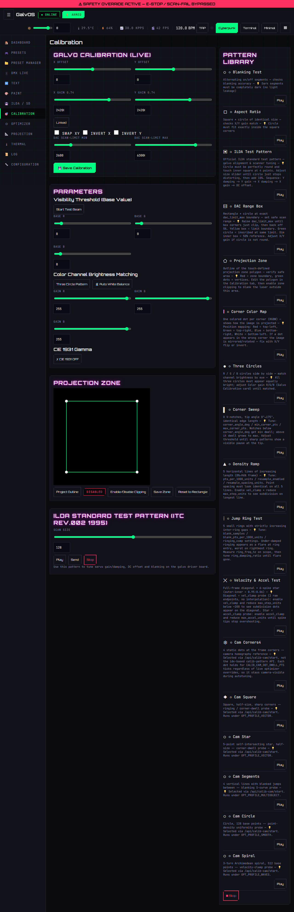

### Pattern Library

A list of calibration patterns to project while adjusting parameters. Select a pattern to activate it; press ⏹ Stop to return to normal operation. Pattern descriptions:

| Pattern | Purpose |
| --- | --- |
| White fill | Full-white output — for overall brightness assessment |
| Red / Green / Blue fill | Single-channel output — for per-channel threshold calibration |
| Three Circles | One solid R, G, B circle side by side — for white balance matching |
| Crosshair | Geometric reference for offset and gain calibration |
| Grid | Linearity check across the full scan range |
| DAC Range Box | Corner-to-corner rectangle at full DAC range — for DAC limit calibration |
| ILDA Test Pattern | Official ILDA 1995 test pattern — for galvo driver tuning |

### Galvo Calibration (live)

Live geometry adjustments, sent to the hardware on every slider change:

- **X/Y Offset** — center the output image. Adjust until the crosshair pattern is centered on the projection surface.
- **X/Y Gain** — scale the image. The "Linked" button keeps X and Y gain equal (maintains aspect ratio).
- **Swap X/Y** — swap the X and Y galvo channels if they are wired in reverse.
- **Invert X / Invert Y** — mirror the output along either axis.
- **DAC limit min/max** — restrict the DAC output range to keep the OPA4134 output within the galvo's ±5V input rating. Default: 0x0666..0xF999.
- **Output Scale** — proportional shrink about the center, applied before the DAC limit clamp. Use it when corners clip: the clamp flattens them, this scales the whole image so they stay in the linear range instead.

Press **💾 Save calibration** to persist all values to NVS.

### Parameter Card (visibility threshold & white balance)

**Visibility threshold (base value):**

Each laser diode has a minimum PWM duty below which it emits no visible light — the dead zone. The threshold calibration finds this minimum so GalvOS can map 0–100% logical brightness onto the actually visible range.

Procedure:

1. Press **▶ Start test beam** — a static low-level beam activates on each channel, bypassing gain, gamma, and master dimmer so only the threshold sliders control it.
2. For each color channel, lower the slider until that color just goes dark. The value at which it disappears is the threshold.
3. Press **💾 Save thresholds**.

**Color channel brightness matching (White Balance):**

1. Press **▶ Start the Three Circle Pattern** — three solid circles (R, G, B) appear side by side.
2. Adjust Gain R / G / B until all three circles appear equally bright to the eye.
3. Alternatively, press **🪄 Auto White Balance** — the firmware calculates gains from the configured laser power values and applies them automatically.
4. Press **💾 Save calibration**.

**CIE 1931 Gamma:**
Toggles perceptual brightness correction. When enabled (default), the firmware applies a γ≈2.2 transfer curve so equal numerical steps in brightness look equal to human perception. Disable only if you need linear 0–255 output for a specific application.

### Projection Zone

An interactive canvas for defining a clipping polygon — the area the laser is allowed to scan. Lit points outside the polygon are blanked (laser off, mirror position retained).

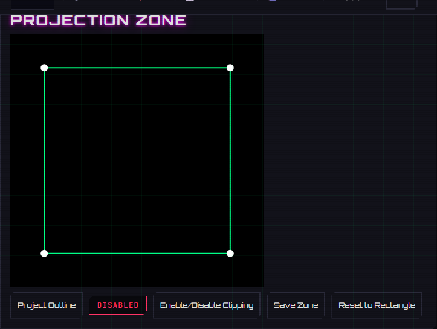

- **Drag vertices** to shape the zone.
- **Tap an edge** to add a new vertex.
- **Double-tap a vertex** to remove it (minimum 3 vertices).
- **Project Outline** — projects the zone boundary onto the screen so you can verify it matches your safe scan area.
- **⬛ Enable Clipping** — activates zone clipping. Only enable after verifying the outline is correct.
- **Save Zone / Reset to Rectangle** — save or discard changes.

### Warp (Camera Closed-Loop Keystone)

A grid editor for geometric correction of an off-axis projector. Drag a control point to bend that part of the image toward it.

- **Grid Size** — 2×2, 3×3, 4×4, or 5×5 control points. 2×2 is plain four-corner keystone; larger grids add interior correction for a non-flat surface.
- **Project Test Grid** — projects the grid itself so you can see what you are correcting against.
- **Enable / Disable Warp**, **Save Grid**, **Reset to Identity**.

Warp is applied inside the optimizer pipeline, after geometry generation, so it corrects everything the projector draws — presets, text, paint, and ILDA files alike. With the grid at identity, the stage is skipped entirely.

### Brightness Compensation

The same grid editor aimed at photons instead of geometry: drag a cell to attenuate that part of the image. Scan speed — and therefore exposure per unit path length — varies with throw distance and angle, so a geometrically correct image can still be visibly brighter in the middle than at the edges.

- **Grid Size** — same 2×2 … 5×5 options as Warp, with independent values.
- **Enable / Disable**, **Save Grid**, **Reset to Identity** (identity = 255, no attenuation).

It scales the emitted RGB only — it never writes back into a pattern's own colors, and it is not the same thing as a color override.

### ILDA Standard Test Pattern (ITC Rev.002 1995)

The official ILDA test pattern with a **Scan Size** control, for tuning servo gain/damping, DC offset, and blanking on the galvo driver board. **Play** projects it, **Send** pushes a size change to the running pattern, **Stop** ends it.

### Camera-in-the-Loop Auto-Tuning (calib-cam)

There is a second calibration path that doesn't live in this tab at all: the `/api/calib-cam/*` REST API, driven by a companion host-side Python tool (`scripts/optimizeGalvo/optimizeGalvo.py`) using a mono/global-shutter USB camera. It projects dedicated reference patterns, measures them with the camera, and runs an automated Optuna search over optimizer scan/dwell parameters — the manual "tune a slider, look at the beam, repeat" loop, done in software instead.

This does **not** replace the Galvo Calibration card above (offset/gain/swap/invert are still manual) — it auto-tunes the *optimizer* profiles (Vector, Smooth, Waves, MultiObject) against camera-measured beam quality. See [Chapter 6 — Camera-in-the-Loop Auto-Tuning](06-camera-autotuning.md) for the full setup and workflow.

---

## Tab: Optimizer

Per-preset-class optimizer profile management. See [Chapter 5 — The Optimizer](05-optimizer.md) for a full explanation of what each parameter does.

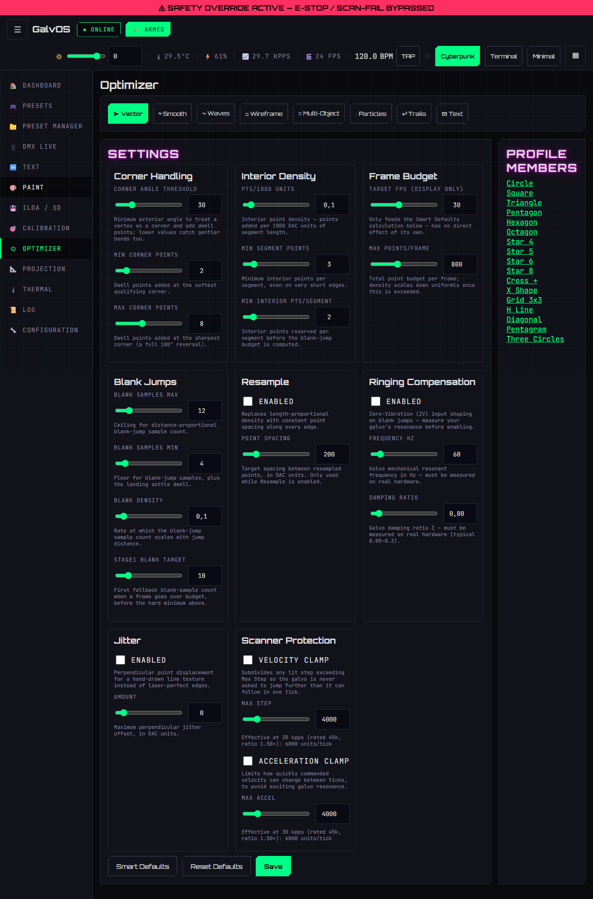

### Profile Selector

Eight optimizer profiles, one per preset class:

| Profile | Preset class | Scanner workload |
| --- | --- | --- |
| Vector | Closed polygons, straight runs | Corner dwell |
| Smooth | Continuous closed curves | Interior density |
| Waves | Open polylines, high frequency | Velocity clamp |
| Wireframe | 3D edge chains | Corner dwell + short jumps |
| MultiObject | Several closed objects | Long blank jumps |
| Particles | Isolated dots | Blank jumps only |
| Trails | Fading/decaying trails | Interior density at a reduced frame budget |
| Text | Glyph strokes | Many short open segments |

The active profile switches automatically when a preset is activated. You can also select a profile manually to edit it. The **Profile Members** card on the right lists which presets belong to the selected profile.

### Live Telemetry

Measured on the last rendered frame, combining every `optimize()` call of that frame:

- **Lit / Blank Points**, **Blank Jumps**, **Jump Distance**, **Budget Used**, and **optimize() Calls**.
- **Truncated** — points the frame budget dropped before they reached the galvo. Anything above zero here means the pattern does not fit the budget and is being cut off, not just thinned.
- **Stage pills** — Stage 1 / Stage 1.5 / Interior ×N show which budget-reduction stages fired and how far interior density was scaled back. The **ZV Shaper** pill lights only when ringing compensation actually shaped a jump (it stays dark if the impulse delay is longer than any jump in the frame, which is the normal case at low resonance frequencies).

### Smart Defaults Button

**⚙ Smart defaults** — computes recommended parameter values from `opt_max_pts_per_frame` and `galvo_kpps` and applies them to the current profile. A good starting point after changing galvo hardware or kpps setting.

### Parameter Sliders

All sliders update the active profile live and show their **effective values** (`opt_eff_*`) after PPS scaling. The effective values are what the optimizer actually uses — they may differ from the raw slider values when `galvo_kpps` differs from `galvo_rated_kpps`.

The sliders are grouped by what they do:

| Group | Contents |
| --- | --- |
| **Corner Handling** | Corner angle threshold, min/max corner points |
| **Interior Density** | Points per 1000 units, minimum interior points per segment |
| **Frame Budget** | Target FPS (feeds Smart Defaults only), max points per frame |
| **Blank Jumps** | Blank samples min/max, blank density, Stage 1 blank target |
| **Resample** | Constant-spacing resample, plus **Curvature-Adaptive** mode with curvature gain and min/max spacing |
| **Ringing Compensation** | ZV input shaping on blank jumps: enable, resonant frequency, damping ratio, and a status line reporting whether shaping actually engages at the current settings |
| **Jitter** | Deterministic perpendicular displacement of interior points, for a hand-drawn line texture instead of laser-perfect edges |
| **Scanner Protection** | Velocity clamp (max step) and acceleration clamp (max accel) |
| **Jump Order** | **Reorder Segments** (nearest-neighbour jump ordering) and **2-opt Refinement** (removes crossings the greedy tour leaves behind; requires Reorder Segments) |

Every field is persisted, included in backups, and honored by community presets.

**Smart Defaults** recomputes the group above from the frame budget and sample rate; **Reset Defaults** restores the compile-time profile defaults; **Save** writes the profile to NVS.

See [Chapter 5 — The Optimizer → Parameter Reference](05-optimizer.md#parameter-reference) for a full table of all parameters.

---

## Tab: Projection

Hardware configuration for the galvo scanner and laser module.

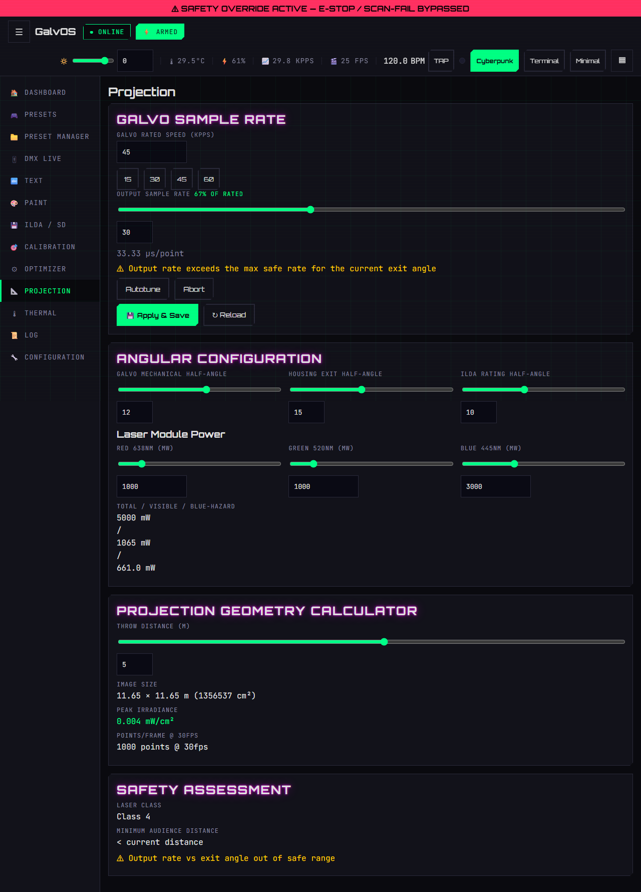

### Galvo Sample Rate Card

- **Galvo rated speed** — set this to your galvo's datasheet kpps rating (Jolooyo JY-15K-BL = 15 kpps). This is the PPS-scaling reference the optimizer's parameters are tuned against ([Chapter 5 — PPS Scaling](05-optimizer.md#pps-scaling)) — a **mechanical** point-rate figure, distinct from the DAC sample clock below.
- **Output Sample Rate slider** — `galvo_kpps`: the actual ISR tick rate (12–60 kpps, defaults its range to at least 60 regardless of rated speed, since running well above the mechanical rating is normal oversampling, not a fault). **This is the most important hardware parameter.** Start at your galvo's rated speed and only increase if the hardware handles it without distortion — use [`GET /api/state`'s `points_per_sec` against `/api/projection`'s `kpps`](08-api-reference.md#get-apistate) to confirm the board is actually delivering the commanded rate, since it silently stops keeping up well before ring-buffer overflow would tell you.
- **Autotune** — binary search for the highest kpps this specific board can sustain without falling short of the commanded rate. Start a real pattern (`master_dimmer` > 0) before running this — an idle/blanked output can't overflow at any rate and would make every trial pass regardless of the true ceiling.
- **Period readout** — shows the calculated µs per DAC sample at the current rate.
- **💾 Apply & Save** — writes kpps and rated_kpps to NVS.

### Angular Configuration Card

Physical angles of the galvo and housing setup — used for the projection geometry calculator and safety assessment:

- **Mechanical Half-Angle** — galvo mirror maximum deflection (±°).
- **Housing Exit Half-Angle** — actual beam exit limit (typically smaller than galvo limit). The Sample Rate card shows an informational line below it stating how many distinct points the mirror can mechanically track at this exit angle, derated from the datasheet figure — the DAC sample clock exceeding that number is normal oversampling, not a problem to fix.
- **ILDA Rating Half-Angle** — standard ±8°; only change if your galvo's datasheet specifies a different rating angle.

### Laser Module Power Card

Laser power in mW per channel. Used for white balance auto-calculation and the safety assessment display. Totals shown:

- **Total power** (all channels)
- **Visible power V(λ)** — weighted by eye sensitivity
- **Blue-light hazard B(λ)** — the blue channel (445 nm) has the highest photochemical retinal risk

### Projection Geometry Card

Enter throw distance (0.5–30 m) to calculate projected image dimensions, area, peak irradiance, and points-per-frame budget at 30 fps.

### Safety Assessment Card

A simplified laser hazard summary based on configured power and angles: laser class, total/visible/BLH power, estimated minimum audience distance, NE555 scan-fail status, and rate-vs-angle adequacy.

---

## Tab: Thermal

Fan and temperature management.

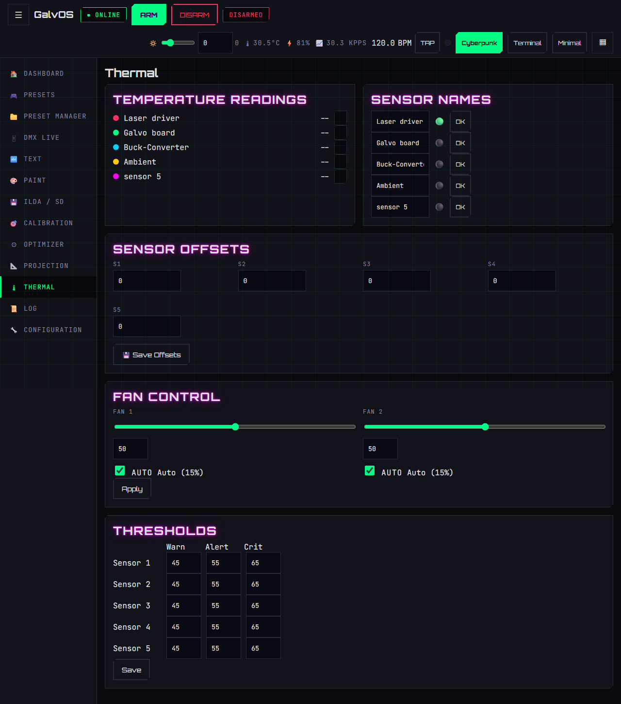

- **Temperature Readings** — all connected DS18B20 sensors, with a **Display Unit** selector (Celsius / Fahrenheit / Kelvin). The unit is a WebUI display preference, persisted on the device; the API and the firmware always work in °C.
- **Sensor Names** — rename each sensor so the Dashboard chart and the badges say "Laser diodes" rather than a bus index.
- **Sensor Offsets (°C)** — per-sensor calibration offset added to the raw reading, for a probe that reads consistently high or low. **💾 Save Offsets** persists them.
- **Fan Control** — Auto mode (temperature-driven) or a manual PWM override per fan. **Minimum fan speed** prevents stalling at low PWM (`fan_min_pct`, default 15%).
- **Thresholds (°C)** — warn, reduce, and shutdown temperatures (`temp_warn_c`, `temp_reduce_c`, `temp_shutdown_c`).

Current readings are also plotted on the Dashboard temperature chart.

---

## Tab: Log

Live firmware log output, streamed from the ESP32 over the WebSocket. Auto-refreshes only when this tab is active.

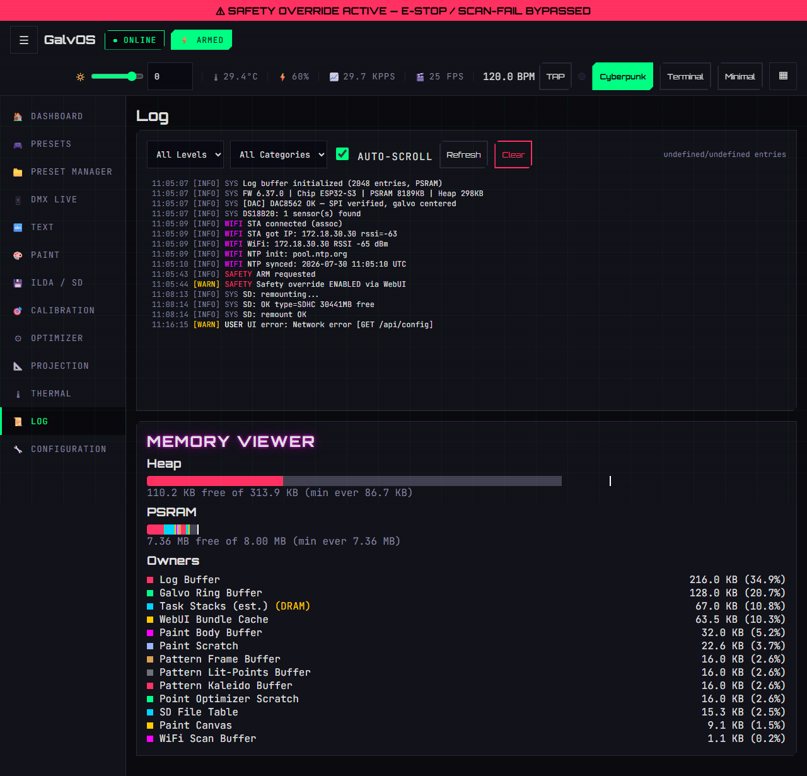

- Log entries are color-coded by severity: INFO (dim), WARN (orange), ERROR (red).
- Use this tab to diagnose startup issues, track DMX frame counts, or watch for ring buffer overflow warnings.
- The log buffer is limited in size — older entries are overwritten.

### Memory Viewer

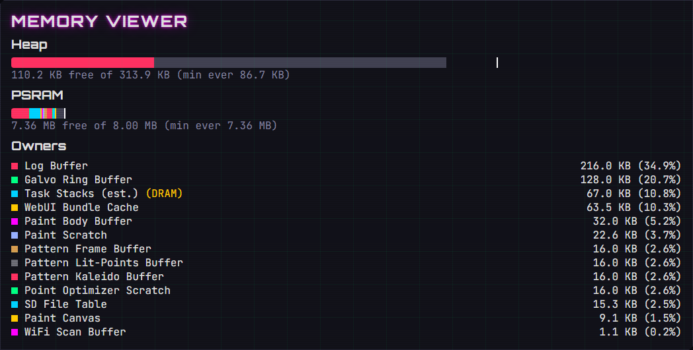

A second card below the log console, showing who holds the RAM — static/long-lived buffers only, sourced from `/api/meminfo` and refreshed every 3 s while the Log tab is open.

- **Internal SRAM (Heap)** — composition bar plus total, free now, largest free block, and lowest free ever since boot (the value the failsafe reboot threshold is compared against), and the failsafe reboot limit itself.
- **PSRAM** — composition bar plus total, free now, largest free block, and lowest free ever since boot.
- **Tracked Owners** — per-subsystem breakdown of registered static/long-lived allocations (see `mem_registry.h`), so a slow leak or an oversized buffer can be attributed to a specific module.
- **🔄 Refresh** — manual refresh outside the 3 s auto-cycle.

### Task Viewer

A third card below the Memory Viewer, listing the FreeRTOS tasks — which core each one
is pinned to, its priority, whether it is running, ready or blocked, and how much of its
stack has never been used. Sourced from [`/api/tasks`](08-api-reference.md#get-apitasks)
and refreshed every 3 s while the Log tab is open. It answers "what is actually running
on Core 0" without opening a serial monitor.

- **Free stack** is the high-water mark: the smallest headroom that task has ever had
  since boot, not its current depth. A task sitting in the low hundreds of bytes is
  close to a stack-canary crash and should get more.
- **State** is a single instant, not an average. Seeing a task "ready" rather than
  "blocked" usually just means it woke up while the snapshot was being taken.
- The list is deliberately incomplete: every task GalvOS itself creates is exact, a few
  framework tasks (`loopTask`, `IDLE0`, `IDLE1`, `async_tcp`) are best-effort, and
  Wi-Fi/lwIP's internal tasks cannot be enumerated at all on this build. There is no
  per-task CPU% for the same reason — see the API reference for why.

---

## Tab: Configuration

Network, DMX, safety, IP, and debug settings.

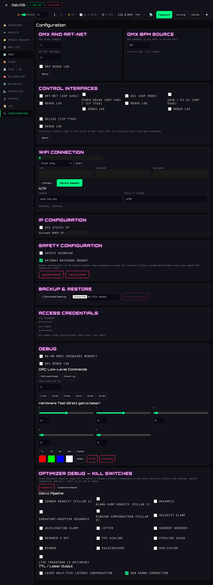

### DMX and Art-Net

- **DMX Start Address** (1–512) — first DMX channel GalvOS responds to.
- **Art-Net Universe** (0–32767) — Art-Net universe number.
- **DMX Debug Log** — logs incoming DMX traffic to Serial and the Log tab (off by default).

### DMX BPM Source

The absolute DMX channel (default 237) that drives the [BPM Clock](#bpm-clock-sidebar)'s DMX source, independent of the fixture's own start address. The mapping is 1:1 — channel value *v* means *v* BPM — and value 0 freezes the beat (Beat-Stop).

### Control Interfaces

Per-interface enable/disable, one checkbox per network input:

- **Art-Net** (UDP 6454)
- **Ether Dream** (UDP 7654 / TCP 7765)
- **OSC** (UDP 9000) — Open Sound Control 1.0 receiver, `/galvos/*` address space (see [Chapter 8 — Network Control Protocols](08-api-reference.md#network-control-protocols-non-http)).
- **sACN / E1.31** (UDP 5568, universe 1) — streaming-DMX over multicast.
- **Helios network DAC** (TCP 7768) — Helios DAC network emulation for laser software that speaks its point-stream framing.

Disabling an interface makes it ignore received data (reduces CPU load); its listening socket stays open until the next reboot. Each interface also has its own **Debug Log** toggle that writes protocol-level traffic to Serial and the Log tab — Ether Dream's is the most talkative, down to raw command bytes, for diagnosing client software that connects and then sulks. Press **Save** to persist.

### WiFi Connection

- Scan for available networks or enter SSID manually.
- Enter password. Hostname (default `galvOS`) sets the mDNS name.
- **NTP Server / Time zone** — time synchronization settings. Use POSIX TZ string format.
- **Connect** — connects without restarting. **Save & Restart** — saves and reboots.

### IP Configuration

- Toggle between DHCP and static IP.
- Enter static IP, gateway, subnet mask, and DNS when static mode is enabled.

### Safety Configuration

- **Safety Override** — bypasses E-Stop and scan-fail checks. Only use with the laser disarmed and no audience. Red warning state clearly shown.
- **⟳ System Reboot** — restarts the ESP32 immediately (confirmation prompt). Use after a config or firmware change that requires a reboot, without needing physical access to the device.
- **⚠ Factory Reset** — clears the main NVS namespace and restarts. Wi-Fi credentials are lost, so the device comes back on its own AP. See [Chapter 3 — Resetting to Defaults](03-build-and-config.md#resetting-to-defaults) for what it does *not* clear.

### Backup & Restore

Because "I remember my DAC limits" is not a disaster recovery plan.

- **⬇ Download Backup** — downloads a JSON snapshot of galvo calibration, all 8 optimizer profiles, network settings, and system/thermal thresholds. The filename carries the firmware version and a timestamp (`galvos_backup_v<fw>_<yyyy-mm-dd-hh-mm-ss>.json`), so a folder full of backups tells you which is which.
- **⬆ Choose Backup File** — pick a previously downloaded backup. GalvOS does a quick JSON-syntax check in the browser, then enables the **⚠ Restore Settings** button (dimmed until a valid file is picked).
- **⚠ Restore Settings** — asks for confirmation, then uploads the file. The firmware validates every single value against the same bounds the live config endpoints enforce before touching anything — if even one field is out of range, the whole restore is rejected and nothing is applied. On success it persists the config and reboots automatically.
- Restore is blocked while the laser is **armed** — disarm first.
- Not a substitute for the calibration workflow — it restores *previous* known-good values, it doesn't calibrate for you. See [Tab: Calibration](#tab-calibration) if you're setting up a projector for the first time.

### Access Credentials

- **HTTP-OTA Pass** — password for the `/update` OTA endpoint (user `admin`). Masked; hover to reveal. See [Chapter 3 — Wireless / OTA Update](03-build-and-config.md#wireless--ota-update) for the full walkthrough.
- **API Token** — current `X-Auth` token required for write access to the HTTP API. Masked; hover to reveal, click to copy. (Moved here from the Dashboard System Card.)

### Debug

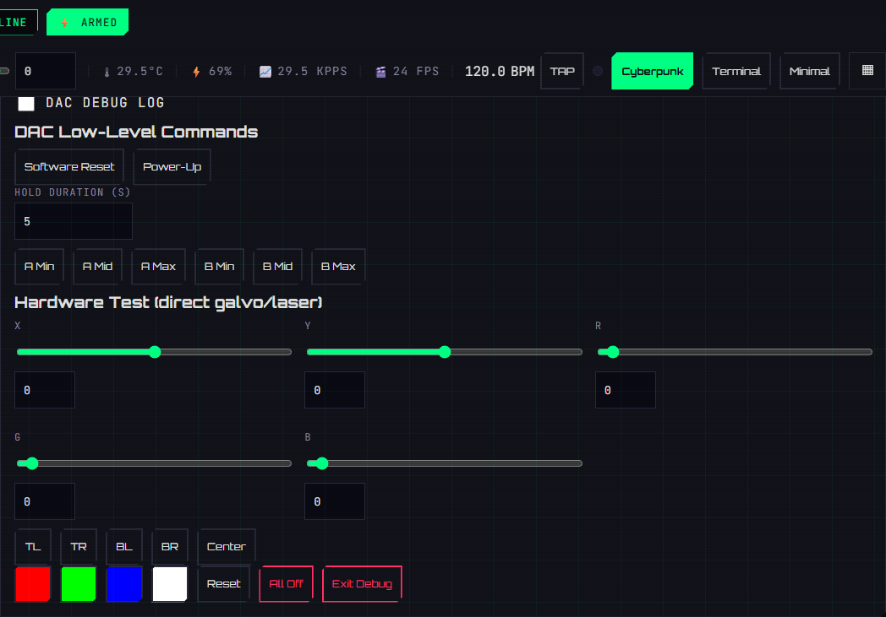

- **No-HW Mode** — skips SPI/DAC init at boot. Use only for firmware development without hardware connected. Disable before normal operation.
- **DAC Debug Log** — logs DAC8562 register writes to serial and the Log tab (rate-limited). For low-level DAC debugging only.
- **DAC Low-Level Commands** — sends raw DAC8562 commands (Software Reset, Power-Up) and drives either channel to its min/mid/max code for a configurable hold duration. This bypasses the pattern engine entirely — it is a hardware bring-up tool, not a performance control.
- **Hardware Test (direct galvo/laser)** — positions the beam directly: X/Y sliders, R/G/B channel toggles, corner/center jump buttons, **Reset**, **All Off**, and **Exit Debug**. While active it blocks normal pattern output.
- **Status** — the current preset and a tail of the log, so you can see what the device thinks it is doing without switching tabs.
- **OTA Update** — firmware update via HTTP at `http://laser/update` (admin / your password). The page itself covers firmware and WebUI updates, a config backup shortcut, and a reboot button — see [Chapter 3 — Wireless / OTA Update](03-build-and-config.md#wireless--ota-update).

---

*Next: [Chapter 5 — The Optimizer](05-optimizer.md)*
