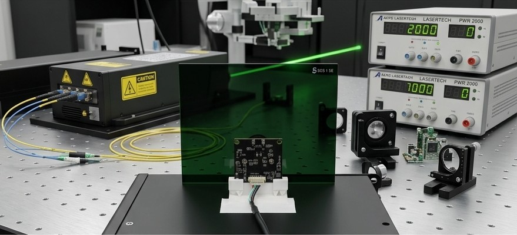
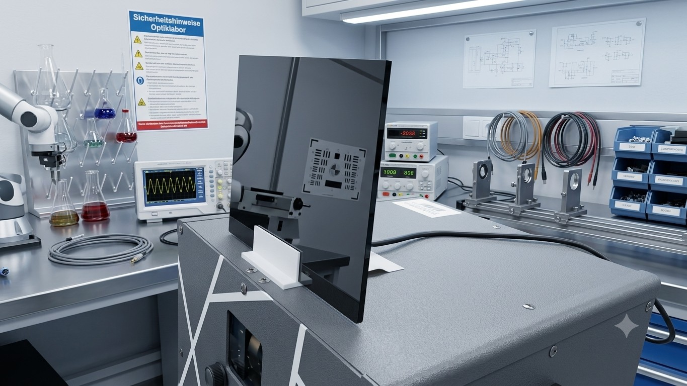

# Chapter 6 — Camera-in-the-Loop Auto-Tuning

> Chapter 5 explained what the optimizer does. This chapter explains how to stop guessing at its parameters by hand and let a camera and a search algorithm do it instead. Turning `max_corner_pts` up by one, projecting, squinting at the beam, turning it back down — that loop gets old fast. This one replaces the squinting with a webcam and a cost function.

## Table of Contents

- [What This Is](#what-this-is)
- [The Bench Setup](#the-bench-setup)
- [Requirements](#requirements)
- [Installation](#installation)
- [Files](#files)
- [The Camera Patterns](#the-camera-patterns)
  - [Why Trails has no camera pattern](#why-trails-has-no-camera-pattern)
- [The Shutter Must Span a Whole Frame](#the-shutter-must-span-a-whole-frame)
- [Workflow](#workflow)
  - [0. wizard](#0-wizard)
  - [1. check](#1-check)
  - [2. preview](#2-preview)
  - [3. calibrate](#3-calibrate)
  - [4. measure](#4-measure)
  - [5. optimize](#5-optimize)
  - [6. diagnose](#6-diagnose)
  - [7. autotune-camera](#7-autotune-camera)
  - [8. autotune-colors](#8-autotune-colors)
  - [Standalone: analyze-live](#standalone-analyze-live)
  - [Standalone: calibrate-warp](#standalone-calibrate-warp)
  - [Standalone: measure-resonance](#standalone-measure-resonance)
  - [Standalone: tune-dac-range](#standalone-tune-dac-range)
- [How Scoring Works](#how-scoring-works)
- [Session Semantics — Nothing Sticks Until You Apply It](#session-semantics--nothing-sticks-until-you-apply-it)
- [Safety](#safety)

---

## What This Is

The firmware exposes a REST API, `/api/calib-cam/*`, that lets an external program select a calibration pattern, live-override the active optimizer profile's parameters (RAM-only, never touching NVS), and read back exactly what has changed. `scripts/optimizeGalvo/optimizeGalvo.py` is the program that actually drives it: it opens a mono/global-shutter USB camera, projects one of nine reference patterns, measures the result, and runs an [Optuna](11-glossary.md) search to find the parameter combination that produces the cleanest beam.

This is **not** a replacement for the manual Galvo Calibration card in the WebUI (Chapter 4) — offset, gain, swap, and invert are still set by hand, because those are fixed hardware/wiring properties, not something a search should be exploring every run. What this tool auto-tunes is the **optimizer**: corner dwell, blanking, resample, ringing compensation — the parameters in [Chapter 5](05-optimizer.md#parameter-reference) that trade off against each other and are genuinely tedious to hand-tune by eye.

It replaces the closing item in [Chapter 10's Planned Features](10-known-issues-and-todos.md#planned-features) — "auto-tuning via global shutter camera" was the plan; this is the implementation.

---

## The Bench Setup

What this actually looks like on the bench: the target board sits on a stand facing the projector, with the mono/global-shutter camera clamped alongside it, aimed at the flat target surface the beam is projected onto.



The small board mounted below the target is the sensor/interface PCB — it carries the camera's own driver electronics, separate from the GalvOS controller itself, which drives the projector over the network as described in [Requirements](#requirements).



Camera and target share one rigid mount so the pixel→DAC [homography](11-glossary.md) solved by `calibrate` (see [Workflow](#workflow) below) stays valid between runs — nudging either one out of alignment is exactly the "re-run `calibrate`" case called out there.

---

## Requirements

- A mono or global-shutter USB camera. The tool was built and tested against an **OV9281**-based module — a rolling-shutter webcam will smear a fast-moving beam and produce misleading measurements.
- A GalvOS device reachable over the network, with the `/api/calib-cam/*` API (any current firmware).
- Python 3.12 or 3.13 is the safest bet — if wheels for `opencv-python`/`optuna`/`numpy` aren't published yet for your interpreter version, use a 3.12/3.13 v-env rather than fighting a source build.
- The ESP32 and the machine running the script on the same network, with a known base URL (hostname or IP).

## Installation

```bash
cd scripts/optimizeGalvo
python -m venv .venv
.venv\Scripts\activate        # or: source .venv/bin/activate
pip install -r requirements.txt
```

`requirements.txt`: `opencv-python`, `numpy`, `optuna`, `requests`.

## Files

| File | Purpose |
| --- | --- |
| `camConfig.json` | Runtime config — ESP32 base URL, camera index/resolution/exposure, DAC calibration range, cost weights, diagnose thresholds, HTTP timeout/retry settings. Created by `wizard` on first run. |
| `homography.npz` | Pixel→DAC homography matrix plus the stored background frame, written by `calibrate`. Required by `measure`, `optimize`, and `diagnose`. |
| `searchSpace.json` | Parameter ranges per camera-tunable optimizer profile (`Vector`, `Smooth`, `Waves`, `MultiObject`, `Wireframe`, `Text`, `Particles`). Regenerated with sensible defaults by `optimize`/`diagnose --autotune` if missing (same first-run behavior as `camConfig.json`) — edit the result if you widen a parameter's firmware-side limits. An **existing** file is never rewritten, so one created before v6.75.0 has no `Wireframe`/`Text`/`Particles` block and those profiles are silently skipped by `optimize`; the tool warns when it detects this — delete the file to regenerate it, or copy the missing blocks in by hand. |
| `results/` | `optuna_study.db` (resumable search state), per-trial `.jsonl` logs, best-parameter JSON snapshots, and saved camera frames from `measure`/`calibrate`., interactive runs offer to clean up stale files here (everything except the `.db`) at startup. |

Override the config path with `--config`, e.g. to keep separate configs for multiple camera rigs.

## The Camera Patterns

Nine patterns exist on the firmware side purely for this tool (`calib_patterns.cpp`, indices 11–16 and 21–23), geometrically matching the ground truth the script rasterizes internally so measured error is directly comparable to the ideal:

| Pattern | Profile | Used for |
| --- | --- | --- |
| `corners4` | — | 4 static dots at the DAC-range corners — the homography reference. Uses a fixed manual dwell so it stays camera-visible regardless of what corner-dwell overrides a search throws at it. |
| `square` | Vector | Sharp 90° corners — corner hotspot + path deviation. |
| `star` | Vector | 5-point pentagram (self-intersecting) — corner hotspot + path deviation. |
| `segments` | MultiObject | 4 parallel vertical lines — blank-jump leakage between disconnected strokes. |
| `circle` | Smooth | Continuous curve, no real corners — path deviation + brightness uniformity. |
| `spiral` | Waves | Dense continuous curve — path deviation + brightness uniformity under high interior density. |
| `wireframe` | Wireframe | Projected cube drawn as 4 open 3-edge chains — corner hotspot, path deviation, and blank leakage on the jumps between chains. |
| `text` | Text | The fixed string `GAL` through the real stroke font (`text_renderer.cpp`) — same metrics as `wireframe`, on many short strokes instead of a few long ones. |
| `particles` | Particles | 12 isolated dwell dots at graded jump distances (10k–36k DAC units) — blob count, blob elongation, and blob centroid error. |

The last three (firmware v6.75.0) close the gap for the three profiles that previously had no camera pattern at all. `wireframe`/`text` are scored as paths; `particles` is scored as **dots**, which is a genuinely different measurement — see [How Scoring Works](#how-scoring-works).

`particles` is the pattern that would have caught the v6.65.1 Starfield regression, where a Particles blank window sized for short hops left the beam still in flight when the laser re-armed and painted "connect the dots" streaks. Each of its dots is a degenerate two-vertex open segment, so its dwell comes entirely from the live profile's `max_corner_pts` — unlike `corners4` there is deliberately **no** fixed-dwell override, because the dwell is part of what is under test.

### Why Trails has no camera pattern

`OPT_PROFILE_TRAILS` is the one profile that is not camera-tunable, and this is a property of the profile, not a missing feature.

Every metric in this tool compares one accumulated camera frame against one static rasterized ideal. A Trails preset's ground truth is not a shape — it is a **trajectory over time**: a head plus a tail whose brightness decays with age. A single accumulated exposure integrates the whole tail into the same image as the head, so:

- The "ideal" a scorer would compare against is not defined without also modelling exposure time, decay rate, and where in the animation phase the shutter opened.
- Path deviation and corner hotspot would read the decaying tail as legitimate lit path, i.e. the correct behavior and the streak defect look identical.
- The dot metrics do not apply either — a trail is not a set of isolated blobs.

A static proxy pattern (some fixed shape run under the Trails profile) could be written, and it would produce numbers. It would not be measuring Trails: the profile's distinguishing parameters are exactly the ones that govern how a *moving* head and a *fading* tail behave, and a static shape exercises none of them. A number that does not respond to the thing you are tuning is worse than no number, so none is produced.

Tuning Trails correctly would need a fundamentally different rig — a high-frame-rate camera synchronized to the frame boundary, scoring a sequence rather than an accumulation. That is out of scope for this tool. Until then, Trails stays on hand tuning via the WebUI Optimizer tab.

`/api/calib-cam/start` accepts a `channel` field (default: **blue**, channel 3) instead of always drawing white. A mono camera can see the R/G/B beams smear apart or land at slightly different positions if the laser diodes aren't perfectly co-bore sighted — measuring on one channel avoids that artifact entirely. `optimizeGalvo.py` drives this from `camPatternChannel` in `camConfig.json`.

---

## The Shutter Must Span a Whole Frame

A vector-scanned pattern only exists as a shape when integrated over a whole frame — at any instant the beam is at exactly one point. A shutter shorter than one frame period therefore does not capture a dim version of the shape. It captures a **random slice of the scan path**, and stacking more of those slices does not fix what each one is missing.

This is a physical constraint, not a tuning preference, so `exposure` is **derived, not searched**. Before any command that scores a capture (`measure`, `optimize`, `diagnose`, `regress`, `autotune-camera`), the tool measures how long one full traversal of the pattern actually takes and raises the shutter to cover it:

```text
frame period = /api/optimizer-stats  planned_total   (points in the frame)
             / /api/state            points_per_sec  (real measured output rate)
```

Both terms are measured rather than modelled, so the result already carries any shortfall between commanded and achieved output rate. Measured on this rig, every calib pattern lands between 15 and 29 ms per pass, which needs `exposure` −4 (62.5 ms) — against the −11 (0.488 ms) an earlier `autotune-camera` run had settled on.

`points_per_sec` is read **twice**, spaced far enough apart to cover a full averaging window, and only the second read is trusted. `galvo_out.cpp`'s `pointsPerSec()` recomputes at most once a second, over the interval since whoever polled it last — so a first read after a long silence describes a window the tool never observed, and past roughly 95 s of silence at 45 kpps its `delta × 1000` overflows `uint32` and returns a wrapped value. Seen live: a first read after several minutes idle reported ~4.8 kpps instead of 45 kpps, inflating `square` from 26.8 ms to 251.6 ms and driving the derived shutter to −1 (500 ms) — long enough to nearly saturate the background by itself.

### Why this had to be taken away from the search

At −11 each capture saw **1.7 % of the scan path**. Even max()-accumulated over `accumFrames: 24` that topped out near 33 %, which is exactly the "the square photographs as a dashed square" artifact. The search could not have found its way out on its own: `autotune-camera`'s cost rewards low saturation and a dark background, and a too-short shutter delivers both beautifully while quietly capturing almost nothing. No additional cost term fixes that — the constraint is physical, so it belongs outside the search.

Worse than the missing coverage: at 1.7 % duty a pixel's value is the beam's *instantaneous* intensity in whichever slice caught it, **not its dwell time**. Every intensity-derived metric depends on dwell — `cornerHotspot` (a corner is hot because the beam lingers there), `brightnessNonUniformity`, and both `blankLeakage` terms (a fast jump trail should read as a *dim* streak, but at 1.7 % duty it reads full-brightness-or-absent). Those metrics were measuring noise.

### Stacking frames is not the alternative

A common instinct is to raise `accumFrames` instead, and to worry that stacking averages real artifacts away. Both are backwards:

- `grabAccumulated()` uses `np.maximum`, not a mean. It keeps the peak value ever seen per pixel, so nothing is averaged away — a blank-jump trail present in any one frame survives at full brightness.
- A short shutter is what *loses* artifacts. A blank jump is a within-frame event lasting tens of microseconds; at 1.7 % duty you have a ~1.7 % chance per shot of catching it. A full-frame shutter integrates every jump in that frame, every time.

`accumFrames` therefore stops being a coverage mechanism. Its default dropped **24 → 8**: with each frame already complete, stacking only evens out the 1-vs-2-pass banding you get because the shutter isn't phase-locked to the laser (a 62.5 ms shutter spans ~2.2 passes of a 28 ms pattern, so some pixels are drawn twice and some once). A longer shutter *and* fewer frames is still net faster than before — 8 frames at 16 fps is 0.5 s, against 24 at 24 fps.

### The light budget

Going −11 → −4 integrates **128× more light** per capture. Cut it optically, never by shortening the shutter again:

| Method | Notes |
| --- | --- |
| ND filter, ~2.1 OD (7 stops) | Best — keeps the sensor response linear and doesn't touch the thing under test |
| Stop the lens down | f/2 → f/22 is ~120×, if the lens has an iris |
| `master_dimmer` | Last resort: 8-bit and gamma-curved, and diode lasers go nonlinear at very low current, which distorts the photometry you just recovered |

`saturationFrac` (weight 3.0 in `costWeights`) polices whatever residual clipping remains.

### Configuration and escape hatches

| Key | Default | Meaning |
| --- | --- | --- |
| `exposureFromFrameRate` | `true` | Derive the shutter from the measured frame period. Set `false` only to reproduce a pre-2.25.0 measurement. |
| `exposureFrameMargin` | `1.25` | Require the shutter to span this many passes, not just one — the point count drifts as `optimize` searches, and derivation runs once per run. |
| `exposure` | `-11` | Now only a **floor**. The effective value is `max(configured, derived)`, so a deliberately longer shutter is still honored. |
| `minPathCoveragePct` | `60.0` | Was `10.0`, set below the undersampled captures it should have been rejecting — which is why nothing ever flagged this. With a full-frame shutter a correct capture sits at 95–100 %. |

Two independent checks enforce it. `resolveExposure()` derives the shutter once per run against a reference pattern set; `measureOnce()` then re-checks the *actual* period of every single capture, so a pattern whose point count pushes it past that derivation cannot slip through silently. A per-profile `profileCamera` override may only ever **lengthen** the shutter — an override tuned under the old regime cannot hand one profile back the sub-frame shutter every other profile was just protected from.

If the frame period can't be measured at all, the tool warns and leaves your configured value alone rather than guessing one.

## Workflow

Run `optimizeGalvo.py <command> --help` for any command's full description; the summaries below are the short version. Two flags apply across most commands: `--no-view` (disable the live camera preview window, e.g. for headless runs) and `--zoom {1,2,3}` (digital zoom on that window, live-adjustable with the `1`/`2`/`3` keys).

### 0. wizard

Interactive first-run setup — prompts for ESP32 base URL, camera index/resolution, exposure, DAC calibration range, and HTTP timeout, showing current/default values in brackets. Runs automatically the first time any command is used with no config file yet; run it directly later to change settings.

### 1. check

```bash
python optimizeGalvo.py check
```

GETs `/api/status` and prints firmware version, network info, and safety-interlock state. Opens no camera — run this first whenever something isn't working, to rule out a wrong base URL or a WiFi/mDNS problem before chasing camera or optics issues. Exits 1 on failure.

### 2. preview

```bash
python optimizeGalvo.py preview
```

Live grayscale feed with saturation %, peak pixel value, and measured fps overlaid. `+`/`-` adjust exposure live (auto-saved), `1`/`2`/`3` zoom, `s` saves a snapshot, `space` freezes the frame, `q` quits. Use this to physically aim/focus the camera and dial in exposure — visible beam trace, not blown out — before calibrating.

### 3. calibrate

```bash
python optimizeGalvo.py calibrate
```

Captures a dark background, projects `corners4`, detects the four dots, and solves the pixel→DAC homography, saving it (with the background) to `homography.npz`. Required once before `measure`/`optimize`/`diagnose`; re-run whenever the camera or projection surface moves. Saves a labeled snapshot marking which dot was identified as TL/TR/BR/BL — check it against the real physical layout if later measurements look rotated or mirrored.

### 4. measure

```bash
python optimizeGalvo.py measure --pattern square
```

Projects one pattern with currently-live parameters, captures, and prints path-deviation RMS, blank-leakage, corner hotspot, brightness non-uniformity, and the weighted cost. `--pattern` accepts any of the eight non-`corners4` patterns above; `particles` prints the blob metrics instead of corner hotspot. Requires `homography.npz`.

### 5. optimize

```bash
python optimizeGalvo.py optimize --profile Vector --trials 40 --apply
```

The main event. Queries the ESP32 for its optimizer profiles and preset membership, runs one Optuna study per selected profile against its `searchSpace.json` ranges, and prints a before/after report — every parameter marked changed, unchanged-not-searched, or unchanged-behind-a-disabled-gate. Each trial calls `/api/calib-cam/params` with candidate values and sums the cost across the profile's pattern(s).

- `--profile Vector,Smooth` or `--profile all` selects profiles directly; `--preset "Milky Way"` tunes whichever profile drives a named preset instead (errors out for Trails — see [Why Trails has no camera pattern](#why-trails-has-no-camera-pattern)). Omit both for an interactive menu.
- Studies persist in SQLite (`--storage`, default `results/optuna_study.db`) under `--study-name` (default: the profile name) — Ctrl+C or a crash loses nothing, just re-run the same command to resume. `--fresh` starts over instead.
- `--apply` applies the winning values to the ESP32 and persists them via `/api/optimizer-save` without asking. **Without it, results only go to the JSON file** — see [Session Semantics](#session-semantics--nothing-sticks-until-you-apply-it).
- `space` pauses between trials, `q` aborts early (like Ctrl+C; completed trials are kept).

### 6. diagnose

```bash
python optimizeGalvo.py diagnose --profile all --autotune
```

Measures each selected profile's current live output (no overrides — a read, not a search) and classifies it: **OK**, a **geometry issue** (size/position off vs. ideal — points at galvo gain/offset drift or a moved camera, fix with the Calibration tab or re-running `calibrate`, not by retuning), or an **optimizer settings issue** (path deviation/leakage/hotspot/uniformity out of tolerance while geometry is clean — genuinely fixable by tuning). `--autotune` runs `optimize` automatically on anything flagged with a settings issue, with the same `--trials`/`--study-name`/`--storage`/`--apply` options.

### 7. autotune-camera

```bash
python optimizeGalvo.py autotune-camera --trials 30 --apply
```

Tunes the camera's own **capture** settings — gain, `binaryThreshold`, `accumFrames` — instead of firmware parameters, which are left exactly as currently live. `exposure` is deliberately **not** in the search: it is fixed by the laser's frame period, for the reasons in [The Shutter Must Span a Whole Frame](#the-shutter-must-span-a-whole-frame). Useful when `measure`/`diagnose` results look inconsistent for reasons that turn out to be the camera, not the beam: washed-out captures, blooming, background noise. Saturated pixels are flagged as their own metric (`saturationFrac`) — a global-shutter sensor blooms into neighboring pixels at saturation, which can otherwise inflate path-deviation/corner-hotspot readings with a camera artifact rather than a real scan problem; `diagnose` will suggest running this command instead of `optimize` when it detects that. On apply, updates `camConfig.json` and refreshes `homography.npz`'s stored background to match the new exposure/gain (background is exposure-dependent, so a stale one would corrupt every later diff-subtraction).

### 8. autotune-colors

```bash
python optimizeGalvo.py autotune-colors --channels r,g,b --apply
```

Automates the WebUI's two manual RGB calibration tools ([Chapter 4 — Parameter Card](04-ui-guide.md#parameter-card-visibility-threshold--white-balance)) with camera measurement instead of eyeballing:

- **Phase 1 — visibility threshold ("Basiswert"):** per channel, binary-searches `thresh_r/g/b` using the existing static test beam, converging on the lowest duty that's reliably camera-visible plus a small margin (`--threshold-margin`, default 3).
- **Phase 2 — brightness/gain matching:** projects the static `corners4` dwell pattern per channel (no scanning, so PWM duty is measured without conflating it with scan speed), finds each channel's maximum brightness at gain 255, then binary-searches the stronger channels' `gain_r/g/b` down to match the weakest — you can only dim a strong channel to match, never brighten the weak one further.

`--skip-threshold` / `--skip-gain` run one phase alone; `--channels r` re-checks a single channel after an optics change. Prints a before/after table and saves the sweep history to `results/colors_<timestamp>.json`.

Two things make this command different from `optimize`:

- **No session rollback in firmware.** `gain_*`/`thresh_*` are live calibration values, not optimizer-profile overrides — every value tested during the search is a real, permanent-until-changed mutation. The script therefore always restores the *original* values afterwards (including on Ctrl+C, `q`, or error) unless you confirm applying the found ones (`--apply` → `/api/calib-live` + `/api/calib-save`).
- **No homography needed.** Brightness matching is photometric, not geometric, so `calibrate` is not a prerequisite. Instead it starts with an interactive exposure check against a live feed (`+`/`-` to adjust, `c` to continue) — a too-dark exposure can make a near-threshold beam invisible and silently bias every reading, and there is no scored ground truth here for a search to catch that automatically.

### Standalone: analyze-live

```bash
python optimizeGalvo.py analyze-live
```

Unlike every other command, this **never** starts or stops anything on the ESP32 — it captures one frame of whatever is already projecting (any preset, ILDA file, or custom output) and leaves it running. Since there's no known "ideal" shape for an arbitrary preset the way there is for the 6 calib patterns, it runs a no-reference *structural* read instead of path-deviation scoring: does the beam trace form one continuous piece (vs. a real gap or disconnected segment), does it enclose an area (closed loop), and is the sensor saturating. It looks up the active preset's name/category via the API to label the report, and its "possibly broken" flag is a heuristic, never a hard fail — plenty of presets are legitimately multi-piece (particles, starfields, multi-object scenes), and known multi-piece presets are excepted.

### Standalone: calibrate-warp

```bash
python optimizeGalvo.py calibrate-warp --grid-size 3 --target-rect 100,80,1180,720
python optimizeGalvo.py calibrate-warp --grid-size 2 --dry-run
```

Solves the firmware's N×N (2–5) `/api/warp/*` keystone-correction grid — independent of `calibrate`/`homography.npz` above (that one scores optimizer trials in pixel↔DAC space; this one corrects projector keystone/perspective, e.g. a projector mounted off-axis from the target surface). Resets the firmware to an identity grid, then projects each control point as a single bright dwell dot via `/api/debug/hw` — bypassing pattern generation, warp, and calibration entirely, so every point lands at a precisely known DAC position regardless of whatever grid was previously active — and measures where it lands (median of `--frames` captures, subpixel centroid).

- `--grid-size 2` (default) solves one homography from the 4 corner measurements and inverts it exactly, no further measurement needed.
- `--grid-size 3`–`5` seeds every control point (interior points too) from that same corner homography, then iteratively re-measures and corrects each one — up to 3 rounds, stopping early once within `warpCalibToleranceCameraPx`.
- `--target-rect X0,Y0,X1,Y1` sets the target rectangle in camera pixel space directly; omit it to click the 4 corners interactively instead (needs a terminal).
- Rejects a control point outright (aborting with the full list of failed indices) if its detected blob area or brightness falls outside `warpCalibMin/MaxBlobAreaPx`/`warpCalibMinPeakVal` in `camConfig.json`, rather than silently solving from bad data.
- Prints the before/after residual (mean/max, camera pixels) and POSTs the resulting grid via `/api/warp/set` (`enabled=true`) unless `--dry-run`.

Requires firmware v6.55.0+ (`/api/warp/*`). No prior `calibrate`/`homography.npz` needed.

### Standalone: measure-resonance

```bash
python optimizeGalvo.py measure-resonance --axis x
```

Sweeps one galvo axis (`--axis x`/`y`, default `resonanceAxis` in `camConfig.json`) over `resonanceMinFreqHz`–`resonanceMaxFreqHz` Hz (default 50–2000) via a firmware-generated sine drive (`/api/debug/resonance`), reading each step's driven streak **spatial extent** (not centroid — a symmetric back-and-forth streak's centroid is amplitude-blind) as an amplitude proxy. Two passes: a coarse log-spaced sweep across the full range locates an approximate peak, then a fine linear-spaced pass around it (`resonanceFineSpanFraction`, default ±40% of the coarse peak) resolves an accurate -3dB bandwidth.

If that fine pass can't resolve a clean -3dB crossing on *both* sides of the peak (too sharp for the span, or a noisy edge), it automatically widens the span (doubling it) and re-sweeps, up to `resonanceFineSpanRetries` times (default 2) before giving up on `Q`/`ring_damping_ratio` for that run and reporting `fRes` alone.

Computes `Q = fRes / bandwidth`, `ring_damping_ratio = 1/(2Q)`, and `ring_freq_hz` — corrected from the driven-response peak back to the *undamped natural frequency* the firmware's ZV shaper actually wants (`point_optimizer.cpp`'s `computeZvShaper()`). Prints the result and the exact `/api/optimizer-live` call to apply it — **never applies it automatically**. Saves a CSV (`freq_hz`, `amplitude_px`) and a Bode-plot PNG to `results/resonance_<axis>_<timestamp>.{csv,png}`.

Requires firmware v6.61.0+ (`/api/debug/resonance`). No homography needed — only *relative* amplitude matters, unlike `calibrate`/`calibrate-warp`. Test amplitude is deliberately conservative (`resonanceAmpFraction` of the safe DAC range, further clamped firmware-side) — near resonance, the same commanded amplitude produces the largest mechanical excursion of this entire toolkit's test signals.

### Standalone: tune-dac-range

```bash
python optimizeGalvo.py tune-dac-range
python optimizeGalvo.py tune-dac-range --max-iterations 10 --dry-run
```

Camera closed-loop auto-tune of per-axis galvo gain/offset **framing** — projects the static `square` calib-cam pattern (thin rectangle outline, sharp corners) and reads where its bounding box sits in the captured frame: a side within ~3% of the frame border counts as clipped, both sides of an axis clearing ~5.5% counts as underscanning, otherwise it's OK. Each iteration solves and live-applies (`/api/calib-live`) the `galvo_x/y_gain` + `galvo_x/y_offset` that would realize the next candidate DAC-code range, re-measures, and adjusts again — shrinking a clipped side, expanding an underscanning axis, freezing a side once it settles within a small deadband so it doesn't oscillate forever right at the edge.

Distinct from the firmware's own `dacClipX/Y` (that flags DAC-*code* clipping against the fixed `dac_limit_min/max` safety clamp, untouched here) — this is a camera-*pixel* framing read. Prints the tuned gain/offset table, then asks before persisting via `/api/calib-save` (declining leaves the values live but reverts on next reboot) — or reverts to the original calibration entirely on `--dry-run` or a declined non-converged run.

No homography needed, like `calibrate-warp`/`measure-resonance` above.

---

## How Scoring Works

Every measurement reduces to a single weighted cost (`costWeights` in `camConfig.json`):

| Metric | What it catches |
| --- | --- |
| `pathDeviationRms` | How far the traced beam deviates from the ideal geometry — corner dwell and interior density problems. |
| `blankLeakage` | Laser visible during a blank jump — insufficient hold-off or blanking overshoot. |
| `cornerHotspot` | Excess brightness pooling at a corner — too much dwell relative to the rest of the shape. |
| `brightnessNonUniformity` | Uneven brightness along a continuous curve — interior density or velocity-easing issues. |
| `blankCorridorLitPct` | Percent of the region that should be dark where the beam is actually visible — derived from the pattern's own ideal geometry rather than from hand-listed jump corridors, so it works on every pattern, not just `segments`. Counts pixels crossing `binaryThreshold`; a clean capture reads exactly `0.000`. Replaced a mean-brightness version (`blankCorridorLeakage`, still reported as a diagnostic) in v2.25.0 — see [The Shutter Must Span a Whole Frame](#the-shutter-must-span-a-whole-frame). |
| `saturationFrac` | Fraction of the traced beam at raw sensor saturation — flags a camera-artifact-inflated reading rather than a real defect. |

Three further metrics apply only to `particles` (they are exactly `0` for every path pattern, so the cost formula is unchanged for the other eight):

| Metric | What it catches |
| --- | --- |
| `blobCountError` | Fewer distinct blobs than dots drawn — streaks that merge neighboring dots into one connected region. |
| `blobElongation` | Blob major/minor axis ratio — a dot smeared into a dash because the beam was still moving when the laser re-armed. |
| `blobCentroidErrorUnits` | Distance from each blob's centroid to its nearest ideal dot, in DAC units — dots landing short of where they were commanded. |

`optimize` and `diagnose` share this cost function; `autotune-camera` adds `saturationFrac` and a background-brightness penalty on top, since capture-quality problems (washed-out frames) don't show up cleanly in the geometry metrics above.

A measurement that cannot see anything meaningful reports `valid = false` with the reasons why (`invalidReasons`) and a `NaN` cost, rather than a worst-case constant that reads downstream like a real number.

## Session Semantics — Nothing Sticks Until You Apply It

A calib-cam session's overrides are **RAM-only** — they never touch NVS on their own. Starting a session (`/api/calib-cam/start`) snapshots the target profile's current values; every override applies on top of that snapshot; and `/stop` (or an E-Stop trip, which force-stops the session from `pattern_engine::task`) **restores the snapshot**, discarding every change. This is deliberate — an interrupted or aborted tuning run must never leave a normal preset's optimizer profile silently altered.

Practical upshot: `optimize --apply` (or `diagnose --autotune --apply`) is what makes a result permanent — it calls `/api/optimizer-live` with the winning values and `/api/optimizer-save` to persist them, before the session ends. Without `--apply`, an interactive run prompts you per profile; a non-interactive run (e.g. from a script or CI) applies nothing and the tuned values only exist in the `results/best_<profile>_<timestamp>.json` file.

## Safety

This tool projects real geometry through the real laser via the normal `calib_active` render path — every hardware safety interlock in [Chapter 1](01-introduction.md#safety-interlock-chain) still applies unchanged (E-Stop, scan-fail, watchdog, ARM). Running an unattended multi-hour `optimize` session does not relax any of the precautions in [Chapter 1's Safety section](01-introduction.md#safety--read-this-first) — beam containment and eye protection rules apply exactly as they do to any other armed session.

Every command that projects a pattern first checks that the laser is **armed and the safety chain is green**, and refuses to start otherwise. Arming stays a deliberate manual action in the WebUI; the script never arms the laser itself.
