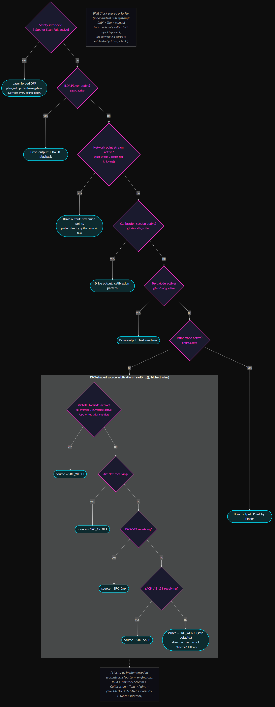

# Chapter 8 — API Reference

The GalvOS REST API is served by the ESP32 WebUI server (ESPAsyncWebServer) at `http://<device-ip>/api/`. The WebUI itself uses this API exclusively — everything the browser can do, an external system can do too.

## Table of Contents

- [Base URL & Conventions](#base-url--conventions)
- [Authentication](#authentication)
- [Route Registration Order](#route-registration-order)
- [System & Status](#system--status)
- [Configuration](#configuration)
- [Safety & ARM](#safety--arm)
- [Presets & Live Controls](#presets--live-controls)
- [Community Presets](#community-presets)
- [BPM Clock](#bpm-clock)
- [Preset Sequencer](#preset-sequencer)
- [Modulators](#modulators)
- [Color Animations & Curves](#color-animations--curves)
- [Calibration](#calibration)
- [Backup & Restore](#backup--restore)
- [Optimizer](#optimizer)
- [Projection](#projection)
- [Text Mode](#text-mode)
- [Paint Mode](#paint-mode)
- [DMX & Art-Net](#dmx--art-net)
- [Network Control Protocols (non-HTTP)](#network-control-protocols-non-http)
- [ILDA & SD Card](#ilda--sd-card)
- [Playlist](#playlist)
- [Zone (Projection Clipping)](#zone-projection-clipping)
- [Thermal & Fan](#thermal--fan)
- [Timer](#timer)
- [Wi-Fi](#wi-fi)
- [Log](#log)
- [Debug & Diagnostics](#debug--diagnostics)

---

## Base URL & Conventions

```text
Base URL:  http://<device-ip>/api/
Format:    JSON (application/json) for all requests and most responses
Encoding:  UTF-8
```

**Request bodies** are JSON unless noted otherwise. Send `Content-Type: application/json`.

**Response bodies** are JSON or plain text (`text/plain`). Successful write operations typically respond with `200 OK` and body `"OK"` or a small JSON object. Errors respond with `400 Bad Request` and body `"bad json"` or a JSON error object.

**Partial updates:** Most `POST /api/config` and similar write endpoints apply only the fields present in the request body. Fields not included are not changed. There is no need to send the full configuration on every write.

---

## Authentication

Write endpoints (all `POST`) require an `X-Auth` header with the current session token:

```text
X-Auth: <token>
```

The token is a session-scoped random value generated at boot. It is displayed in the Dashboard → System card ("API Token") and returned in the `/api/state` response as `auth_token`. The token changes on every reboot.

`GET` endpoints are unauthenticated (read-only).

Default WebUI password for OTA updates: the first 8 hex digits of the chip MAC (shown as "HTTP-OTA Pass" on the Dashboard). Username: `admin`.

---

## Route Registration Order

ESPAsyncWebServer matches routes in registration order. Two endpoints are order-sensitive and **must** be registered before any wildcard prefix handler that would otherwise capture them:

- `POST /api/calib-pattern/stop` — registered before `/api/calib-pattern`
- `GET /api/text/vertices` — registered before `/api/text`
- `/api/calib-cam/{start,params,stop,status}` — registered before `/api/calib-pattern/...` and well before the LittleFS catch-all

This is handled correctly in the shipped firmware. If you add new routes that share a prefix with an existing endpoint, register the more specific route first.

---

## System & Status

### `GET /api/state`

Full system state. Polled by the WebUI every second.

**Response fields:**

| Field | Type | Description |
| --- | --- | --- |
| `estop_ok` | bool | E-Stop circuit closed (not pressed) |
| `scanfail_ok` | bool | NE555 scan-fail hardware OK |
| `laser_armed` | bool | Laser power rail enabled |
| `watchdog_ok` | bool | Hardware watchdog heartbeat OK |
| `subsystems_ok` | bool | All firmware subsystems healthy |
| `last_failsafe` | string | Reason for last safety shutdown (survives restart) |
| `arm_requested` | bool | User has pressed ARM |
| `calib_active` | bool | Calibration pattern currently active |
| `ilda_active` | bool | ILDA player currently active |
| `playlist_active` | bool | Playlist currently running |
| `safety_override` | bool | Safety override enabled |
| `source` | int | Active control source: 0=none, 1=DMX, 2=ArtNet, 3=EtherDream, 4=Helios (network), 5=Internal, 6=WebUI, 7=sACN, 8=OSC |
| `master_dimmer` | int | Effective master brightness (0–255) |
| `dmx_frame_count` | int | Running count of received DMX frames |
| `points_per_sec` | int | Current galvo output rate (pps) |
| `fps` | int | Drawn frames per second |
| `buffer_fill` | int | Ring buffer fill level (%) |
| `last_dmx_age_ms` | int | ms since last DMX frame (−1 if never received) |
| `preset_idx` | int | Active preset index (−1 if none) |
| `starfield_stars` | int | Actual rendered star count for the Starfield preset (since v6.02.4) — the requested Size (0–255) can be capped lower by the Particles optimizer profile's `max_pts_per_frame` budget; the WebUI shows this value instead of echoing the raw slider |
| `dac_ok` | bool | DAC8562 initialized and responding |
| `no_hw_mode` | bool | No-HW debug mode active |
| `heap` | int | Free internal heap (bytes) |
| `psram` | int | Free PSRAM (bytes) |
| `cpu0` | int | Core 0 CPU load (%) |
| `cpu1` | int | Core 1 CPU load (%) |
| `ip` | string | Current IP address |
| `rssi` | int | Wi-Fi signal strength (dBm) |
| `uptime_s` | int | Uptime in seconds |
| `hostname` | string | mDNS hostname |
| `fw_version` | string | Firmware version string |
| `ota_pass` | string | OTA HTTP password (chip-ID based) |
| `auth_token` | string | Current API write token |
| `temps` | array | Temperature readings per sensor (°C, null if sensor absent) |
| `names` | array | Sensor names |
| `ok` | array | Sensor OK flags |
| `fan1_duty` / `fan2_duty` | int | Current fan PWM duty (0–255) |
| `temp_alert` | bool | Any sensor above warn threshold |
| `temp_crit` | bool | Any sensor above shutdown threshold |
| `sd_ready` | bool | SD card mounted and accessible |
| `sd_free_kb` / `sd_total_kb` | int | SD card capacity |
| `sd_fs_type` | string | Filesystem type (e.g. "FAT32") |
| `sd_file_count` | int | Number of `.ild` files indexed |
| `ntp_synced` | bool | NTP time synchronized |
| `found` | int | Number of DS18B20 sensors found on 1-Wire bus |
| `etherdream_connected` / `etherdream_playing` | bool | Ether Dream client TCP-connected / actively streaming points (since v6.08.0) |
| `helios_net_connected` / `helios_net_playing` | bool | Helios network-DAC client TCP-connected / actively streaming (since v6.08.0) |
| `helios_usb_connected` | bool | Always `false` — the Helios USB protocol is a stub (since v6.08.0) |
| `osc_active` | bool | OSC packets received recently (since v6.08.0) |
| `sacn_active` | bool | sACN/E1.31 frames received recently (since v6.08.0) |
| `ui_override` / `ui_master_dimmer` | bool / int | WebUI-override state and WebUI master dimmer, echoed back so clients can stay in sync (since v6.09.0 — before that, only `/api/status` reported them) |
| `bpm` | float | Effective BPM resolved from the active clock source (since v6.21.0) |
| `bpm_source` | int | Active BPM source: 0=Manual, 1=Tap, 2=DMX (since v6.21.0) |
| `bpm_phase` | int | Beat phase in permille (0–999) — drives the WebUI's beat-flash dot (since v6.21.0) |
| `seq_running` / `seq_loop` | bool | Preset Sequencer transport state (since v6.22.0) |
| `seq_current` / `seq_stepcount` | int | Current sequencer step / total steps — the full playlist comes from `GET /api/sequencer` (since v6.22.0) |

### Control Source Priority

`source` resolves per-frame in `readDmx()` (`src/patterns/pattern_engine.cpp`). A higher-priority active source always wins; the Safety interlock overrides everything regardless of source.



Priority, highest to lowest: **ILDA Player** > **Network point stream** (Ether Dream / Helios) > **Calibration session** > **Text Mode** > **Paint Mode** > DMX-shaped sources, themselves arbitrated as **WebUI Override / OSC** > **Art-Net** > **DMX-512** > **sACN/E1.31** > **Internal** (active preset, fallback). BPM Clock is a separate sub-system with its own priority: **DMX > Tap > Manual** (DMX counts only while a signal is present; Tap only while a tempo is established — ≥2 taps, last tap <3s old).

---

### `GET /api/status`

Lightweight status response. Lower overhead than `/api/state` — uses direct `snprintf` instead of JSON serialization. Suitable for high-frequency polling.

**Response fields:** `estop_ok`, `scanfail_ok`, `laser_armed`, `source`, `master_dimmer`, `points_per_sec`, `buffer_fill`, `debug_mode`, `ui_override`, `ui_master_dimmer`, `fw_version`, `ota_pass`, `free_heap`, `free_psram`, `hostname`, `ip`, `rssi`, `uptime_s`, `last_dmx_age_ms`.

---

## Configuration

### `GET /api/config`

Returns the full `RuntimeConfig` plus all optimizer profiles.

Key response fields: all `RuntimeConfig` fields (see [Chapter 3](03-build-and-config.md#runtimeconfig--user-parameters)), plus:

| Field | Description |
| --- | --- |
| `opt_active_profile` | Index of the currently active optimizer profile (0–5) |
| `opt_profiles` | Array of 6 profile objects, each containing all optimizer parameters and their effective values (`opt_eff_*`) |
| `opt_profile_members` | Array of 6 arrays, each listing the preset names that belong to that profile |
| `opt_*` (top-level) | Active profile values — provided for backwards compatibility |

---

### `POST /api/config`

Write one or more `RuntimeConfig` fields. Only fields present in the body are updated. Takes effect immediately; changes are not automatically persisted to NVS (use the Calibration save button or `/api/calib-save`).

**Example — change DMX address:**

```json
{"dmx_address": 17}
```

**Example — update white balance gains:**

```json
{"gain_r": 115, "gain_g": 43, "gain_b": 255}
```

**Example — update visibility thresholds:**

```json
{"thresh_r": 143, "thresh_g": 144, "thresh_b": 169}
```

**Example — enable/disable control interfaces (since v6.08.0; Art-Net and Ether Dream toggles since v6.15.1):**

```json
{"osc_enabled": true, "sacn_enabled": false, "helios_net_enabled": true,
 "artnet_enabled": true, "etherdream_enabled": true}
```

All five default to enabled and are persisted to NVS immediately. A disabled interface ignores received data; its listening socket stays open until the next reboot. The current values are returned by `GET /api/config` under the same field names.

**Example — per-protocol debug logging (since v6.16.0):**

```json
{"debug_log_dmx": false, "debug_log_artnet": false, "debug_log_etherdream": true,
 "debug_log_helios_net": false, "debug_log_osc": false, "debug_log_sacn": false}
```

All off by default. When enabled, the protocol's receiver logs its traffic to Serial and the WebUI Log tab — Ether Dream gets the deepest instrumentation (raw command bytes, TX write results, header/point timing). Useful for chasing "my laser software connects but nothing happens" reports without a logic analyzer.

`GET /api/config` also reports `bpm_manual` and `bpm_dmx_channel` (see [BPM Clock](#bpm-clock)); both are set via `POST /api/bpm`, not `POST /api/config`.

---

## Safety & ARM

### `POST /api/arm`

Arm or disarm the laser. Body is a plain `1` (arm) or `0` (disarm) — not JSON.

```text
POST /api/arm
Body: 1
```

Response: `"ARMED"` or `"DISARMED"` (plain text).

Arming only succeeds if all hardware safety conditions are met (E-Stop OK, scan-fail OK, watchdog OK). The response reflects the request, not whether arming actually succeeded — check `/api/state` → `laser_armed` to confirm.

---

### `POST /api/safety-override`

Enable or disable the software safety override. **Development use only.**

```json
{"enabled": true}
```

Response: `{"ok": true, "enabled": true}`

---

### `GET /api/safety/config`

Returns current safety thresholds.

---

### `POST /api/safety/config`

Update safety thresholds.

```json
{
  "temp_warn_c": 45,
  "temp_reduce_c": 55,
  "temp_shutdown_c": 70,
  "fan_min_pct": 15,
  "fan_auto": true
}
```

---

## Presets & Live Controls

### `GET /api/presets`

Returns the full preset list. Used by the Presets tab grid.

**Response:** Array of preset objects:

```json
[
  {"idx": 0, "name": "Circle", "class": 0, "svg": "<svg>...</svg>"},
  ...
]
```

`class` maps to the optimizer profile index (0=Vector, 1=Smooth, 2=Waves, 3=Wireframe, 4=MultiObject, 5=Particles).

---

### `POST /api/preset`

Activate a preset by index, or deactivate.

```json
{"idx": 5}
```

Deactivate (laser off):

```json
{"idx": -1}
```

---

### `POST /api/preset-live`

Update live preset controls without changing the active preset. All fields are optional — only those present are applied. Takes effect on the next rendered frame.

**Available fields:**

| Field | Type | Range | Description |
| --- | --- | --- | --- |
| `speed` | int | 0–255 | Animation speed |
| `size` | int | 0–255 | Pattern scale |
| `autoscaleSpeed` | int | 0–100 | Auto-scaling speed (0 = off) |
| `autoscaleMode` | int | 0–2 | 0=Small→Big→Small, 1=Small→Big, 2=Big→Small |
| `col_r/g/b` | int | 0–255 | Color override channels |
| `col_override` | bool | — | Enable color override |
| `col_anim_type` | int | 0–7 | Color animation type (0=off) |
| `col_anim_seq` | int | 0–9 | Color sequence index |
| `col_anim_speed` | int | 0–255 | Color animation speed |
| `col_seg_count` | int | 1–10 | Segment color count |
| `col_seg_dir` | int | −1, +1 | Segment animation direction |
| `rotation` | int | −180–180 | Static Z rotation (degrees) |
| `rot_x/y/z` | bool | — | Enable continuous auto-rotation axis |
| `rot_speed` | float | 0–1 | Auto-rotation master speed |
| `wave_amp` | float | 0.1–2.0 | Wave amplitude multiplier |
| `wave_freq` | float | 0.25–4.0 | Wave frequency multiplier |
| `kaleido_enabled` | bool | — | Kaleidoscope effect |
| `kaleido_segments` | int | 2–16 | Number of segments |
| `kaleido_mirror_h/v` | bool | — | Mirror alternate segments |
| `mirror_mode` | int | 0–3 | Mirror: 0=off, 1=X, 2=Y, 3=Radial4 |
| `points_mode_enabled` | bool | — | Points-Only mode |
| `points_count` | int | 2–80 | Number of dots |
| `points_fade_in_on/out_on` | bool | — | Enable fade in/out |
| `points_fade_in_ms/out_ms` | int | 0–10000 | Fade duration (ms) |
| `points_fade_dir` | int | 0–5 | Fade direction |
| `points_static_on` | bool | — | Static mode (no fade) |
| `bp_trail_len` | int | 0–12 | Bouncing Points trail length |
| `bp_endless` | bool | — | Bouncing Points loop forever |
| `bp_duration_sec` | int | 1–90 | Duration when not endless |

---

## Community Presets

Manages GitHub-hosted community presets stored on LittleFS (`/presets/community/<id>.json`). The firmware never talks to GitHub — the WebUI (i.e. the browser) downloads the preset JSON from `raw.githubusercontent.com` and POSTs it to the device for validation and storage.

A preset document has three parts:

```json
{
  "meta": {
    "id": "shooting-stars-v1",
    "name": "Shooting Stars",
    "author": "Andre1Becker",
    "description": "...",
    "tags": ["particles", "trails"],
    "schema_version": 1
  },
  "optimizer_profile": { "...same fields/bounds as /api/optimizer-live..." },
  "preset_params": {
    "preset_idx": 74,
    "col_r": 255, "col_g": 255, "col_b": 255,
    "speed": 140, "size_val": 200
  }
}
```

**Validation limits:** max 10 KB per file, `id` sanitized to lowercase `[a-z0-9-]` (max 64 chars), `schema_version` must be 1, and `max_pts_per_frame` is capped at 1300 — tighter than the general `/api/optimizer-live` ceiling, so a downloaded preset can't request a bigger frame budget than any built-in profile uses.

### `GET /api/community/list`

Lists all stored presets.

**Response:**

```json
{"presets": [{"id": "shooting-stars-v1", "name": "Shooting Stars", "author": "Andre1Becker", "size_bytes": 1024}]}
```

---

### `GET /api/community/fs-info`

LittleFS storage stats for the Storage Monitor card.

**Response:**

```json
{"total_bytes": 0, "used_bytes": 0, "free_bytes": 0, "preset_count": 0}
```

---

### `POST /api/community/save`

Body: a full preset document (see above). Validates and writes it to LittleFS.

Validation was hardened in v6.07.6: `meta.name` and `meta.author` must be non-empty printable ASCII under a length cap, unknown top-level JSON keys are rejected outright (instead of silently ignored), and storage is capped at **20 presets** — updating an existing `id` doesn't count against the limit.

**Errors:** `413` preset too large, `400` bad JSON or a validation failure (the `error` field carries a human-readable reason, including "storage full" when the 20-preset cap is hit), `500` write failed.

---

### `POST /api/community/activate`

```json
{"id": "shooting-stars-v1"}
```

Applies `preset_params` (activates the built-in preset with the bundled color/speed/size), then layers `optimizer_profile` on top of the live optimizer config as a **RAM-only override** — not persisted, same pattern as the calib-cam session overrides. Selecting another preset or rebooting reverts to the preset class profile.

**Response:**

```json
{"ok": true, "idx": 74, "name": "Shooting Stars"}
```

**Errors:** `404` not found, `400` invalid `preset_idx`.

---

### `POST /api/community/rename`

```json
{"id": "shooting-stars-v1", "name": "New Name"}
```

Rewrites `meta.name` in place. The id and filename stay unchanged.

---

### `DELETE /api/community/delete`

```json
{"id": "shooting-stars-v1"}
```

Deletes the stored preset. Note the HTTP method: `DELETE` with a JSON body — one of the few non-GET/POST routes in the API.

---

## BPM Clock

Added in v6.21.0 — a global tempo clock the Sequencer and Modulators sync to. Three input sources with fixed priority **DMX > Tap > Manual**: DMX counts only while a DMX signal is actually present, Tap only while a tempo has been established (≥2 taps) and the last tap is less than 3 s old. Otherwise the clock falls back to Manual. The resolved BPM, active source, and beat phase are reported in `/api/state` (`bpm`, `bpm_source`, `bpm_phase`).

### `POST /api/bpm`

Set the manual BPM and/or the DMX channel used as tempo source. Both fields optional.

```json
{"bpm": 128.0, "dmx_channel": 237}
```

- `bpm` — clamped to 20.0–300.0, persisted to NVS.
- `dmx_channel` — absolute 1-based DMX address (1–512, default 237), independent of the fixture's own `dmx_address`. Persisted to NVS.

Current values are readable via `GET /api/config` (`bpm_manual`, `bpm_dmx_channel`).

---

### `POST /api/bpm/tap`

Register one tap of the Tap Tempo source. Body: empty. BPM is the average of the last up to 3 intervals; a gap of more than 3 s resets the tap history (and the clock falls back to DMX/Manual).

> Historical footnote: until v6.25.1 this route was silently swallowed by `/api/bpm`'s prefix-matching registration and every tap returned 501. If your taps seem to be judged and ignored, update the firmware.

---

## Preset Sequencer

Added in v6.22.0 — a BPM-synced playlist that walks built-in presets in order, advancing one beat-quantized step at a time, with an optional blank "transition" window before each advance. The sequencer **never auto-starts on boot**, no matter what state was persisted — a Class 4 laser resuming playback on power-up is not a feature anyone should want. Playlist persistence lives at `/sequencer.json` on LittleFS.

Transport status (`seq_running`, `seq_loop`, `seq_current`, `seq_stepcount`) is included in `/api/state`; the full playlist is fetched separately here.

### `GET /api/sequencer`

Returns the full sequencer state: `running`, `loop`, `currentStep`, and the `steps[]` array.

---

### `POST /api/sequencer`

Replace the whole playlist. Each step is validated and clamped; a malformed array leaves the stored playlist untouched.

```json
{
  "loop": true,
  "steps": [
    {"presetIdx": 3, "beats": 4, "transitionBeats": 0, "enabled": true},
    {"presetIdx": 7, "beats": 8, "transitionBeats": 1, "enabled": true}
  ]
}
```

- `beats` — step duration in beats (the WebUI offers 1/2/4/8/16/32).
- `transitionBeats` — blank window before the next step; `0` = hard cut. During the blank the frame is forced dark right before output, but pattern/modulator state keeps advancing (so nothing "freezes" — see the v6.24.0 fix).

---

### `DELETE /api/sequencer`

Empties the playlist, stops playback, persists the empty state.

---

### Transport: `POST /api/sequencer/start` / `stop` / `next` / `prev` / `step`

All body-less except `step`:

- `start` — jumps to step 0 and starts beat-driven playback.
- `stop` — stops; the current preset stays on screen.
- `next` / `prev` — manual advance/step back, hard cut, ignores beat and transition.
- `step` — jump to a specific step (`{"step": 2}`).

---

## Modulators

Added in v6.23.0, refactored into an extensible registry in v6.27.0 — the "Animation & Modulation System". **8 modulator slots** (Oscillator / Noise / Envelope / Step-Sequencer), each producing a per-frame value in [−1..1], routed onto live pattern parameters through **up to 16 bindings** (modulator → target, with depth + offset). BPM-synced (whole to sixteenth notes) or free-running in Hz. State persists at `/modulators.json` on LittleFS; old files auto-migrate on schema bumps.

Since v6.27.0 the type/shape/target id-spaces are a registry: self-contained modules register their own targets without touching the engine. Currently registered on top of the 10 built-in targets (transform scale/shift/rotation, color hue/sat/brightness, animation speed, point density):

- **Camera** (v6.28.0) — `CAMERA_YAW/PITCH/ROLL/DIST/FOV`, driving the five 3D wireframe presets' view transform. All default neutral.
- **Duplicator** (v6.29.1) — `DUP_COUNT/OFFSET_X/OFFSET_Y/ANGLE/SCALE`, chains N transformed copies (grid/radial/spiral) onto the final frame.
- **Spatial Noise** (v6.30.0) — `NOISE2D` modulator *type*: 2D value-noise sampled along a BPM-synced time axis.
- **Dotter** (v6.31.0) — `DOT_SPREAD`, scatters Points-Only-Mode dots in stable pseudo-random directions. API-only so far (bindable via the generic Bindings UI).

Modulators currently apply to the Preset render path (and `OPT_DENSITY`); Curve/Paint/Text/ILDA are not wired to them.

### `GET /api/modulators/meta`

Returns the registry: every registered modulator type, wave shape, and bindable target with names and value ranges. The WebUI builds its dropdowns from this — a new firmware module's targets show up with zero UI changes. Registered **before** the bare `/api/modulators` route (registration-order rule, see [Route Registration Order](#route-registration-order)).

---

### `GET /api/modulators`

Returns all 8 slots plus the `bindings` array.

---

### `POST /api/modulators`

Replace all slots at once (`{"modulators": [...]}`); slots beyond the array are cleared.

---

### `PATCH /api/modulators?idx=N` / `DELETE /api/modulators?idx=N`

Update fields of, or clear, a single slot. Slot fields include `enabled`, `type`, `shape`, `cycles`, `phaseOffset`, `phaseSpeed` (Hz, free-run), `level`, `bpmSync`, `bpmDiv` (0=1/1 … 4=1/16), `name`, `shapeParam` (square duty / triangle-saw morph), the legacy envelope ramp (`envAttackMs`/`envSustainMs`/`envReleaseMs`), an optional multi-point envelope (`envData`: up to 8 breakpoints, 6 curve types, One-Shot/Loop/Ping-Pong/Trigger), step-sequencer values (`seqValues`, `seqStepCount`), and `noiseSeed`.

---

### `POST /api/modulators/trigger?idx=N`

Fire an Envelope slot (the one genuinely stateful modulator type). Body: empty.

---

### `GET /api/modulators/bindings` / `POST /api/modulators/bindings`

Read or replace the 16-slot binding matrix: `{"bindings": [{"enabled": true, "modIdx": 0, "target": 4, "depth": 0.5, "offset": 0.0}, ...]}`. Target ids come from `/api/modulators/meta`. Since v6.29.1, binding writes are flash-debounced (400 ms idle flush) — dragging a depth slider no longer fires dozens of blocking LittleFS writes per second.

---

### `POST /api/modulators/reset`

Clears all slots and bindings. Body: empty.

---

## Color Animations & Curves

Color animations are applied via `POST /api/preset-live` using `col_anim_type` and related fields (see above).

To stop an animation and clear the color override:

```json
{"col_override": false, "col_anim_type": 0}
```

### `GET /api/curves` / `POST /api/curves`

> **Note:** The "∿ Curves" WebUI card was removed — no frontend code calls these routes anymore.
> The backend (`src/patterns/curve_patterns.cpp/.h`, `pattern_engine.cpp`, and these two routes
> in `web_ui.cpp`) is still present but unreferenced; see
> [Chapter 10 — Known Issues & Todos](10-known-issues-and-todos.md) for the cleanup TODO.

`GET` returns the mathematical curve definitions and current parameter values. `POST` activates
a curve and/or sets its parameters:

```json
{
  "active_curve": 0,
  "params": [[1.0, 2.0, 0.0, 0.0, 0.0], ...],
  "colors": [{"r": 255, "g": 0, "b": 0}, ...]
}
```

Set `"active_curve": -1` to deactivate curve mode.

---

## Calibration

### `GET /api/calib-pattern/list`

Returns the list of available calibration patterns with index, name, and description.

---

### `POST /api/calib-pattern`

Activate a calibration pattern.

```json
{"idx": 0, "channel": 0}
```

`channel`: 0 = RGB, 1 = R only, 2 = G only, 3 = B only. Not all patterns respect the channel parameter.

---

### `POST /api/calib-pattern/stop`

Stop the active calibration pattern and return to normal operation.

> ⚠️ This route must be registered **before** any prefix-matching handler for `/api/calib-pattern`. See [Route Registration Order](#route-registration-order).

Body: empty or `{}`.

---

### Camera-in-the-Loop Calibration (`/api/calib-cam/*`)

Added in v6.03.0 — a session-based API for the host-side camera auto-tuning tool (`scripts/optimizeGalvo/optimizeGalvo.py`, see [Chapter 6](06-camera-autotuning.md)). It projects one of 6 dedicated camera-reference patterns and lets the host apply optimizer overrides live, RAM-only, without touching NVS. There is no dedicated WebUI panel for this — it exists purely for the host tool to drive.

All four routes are registered before `/api/calib-pattern/...` for the same route-ordering reason as `/api/calib-pattern/stop` — see [Route Registration Order](#route-registration-order).

#### `POST /api/calib-cam/start`

Starts a session and activates one of the camera-reference patterns.

```json
{"pattern": "square", "channel": 3}
```

`pattern`: one of `corners4`, `square`, `star`, `segments`, `circle`, `spiral`. `corners4` is the 4-dot homography reference used by the tool's `calibrate` command; the rest are used for measurement and tuning.

`channel` (optional, since v6.04.1): `0` = white (R+G+B), `1` = R, `2` = G, `3` = B (**default**). Patterns default to blue rather than white because a mono/global-shutter camera can see the R/G/B beams smear apart or offset if the laser diodes aren't perfectly co-bore sighted — a single channel avoids that entirely.

Starting a session snapshots the current values of whichever optimizer profile the pattern belongs to, and switches the active profile to it if it isn't already active. Any previous session that was never cleanly `/stop`-ped (client crash, page reload mid-run) is force-restored first, so overrides can never leak across sessions.

---

#### `POST /api/calib-cam/params`

Applies optimizer parameter overrides to the session's profile, live, without persisting to NVS. Requires an active session (`/start` first).

```json
{
  "corner_angle_deg": 25.0,
  "max_corner_pts": 8,
  "blank_samples": 16,
  "profile": 0
}
```

All fields are optional; unrecognized keys are echoed back in the response's `ignored` array instead of erroring. **Note the field names here have no `opt_` prefix**, unlike `/api/optimizer-live` — `corner_angle_deg` here is `opt_corner_angle_deg` there. Both endpoints clamp to the same bounds by hand-kept convention. `profile`, if present, must match the profile the active pattern already belongs to (it exists only so the caller can double-check, not to switch profiles mid-session).

Response:

```json
{"ok": true, "applied": {"corner_angle_deg": 25.0, "max_corner_pts": 8}, "ignored": []}
```

`applied` echoes the effective (post-clamp) value of every field that was recognized and set.

---

#### `POST /api/calib-cam/stop`

Ends the session and restores the profile's pre-session snapshot (if any override was ever applied). Body: empty or `{}`.

> Tuned values do **not** persist by themselves — stopping the session always reverts to the snapshot. To keep a tuned result, the host tool must call `/api/optimizer-live` (with the winning values, `opt_`-prefixed) and `/api/optimizer-save` *before* calling `/stop`, or the values vanish when the session ends. This is also invoked automatically the instant E-Stop trips, so an aborted tuning run can never leave a preset's optimizer profile silently altered.

---

#### `GET /api/calib-cam/status`

```json
{
  "active": true,
  "pattern": "square",
  "overrides": {"corner_angle_deg": 25.0, "max_corner_pts": 8}
}
```

`overrides` lists only the fields that differ from the session's original snapshot — i.e. what has actually been changed so far.

---

### `POST /api/calib-live`

Apply galvo calibration values live (without saving to NVS). Fields optional.

```json
{
  "galvo_x_offset": 0,
  "galvo_y_offset": 0,
  "galvo_x_gain": 32767,
  "galvo_y_gain": 32767,
  "swap_xy": false,
  "invert_x": false,
  "invert_y": false,
  "dac_limit_min": 1638,
  "dac_limit_max": 63897
}
```

---

### `POST /api/calib-save`

Persist the current calibration values (gain, threshold, gamma, offsets, DAC limits) to NVS.

Body: empty or `{}`.

---

### `POST /api/calib-thresh-test`

Start or stop the visibility threshold test beam.

```json
{"active": true, "channel": 0}
```

`channel`: 0 = RGB, 1 = R, 2 = G, 3 = B.

The test beam bypasses gain, gamma, and master dimmer — only the threshold sliders control it.

---

### `POST /api/test-pattern`

Activate the ILDA standard test pattern.

```json
{"active": true, "size": 128}
```

---

## Backup & Restore

Added in v6.06.0. Snapshots the live in-RAM config (galvo calibration, all 8 optimizer profiles, network, projection/system/thermal settings) to a single JSON document and back — see `src/net/backup_manager.h`/`.cpp`.

Restore validates every recognized key against the same bounds the live `/api/calib-live`, `/api/optimizer-live`, `/api/projection`, `/api/dmx/address`, and `/api/safety/config` endpoints enforce, **before applying anything**. A single rejected field aborts the whole restore — nothing partially applies. `galvo_kpps` and each profile's `max_pts_per_frame` additionally get a hard clamp to their `config.h` limits at apply time, on top of the reject-on-out-of-range check.

### `GET /api/backup`

Downloads the full config snapshot as `application/json`. The WebUI names the file `galvos_backup_v<fw>_<yyyy-mm-dd-hh-mm-ss>.json` (since v6.07.4), so backups sort by date and identify their firmware version.

---

### `GET /api/backup/info`

Metadata only — no download. Useful for a quick "what would I be downloading" check.

```json
{"fw": "6.07.0", "schema": 1, "timestamp": 1737800000}
```

---

### `POST /api/restore`

Body: a full backup document (as produced by `GET /api/backup`). Validates every field; applies and persists to NVS only if nothing is rejected, then reboots.

**Response (success):**

```json
{"ok": true, "rejected": []}
```

**Response (rejected):**

```json
{"ok": false, "rejected": ["calib.gain_r", "optimizer.profiles[3].max_pts_per_frame"]}
```

**Errors:** `403` if the laser is currently armed (disarm first), `400` bad JSON or `ok: false` with the `rejected` array populated.

> ⚠️ Restore reboots the device on success (same as OTA — never leaves it running on half-applied config). Expect the connection to drop.

---

## Optimizer

### `POST /api/optimizer-profile-switch`

Switch the active optimizer profile.

```json
{"profile": 0}
```

Profile indices: 0=Vector, 1=Smooth, 2=Waves, 3=Wireframe, 4=MultiObject, 5=Particles.

---

### `POST /api/optimizer-live`

Apply optimizer parameters to the active profile immediately (no NVS persist). All fields optional.

```json
{
  "opt_corner_angle_deg": 25.0,
  "opt_min_corner_pts": 2,
  "opt_max_corner_pts": 8,
  "opt_pts_per_1000_units": 6.0,
  "opt_min_segment_pts": 2,
  "opt_blank_samples": 16,
  "opt_max_pts_per_frame": 1010,
  "opt_min_blank_samples": 6,
  "opt_blank_pts_per_1000_units": 8.0,
  "opt_min_interior_pts_per_segment": 8,
  "opt_stage1_blank_target": 16,
  "opt_resample_enabled": false,
  "opt_resample_spacing_units": 160.0,
  "opt_ringing_comp_enabled": false,
  "opt_ring_freq_hz": 200.0,
  "opt_ring_damping_ratio": 0.15,
  "opt_vel_clamp_enabled": false,
  "opt_max_step_units": 200.0,
  "opt_accel_clamp_enabled": false,
  "opt_max_accel_units": 800.0
}
```

---

### `POST /api/optimizer-save`

Persist the current optimizer profile values to NVS.

Body: empty or `{}`.

---

## Projection

### `GET /api/projection`

Returns projection configuration and all derived safety calculations.

**Key response fields:**

| Field | Description |
| --- | --- |
| `kpps` | Current output rate |
| `rated_kpps` | Galvo rated speed |
| `exit_angle` | Housing aperture half-angle (°) |
| `max_safe_kpps` | Maximum safe kpps for current angle |
| `total_mw` / `vis_mw` / `blhaz_mw` | Power totals |
| `awb_r/g/b` | Auto white balance gains |
| `img_w_m` / `img_h_m` | Projected image dimensions at `distance_m` |
| `irr_mw_cm2` | Peak irradiance (mW/cm²) |
| `min_dist_m` | Estimated minimum audience distance |
| `ne555_ok` | Whether kpps is high enough to trigger scan-fail NE555 |

---

### `POST /api/projection`

Update projection configuration and save to NVS.

```json
{
  "kpps": 20,
  "rated_kpps": 15,
  "scan_angle_mech_deg": 25.0,
  "exit_angle_deg": 20.0,
  "ilda_test_angle_deg": 8.0,
  "power_r_mw": 1000.0,
  "power_g_mw": 1000.0,
  "power_b_mw": 3000.0,
  "distance_m": 3.0
}
```

---

### `POST /api/projection/awb`

Compute and apply auto white balance gains from the current power values. Does not require a request body.

Response: `{"gain_r": N, "gain_g": N, "gain_b": N}`

---

### `GET /api/galvo/autotune`

Returns the current state of the kpps autotune sweep.

```json
{
  "running": false,
  "done": true,
  "floor_unstable": false,
  "candidate_kpps": 30,
  "result_kpps": 28,
  "step": 8,
  "step_total": 8
}
```

---

### `POST /api/galvo/autotune`

Start or abort the autotune sweep.

```json
{"action": "start"}
```

```json
{"action": "abort"}
```

The autotune binary-searches for the highest kpps that produces zero ring buffer overflows over a 1500 ms measurement window. Run with an active pattern for a meaningful result.

---

## Text Mode

### `POST /api/text`

Activate text mode and set content. Text mode overrides presets and DMX while active.

```json
{
  "text": "HELLO WORLD",
  "font": 0,
  "anim": 1,
  "speed": 80,
  "size": 128,
  "col_r": 255,
  "col_g": 255,
  "col_b": 255,
  "rainbow": false,
  "flip_x": false,
  "flip_y": false,
  "orbit_reverse": false,
  "active": true
}
```

| Field | Values |
| --- | --- |
| `font` | 0=Simple, 1=Bold, 2=Outline |
| `anim` | 0=Static, 1=Scroll Left, 2=Scroll Right, 3=Bounce, 4=Typewriter, 5=Wave, 6=Pulse, 7=Rotate, 8=Zoom, 10=Orbit, 11=Star Wars |
| `orbit_reverse` | bool — reverses spin direction for the Orbit animation only (since v6.05.7) |

Characters supported: A–Z, 0–9, `.,:!?-+`

---

### `GET /api/text`

Returns current text configuration.

---

### `POST /api/text/off`

Deactivate text mode. Body: empty.

---

### `GET /api/text/vertices`

Returns the pre-computed vertex list for the current text. Used by the WebUI for preview rendering.

> ⚠️ Must be registered **before** the general `/api/text` handler. See [Route Registration Order](#route-registration-order).

---

## Paint Mode

### `GET /api/paint`

Returns current paint canvas state (strokes, vertex counts, colors).

---

### `POST /api/paint/set`

Upload canvas strokes and activate paint mode. Paint mode overrides presets, curves, and DMX.

```json
{
  "active": true,
  "strokes": [
    {
      "closed": false,
      "r": 255, "g": 0, "b": 0,
      "x": [0.1, 0.5, 0.9],
      "y": [0.5, 0.2, 0.8]
    }
  ]
}
```

Coordinates are normalized [0.0, 1.0] and mapped to the galvo coordinate space by the firmware. Maximum 12 strokes, 96 vertices per stroke.

---

### `POST /api/paint/clear`

Clear all strokes from the canvas. Body: empty.

---

### `POST /api/paint/off`

Deactivate paint mode. Body: empty.

---

## DMX & Art-Net

### Channel Map

| CH | Name                | Range | Notes                                                                                                                                                                |
| -- | ------------------- | ----- | -------------------------------------------------------------------------------------------------------------------------------------------------------------------- |
| 1  | Master Dimmer       | 0-255 | 0 = off, 255 = full; overridden by WebUI dimmer when `ui_override` active                                                                                            |
| 2  | Color Preset        | 0-255 | Selects built-in color palette entry                                                                                                                                 |
| 3  | Color Speed         | 0-255 | Color animation speed                                                                                                                                                |
| 4  | Pattern Group       | 0-255 | 0=Geometry, 1=Waves, 2=3D, 3=Scenes, ...                                                                                                                             |
| 5  | Pattern Select      | 0-255 | Pattern index within group                                                                                                                                           |
| 6  | Effect Mode         | 0-255 | Dynamic effect (Rotation, Pulse, ...)                                                                                                                                |
| 7  | Effect Speed        | 0-255 | Effect speed                                                                                                                                                         |
| 8  | Size                | 0-255 | Pattern scale; 255 = full scan range                                                                                                                                 |
| 9  | Auto-Scale          | 0-255 | 0 = off, >0 = auto-scale enabled                                                                                                                                     |
| 10 | Rotation            | 0-255 | Maps to 0-360deg                                                                                                                                                     |
| 11 | H-Flip              | 0-255 | 0 = normal, >=128 = flip                                                                                                                                             |
| 12 | V-Flip              | 0-255 | 0 = normal, >=128 = flip                                                                                                                                             |
| 13 | H-Position          | 0-255 | Horizontal offset                                                                                                                                                    |
| 14 | V-Position          | 0-255 | Vertical offset                                                                                                                                                      |
| 15 | Wave Amplitude      | 0-255 | Wave presets only                                                                                                                                                    |
| 16 | Wave Frequency      | 0-255 | Wave presets only                                                                                                                                                    |
| 17 | ILDA File           | 0-255 | 0=off, 1-40=file index, 255=last                                                                                                                                     |
| 18 | ILDA Speed          | 0-255 | Playback speed                                                                                                                                                       |
| 19 | ILDA Size           | 0-255 | 128 = original size                                                                                                                                                  |
| 20 | ILDA Loop           | 0-255 | 0=once, >=1=loop                                                                                                                                                     |
| 21 | ILDA Brightness     | 0-255 | 255 = follow master dimmer                                                                                                                                           |
| 22 | ILDA Frame Repeat   | 0-255 | 0=normal, >=1=slower                                                                                                                                                 |
| 23 | Color Anim Type     | 0-255 | 0=off, 1=gradient, 2=chase, 3=strobe, 4=pulse, 5=twinkle, 6=flip                                                                                                     |
| 24 | Color Anim Sequence | 0-9   | Palette sequence index                                                                                                                                               |
| 25 | Color Anim Speed    | 0-255 | Animation speed                                                                                                                                                      |
| -- | BPM Clock           | 0-255 | Absolute CH 237 by default (configurable via `cfg-bpm-dmx-channel` / `bpm_clock::setDmxChannel()`); independent of the DMX start address -- 0-255 maps to 20-300 BPM |

Source of truth: `include/config.h`'s `DmxChannel` enum + `DMX_CHANNEL_NAMES[25]`; BPM default verified in `src/bpm_clock.cpp` (`s_dmx_channel = 237`).

### `GET /api/dmx/channels`

Returns the current DMX channel values (from hardware input or override) and the channel name map.

---

### `GET /api/dmx/address`

Returns `{"dmx_address": N, "artnet_universe": N}`.

---

### `POST /api/dmx/address`

Update DMX start address and/or Art-Net universe.

```json
{"dmx_address": 1, "artnet_universe": 0}
```

---

### `POST /api/dmx-override`

Set all 25 DMX override channel values at once.

```json
{"values": [255, 0, 0, 0, 0, 0, 0, 128, 0, 0, 0, 0, 128, 128, 0, 0, 0, 0, 128, 0, 255, 0, 0, 0, 0]}
```

Array must be exactly 25 elements (DMX_CHANNELS_USED).

---

### `POST /api/override-mode`

Enable or disable the WebUI DMX override.

```json
{"active": true}
```

When active, the slider values from `/api/dmx-override` drive the pattern engine instead of the hardware DMX input.

---

### `GET /api/artnet/status`

Returns Art-Net and Ether Dream connection status.

```json
{
  "enabled": true,
  "universe": 0,
  "dmx_address": 1,
  "etherdream_connected": false,
  "etherdream_playing": false
}
```

---

## Network Control Protocols (non-HTTP)

Added in v6.08.0. These are not REST endpoints — they are raw network listeners that run alongside the HTTP API. Each can be individually enabled/disabled via `POST /api/config` (see [Configuration](#configuration)) or the Configuration tab's Control Interfaces card; per-interface activity is reported in `/api/state`.

### OSC (Open Sound Control 1.0) — UDP port 9000

Single messages only, no `#bundle` support. Address space:

| Address | Arguments | Effect |
| --- | --- | --- |
| `/galvos/preset` | `i` (int32) | Activate preset by index |
| `/galvos/color` | `fff` (float32 ×3, 0.0–1.0) | Color override (RGB) |
| `/galvos/speed` | `f` (0.0–1.0) | Pattern speed |
| `/galvos/brightness` | `f` (0.0–1.0) | Master dimmer (`ui_master_dimmer`) |
| `/galvos/enable` | `i` (0/1) | Sets `ui_override` — the same arbitration the WebUI uses, taking priority over DMX/Art-Net. **Does not arm the laser** — arming stays a deliberate, separate safety action. |

### sACN / E1.31 — UDP multicast 239.255.0.1:5568

Streaming-DMX receiver, **universe 1 only**. Channel map is identical to DMX-512/Art-Net. It is the lowest-priority of the three DMX-shaped sources: Art-Net and DMX512 both win over it when active simultaneously.

### Helios DAC (network emulation) — TCP port 7768

Emulates a Helios DAC's point-stream framing over TCP (5-byte header + 7-byte points; port 7768 because the Ether Dream listener already owns 7654/7765) for laser software that speaks the Helios protocol. Incoming frames are routed through the same live optimizer transform and clamped to the active profile's `max_pts_per_frame`, exactly like the preset/paint/calib render paths. The original Helios **USB** protocol remains a stub — see [Known Issues](10-known-issues-and-todos.md).

---

## ILDA & SD Card

### `GET /api/sd`

Returns SD status, the `.ild` file list, and current ILDA player state. Since v6.10.0 the scanner recurses into subfolders and reports per-file metadata:

| Field | Description |
| --- | --- |
| `ready` / `file_count` / `free_kb` / `total_kb` | SD card status |
| `ilda_max_kb` | Largest ILDA file the device could currently load (worst-case PSRAM estimate: free PSRAM minus 1 MB headroom, at the densest possible point format) — since v6.12.0 |
| `files[]` | Per file: `idx`, `name`, `path` (may include a subfolder prefix), `size`, `mtime`, and `too_large` — `true` if the file exceeds `ilda_max_kb`; the WebUI grays those out instead of letting you play PSRAM roulette |
| `ilda_active` / `ilda_file` / `ilda_frame` / `ilda_total` / `ilda_points` | Current player state |

---

### `GET /api/sd/info`

Returns SD card status (ready, type, total KB, free KB, file count, error message).

---

### `POST /api/sd/scan`

Re-scan the SD card for `.ild` files (recursive since v6.10.0). Body: empty.

---

### `POST /api/sd/remount`

Unmount and remount the SD card. Body: empty.

---

### `POST /api/sd/eject`

Safely unmount the SD card. Body: empty. Since v6.14.0 an eject also disables the standing auto-mount watcher (which otherwise retries a mount every 5 s until a card shows up), so an intentional eject doesn't get instantly re-mounted behind your back — pressing Mount (`/api/sd/remount`) re-enables it.

---

### `POST /api/ilda/play`

Start ILDA playback.

```json
{
  "file_idx": 0,
  "loop": true,
  "speed": 128,
  "size": 128,
  "brightness": 255
}
```

Large files take a few seconds to load (the response doesn't return until loading finishes — the WebUI shows a per-row "Loading…" indicator meanwhile). ILDA frames pass through only two optimizer stages: the live affine transform (position/size/rotation) and the velocity clamp derived from `galvo_kpps` — resample, corner dwell, and blanking stay untouched, on the theory that the `.ild` author already knew what they were doing (v6.13.0).

---

### `POST /api/ilda/stop`

Stop ILDA playback. Body: empty.

---

### `POST /api/ilda/pause`

Pause/resume ILDA playback. Body: empty.

---

### `POST /api/ilda/param`

Live playback parameter update — applied on the very next frame without reloading or stopping the file (since v6.14.0). All fields optional:

```json
{"speed": 128, "size": 200, "loop": true, "invert_x": false, "invert_y": true,
 "col_override": true, "col_r": 255, "col_g": 0, "col_b": 128}
```

---

### `POST /api/ilda/enable`

Master enable/disable for the ILDA player (`{"enabled": false}`). Disabling force-stops playback and turns `loadFile()`/DMX file selection into no-ops until re-enabled (since v6.10.1).

---

### `GET /api/ilda/status`

Returns current ILDA player state (active, file index, frame count, loop mode).

---

### `POST /api/ilda/upload`

Upload a `.ild` file directly to the SD card via HTTP multipart. Used for OTA ILDA file transfer. Since v6.12.2, filenames are sanitized server-side (directory components stripped, unsafe characters replaced, basename length capped) so an over-long or path-traversing name can't corrupt the file index — genuinely failed SD writes now report an error instead of a cheerful false "ok".

---

## Playlist

### `GET /api/playlist`

Returns the current playlist configuration.

---

### `POST /api/playlist`

Set the playlist contents.

```json
{
  "loop_all": true,
  "entries": [
    {"file_idx": 0, "loop_count": 3, "pause_ms": 500},
    {"file_idx": 1, "loop_count": 0, "pause_ms": 1000}
  ]
}
```

`loop_count = 0` means infinite loop for that entry.

---

### `POST /api/playlist/start`

Start playlist playback. Body: empty.

---

### `POST /api/playlist/stop`

Stop playlist playback. Body: empty.

---

### `POST /api/playlist/reload`

Reload playlist from the current configuration. Body: empty.

---

## Zone (Projection Clipping)

### `GET /api/zone`

Returns the current zone polygon and clipping state.

```json
{
  "enabled": false,
  "count": 4,
  "x": [-24000, 24000, 24000, -24000],
  "y": [-24000, -24000, 24000, 24000]
}
```

Coordinates are in galvo DAC units (−32768 to +32767).

---

### `POST /api/zone`

Set the zone polygon and persist to NVS.

```json
{
  "count": 4,
  "x": [-20000, 20000, 20000, -20000],
  "y": [-20000, -20000, 20000, 20000]
}
```

---

### `POST /api/zone/enable`

Enable or disable zone clipping without changing the polygon.

```json
{"enabled": true}
```

---

### `POST /api/zone/preview`

Project the zone boundary as a calibration pattern (outline only, laser draws the polygon edge).

Body: empty.

---

## Thermal & Fan

### `POST /api/fan-override`

Override fan duty cycles manually.

```json
{"fan1": 128, "fan2": 200}
```

Set `fan_auto: true` in `/api/safety/config` to return to automatic control.

---

### `POST /api/temp-thresholds`

Update temperature thresholds (same as `POST /api/safety/config`).

---

### `POST /api/temp/offset`

Set a calibration offset for a specific temperature sensor.

```json
{"sensor": 0, "offset_c": -1.5}
```

---

### `POST /api/temp/name`

Set a display name for a temperature sensor.

```json
{"sensor": 0, "name": "Laser Diode"}
```

---

## Timer

### `POST /api/timer/set`

Configure the countdown timer.

```json
{"hours": 0, "minutes": 5, "seconds": 0, "expire": "text", "text": "Time's up!"}
```

`expire`: `"none"`, `"text"`, or `"ilda"`. If `"ilda"`, add `"ilda_file_idx": N`.

---

### `POST /api/timer/start`

Start the countdown. Body: empty.

---

### `POST /api/timer/pause`

Pause or resume the countdown. Body: empty.

---

### `POST /api/timer/stop`

Stop and reset the countdown. Body: empty.

---

### `POST /api/timer/reset`

Reset the countdown to the configured time. Body: empty.

---

### `GET /api/timer/state`

Returns current timer state.

```json
{
  "running": false,
  "remaining_s": 300,
  "total_s": 300,
  "expired": false
}
```

---

## Wi-Fi

### `GET /api/wifi-scan`

Trigger a Wi-Fi network scan (background, ~3 seconds). Poll the same endpoint to get results.

---

### `GET /api/wifi-status`

Returns current Wi-Fi connection state, SSID, IP, RSSI.

---

### `POST /api/wifi-connect`

Connect to a Wi-Fi network. Does not restart; use `POST /api/config` + reboot for persistent changes.

```json
{"ssid": "MyNetwork", "password": "secret"}
```

---

## Log

### `GET /api/log`

Returns recent firmware log entries as a JSON array of `{ts, level, cat, msg}` objects. The log buffer is limited in size; oldest entries are discarded.

---

### `POST /api/log/clear`

Clear the log buffer. Body: empty.

---

### `GET /api/log/stats`

Returns log buffer statistics (total entries, dropped count, categories).

---

## Debug & Diagnostics

### `GET /api/debug/hw`

Returns hardware debug state (DAC gain snapshot values for debugging the gain live-update path).

---

### `POST /api/debug/hw`

Write DAC debug configuration. **Development use only.**

---

### `POST /api/debug/dac-cmd`

Send a raw low-level DAC8562 command register write. **Hardware-level access — use with caution.**

```json
{"cmd": 3, "channel": 0, "value": 32767}
```

---

### `POST /api/debug-mode`

Enable or disable No-HW mode (skips DAC/SPI at next boot).

```json
{"enabled": false}
```

---

### `POST /api/factory-reset`

Clear all NVS configuration and restart. **Irreversible.** Wi-Fi credentials are lost; device returns to AP mode.

Body: empty.

---

### `POST /api/ui-control`

Generic UI control endpoint used by the WebUI for actions not covered by other endpoints (e.g. smart defaults computation for the Optimizer tab).

```json
{"action": "smart_defaults", "profile": 0}
```
